# Agentic RAG System - Architecture Diagrams

This document provides visual explanations of how the Agentic RAG (Retrieval-Augmented Generation) system works using Mermaid diagrams.

---

## 1. High-Level System Architecture

```mermaid
graph TB
    subgraph "User Interface"
        User[👤 User Query]
    end
    
    subgraph "LangGraph Application"
        Agent[🤖 Agent Node<br/>GPT-4o-mini]
        Decision{Agent Decision:<br/>Need Retrieval?}
    end
    
    subgraph "Knowledge Base"
        VectorDB[(🗄️ PGVector<br/>PostgreSQL)]
        Embeddings[📊 OpenAI Embeddings<br/>text-embedding-3-small]
    end
    
    subgraph "Tools"
        RetrievalTool[🔍 retrieve_langgraph_docs]
    end
    
    User -->|Query| Agent
    Agent --> Decision
    Decision -->|Yes<br/>Technical Question| RetrievalTool
    Decision -->|No<br/>General Question| Response[💬 Direct Response]
    RetrievalTool -->|Search Query| Embeddings
    Embeddings -->|Similarity Search| VectorDB
    VectorDB -->|Top 2 Docs| RetrievalTool
    RetrievalTool -->|Context| Agent
    Agent -->|Final Answer| User
    Response -->|Answer| User
    
    style Agent fill:#4A90E2,color:#fff
    style VectorDB fill:#50C878,color:#fff
    style Decision fill:#FFB84D,color:#000
    style RetrievalTool fill:#9B59B6,color:#fff
```



**Key Insight:** The agent intelligently decides whether to retrieve from the knowledge base, unlike basic RAG which always retrieves.

---

## 2. LangGraph State Flow


---

## 3. Data Flow: Query Processing Pipeline


---

## 4. Vector Store Creation Process

```mermaid
flowchart TD
    Start([Start: create_vectorstore]) --> LoadDocs[📄 Load Sample Documents<br/>6 LangGraph Docs]
    LoadDocs --> Split[✂️ Text Splitter<br/>RecursiveCharacterTextSplitter<br/>chunk_size=500, overlap=50]
    Split --> Chunks[📑 Document Chunks<br/>~10-15 chunks]
    
    Chunks --> Embed[🔢 Generate Embeddings<br/>OpenAI text-embedding-3-small]
    Embed --> Vectors[📊 Vector Representations<br/>1536 dimensions each]
    
    Vectors --> Store[💾 Store in PGVector<br/>Collection: langgraph_docs]
    Store --> Index[🔍 Create Vector Index<br/>For fast similarity search]
    Index --> Ready[✅ Vector Store Ready]
    
    Ready --> End([Return: vectorstore])
    
    style Start fill:#4A90E2,color:#fff
    style End fill:#50C878,color:#fff
    style Embed fill:#9B59B6,color:#fff
    style Store fill:#E74C3C,color:#fff
```



---

## 5. Agent Decision Logic


---

## 6. Complete System Component Diagram

```mermaid
graph TB
    subgraph "Configuration Layer"
        ENV[.env File<br/>API Keys & DB URL]
        Config[Configuration<br/>OPENAI_API_KEY<br/>DATABASE_URL]
    end
    
    subgraph "LLM & Embeddings"
        LLM[ChatOpenAI<br/>gpt-4o-mini]
        EMB[OpenAIEmbeddings<br/>text-embedding-3-small]
    end
    
    subgraph "Knowledge Base Layer"
        Docs[Sample Documents<br/>6 LangGraph Docs]
        Splitter[RecursiveCharacterTextSplitter<br/>chunk_size=500]
        VectorStore[(PGVector<br/>PostgreSQL + pgvector)]
    end
    
    subgraph "Tool Layer"
        Tool[@tool<br/>retrieve_langgraph_docs<br/>Similarity Search k=2]
    end
    
    subgraph "Agent Layer"
        AgentFunc[create_agent<br/>System Prompt<br/>Tools: [retrieve_langgraph_docs]]
        AgentNode[agent_node Function<br/>Invokes Agent<br/>Tracks retrieval_used]
    end
    
    subgraph "LangGraph Layer"
        StateSchema[AgenticRAGState<br/>- messages: MessagesState<br/>- retrieval_used: bool]
        GraphBuilder[StateGraph Builder<br/>Add Nodes & Edges]
        CompiledGraph[Compiled Graph<br/>graph.compile]
    end
    
    subgraph "Execution Layer"
        Stream[graph.stream<br/>Process Query<br/>Return Chunks]
        Response[AI Response<br/>+ Metadata]
    end
    
    ENV --> Config
    Config --> LLM
    Config --> EMB
    Config --> VectorStore
    
    Docs --> Splitter
    Splitter --> VectorStore
    EMB --> VectorStore
    
    VectorStore --> Tool
    Tool --> AgentFunc
    LLM --> AgentFunc
    
    AgentFunc --> AgentNode
    AgentNode --> GraphBuilder
    StateSchema --> GraphBuilder
    GraphBuilder --> CompiledGraph
    
    CompiledGraph --> Stream
    Stream --> Response
    
    style Config fill:#4A90E2,color:#fff
    style VectorStore fill:#50C878,color:#fff
    style Tool fill:#9B59B6,color:#fff
    style CompiledGraph fill:#E74C3C,color:#fff
```

---

## 7. Retrieval Tool Execution Flow

```mermaid
flowchart LR
    subgraph "Tool Invocation"
        Start([Agent Calls Tool]) --> Input[Input: query string]
        Input --> Log1[Log: 🔍 Retrieving docs]
    end
    
    subgraph "Vector Search"
        Log1 --> Search[vectorstore.similarity_search]
        Search --> Params[Parameters:<br/>query=query<br/>k=2]
        Params --> Execute[Execute Cosine Similarity]
        Execute --> Results[Top 2 Most Similar Docs]
    end
    
    subgraph "Format Results"
        Results --> Format[Format Each Doc:<br/>[Document N]<br/>page_content]
        Format --> Combine[Combine with newlines]
        Combine --> Log2[Log: ✅ Retrieved N docs]
    end
    
    subgraph "Return"
        Log2 --> Return([Return: Combined String])
    end
    
    style Start fill:#4A90E2,color:#fff
    style Execute fill:#9B59B6,color:#fff
    style Return fill:#50C878,color:#fff
```

---

## 8. State Management


---

## 9. Comparison: Basic RAG vs Agentic RAG


**Benefits of Agentic RAG:**
- ⚡ **Faster**: No unnecessary retrieval for simple queries
- 💰 **Cheaper**: Fewer embedding API calls
- 🎯 **Smarter**: Agent decides when context is needed
- 🔄 **Flexible**: Adapts to different query types

---

## 10. Example Query Flows

### Example 1: General Greeting (No Retrieval)


### Example 2: Technical Question (With Retrieval)


---

## Key Concepts Summary

| Component | Purpose | Technology |
|-----------|---------|------------|
| **Agent** | Decides when to retrieve | GPT-4o-mini with tools |
| **Vector Store** | Stores document embeddings | PGVector (PostgreSQL) |
| **Embeddings** | Convert text to vectors | OpenAI text-embedding-3-small |
| **Tool** | Retrieval function | LangChain @tool decorator |
| **Graph** | Orchestrates flow | LangGraph StateGraph |
| **State** | Tracks conversation | MessagesState + custom fields |

---

## Performance Characteristics


**Cost Savings:** ~40-50% reduction in embedding API calls compared to basic RAG that always retrieves.

---

## Deployment Architecture


**Deployment Notes:**
- Graph is exported as `graph` variable for LangGraph API
- No checkpointer needed in code (LangGraph Cloud provides it)
- Environment variables configured via `.env`
- PostgreSQL/Supabase for production vector storage

---

## Conclusion

This Agentic RAG system demonstrates:

1. **Intelligent Retrieval**: Agent decides when to access knowledge base
2. **State Management**: LangGraph tracks conversation and retrieval usage
3. **Vector Search**: PGVector enables semantic similarity search
4. **Tool Integration**: LangChain tools provide retrieval capability
5. **Production Ready**: Designed for deployment on LangGraph Cloud

The key innovation is the **agent's decision-making capability**, making the system more efficient and cost-effective than traditional RAG approaches.
