# Hierarchical Multi-Agent Teams - Architecture Diagrams

This document provides comprehensive visual explanations of the hierarchical supervisor-of-supervisors pattern using Mermaid diagrams.

---

## 1. High-Level Hierarchical Architecture

```mermaid
graph TB
    User[👤 User Request]
    
    subgraph "Level 1: Top Coordination"
        TopSup[🎯 Top Supervisor<br/>Coordinates Teams]
    end
    
    subgraph "Level 2: Team Supervisors"
        CommSup[📢 Communication Team<br/>Supervisor]
        SchedSup[📅 Scheduling Team<br/>Supervisor]
    end
    
    subgraph "Level 3: Worker Agents"
        subgraph "Communication Team"
            Email[📧 Email Agent<br/>send_email tool]
            Slack[💬 Slack Agent<br/>send_slack_message tool]
        end
        
        subgraph "Scheduling Team"
            Calendar[📆 Calendar Agent<br/>create_calendar_event tool]
            Meeting[🏢 Meeting Agent<br/>schedule_meeting_room tool]
        end
    end
    
    User -->|Request| TopSup
    TopSup -->|Route: communication| CommSup
    TopSup -->|Route: scheduling| SchedSup
    
    CommSup -->|Route: email| Email
    CommSup -->|Route: slack| Slack
    
    SchedSup -->|Route: calendar| Calendar
    SchedSup -->|Route: meeting| Meeting
    
    Email -->|Complete| CommSup
    Slack -->|Complete| CommSup
    Calendar -->|Complete| SchedSup
    Meeting -->|Complete| SchedSup
    
    CommSup -->|Report Back| TopSup
    SchedSup -->|Report Back| TopSup
    TopSup -->|Final Response| User
    
    style TopSup fill:#FF6B6B,color:#fff
    style CommSup fill:#4ECDC4,color:#fff
    style SchedSup fill:#45B7D1,color:#fff
    style Email fill:#95E1D3,color:#000
    style Slack fill:#95E1D3,color:#000
    style Calendar fill:#A8E6CF,color:#000
    style Meeting fill:#A8E6CF,color:#000
```



**Key Principle:** Each level delegates to the next, creating a clear chain of command and specialization.

---

## 2. Complete LangGraph State Flow


---

## 3. Example Flow: Communication Task

```mermaid
sequenceDiagram
    participant U as User
    participant TS as Top Supervisor
    participant CS as Communication<br/>Supervisor
    participant EA as Email Agent
    participant SA as Slack Agent
    participant LLM as GPT-4o-mini
    
    U->>TS: "Send email to team about update<br/>and post in #general"
    
    Note over TS: Analyze request
    TS->>LLM: Classify task type
    LLM->>TS: Decision: "communication"
    TS->>CS: Route to Communication Team
    
    Note over CS: Analyze communication needs
    CS->>LLM: Which agent first?
    LLM->>CS: Decision: "email"
    CS->>EA: Route to Email Agent
    
    Note over EA: Execute email task
    EA->>LLM: Parse request
    LLM->>EA: Extract: to, subject, body
    EA->>EA: Call send_email tool
    EA->>CS: "📧 Email sent to team..."
    
    Note over CS: Check if more work needed
    CS->>LLM: Task complete?
    LLM->>CS: Decision: "slack" (still needed)
    CS->>SA: Route to Slack Agent
    
    Note over SA: Execute Slack task
    SA->>LLM: Parse request
    LLM->>SA: Extract: channel, message
    SA->>SA: Call send_slack_message tool
    SA->>CS: "💬 Slack message sent to #general..."
    
    Note over CS: Check if done
    CS->>LLM: All tasks complete?
    LLM->>CS: Decision: "FINISH"
    CS->>TS: Report completion
    
    Note over TS: Verify all done
    TS->>LLM: Anything else needed?
    LLM->>TS: Decision: "FINISH"
    TS->>U: Final summary response
```



---

## 4. Example Flow: Scheduling Task

```mermaid
sequenceDiagram
    participant U as User
    participant TS as Top Supervisor
    participant SS as Scheduling<br/>Supervisor
    participant CA as Calendar Agent
    participant MA as Meeting Agent
    participant LLM as GPT-4o-mini
    
    U->>TS: "Schedule team meeting tomorrow 2pm<br/>and book conference room"
    
    Note over TS: Analyze request
    TS->>LLM: Classify task type
    LLM->>TS: Decision: "scheduling"
    TS->>SS: Route to Scheduling Team
    
    Note over SS: Analyze scheduling needs
    SS->>LLM: Which agent first?
    LLM->>SS: Decision: "calendar"
    SS->>CA: Route to Calendar Agent
    
    Note over CA: Execute calendar task
    CA->>LLM: Parse request + apply defaults
    LLM->>CA: Extract: title, time, duration, attendees
    CA->>CA: Call create_calendar_event tool
    CA->>SS: "📅 Calendar event created..."
    
    Note over SS: Check if more work needed
    SS->>LLM: Task complete?
    LLM->>SS: Decision: "meeting" (still needed)
    SS->>MA: Route to Meeting Agent
    
    Note over MA: Execute meeting room task
    MA->>LLM: Parse request + apply defaults
    LLM->>MA: Extract: room, time, duration
    MA->>MA: Call schedule_meeting_room tool
    MA->>SS: "🏢 Meeting room reserved..."
    
    Note over SS: Check if done
    SS->>LLM: All tasks complete?
    LLM->>SS: Decision: "FINISH"
    SS->>TS: Report completion
    
    Note over TS: Verify all done
    TS->>LLM: Anything else needed?
    LLM->>TS: Decision: "FINISH"
    TS->>U: Final summary response
```



---

## 5. Routing Decision Logic


---

## 6. State Schema and Data Flow


---

## 7. Complete Graph Structure


**Graph Characteristics:**
- **Cyclic**: Agents return to supervisors, supervisors return to top
- **Conditional Edges**: Routing based on state values
- **Multiple END paths**: Any supervisor can end the graph

---

## 8. Tool Execution Flow


---

## 9. Supervisor Decision-Making Process


**Key Decision Points:**
1. **Top Supervisor**: Classifies task → Routes to team
2. **Team Supervisor**: Checks completion → Routes to agent or finishes
3. **Worker Agent**: Executes tool → Returns to supervisor

---

## 10. Multi-Step Request Execution


**Execution Steps:**
1. Top Supervisor → Communication Team
2. Communication Supervisor → Email Agent
3. Email Agent → Executes & Returns
4. Communication Supervisor → Slack Agent
5. Slack Agent → Executes & Returns
6. Communication Supervisor → Reports FINISH
7. Top Supervisor → Verifies & Ends

---

## 11. Component Interaction Diagram

```mermaid
graph TB
    subgraph "Configuration"
        ENV[.env File]
        Config[OpenAI API Key<br/>LangSmith Config]
    end
    
    subgraph "LLM Layer"
        LLM[ChatOpenAI<br/>gpt-4o-mini]
    end
    
    subgraph "Tools Layer"
        T1[@tool send_email]
        T2[@tool send_slack_message]
        T3[@tool create_calendar_event]
        T4[@tool schedule_meeting_room]
    end
    
    subgraph "Agent Layer"
        A1[email_agent<br/>create_agent]
        A2[slack_agent<br/>create_agent]
        A3[calendar_agent<br/>create_agent]
        A4[meeting_agent<br/>create_agent]
    end
    
    subgraph "Supervisor Layer"
        S1[top_supervisor_node]
        S2[communication_supervisor_node]
        S3[scheduling_supervisor_node]
    end
    
    subgraph "Graph Layer"
        State[HierarchicalState<br/>Schema]
        Builder[StateGraph Builder]
        Graph[Compiled Graph]
    end
    
    subgraph "Routing Layer"
        R1[route_from_top_supervisor]
        R2[route_from_communication_team]
        R3[route_from_scheduling_team]
    end
    
    ENV --> Config
    Config --> LLM
    
    T1 --> A1
    T2 --> A2
    T3 --> A3
    T4 --> A4
    
    LLM --> A1
    LLM --> A2
    LLM --> A3
    LLM --> A4
    LLM --> S1
    LLM --> S2
    LLM --> S3
    
    A1 --> Builder
    A2 --> Builder
    A3 --> Builder
    A4 --> Builder
    S1 --> Builder
    S2 --> Builder
    S3 --> Builder
    
    State --> Builder
    R1 --> Builder
    R2 --> Builder
    R3 --> Builder
    
    Builder --> Graph
    
    style Config fill:#4A90E2,color:#fff
    style LLM fill:#9B59B6,color:#fff
    style Graph fill:#E74C3C,color:#fff
```

---

## 12. Comparison: Flat vs Hierarchical


**Benefits of Hierarchical:**
- ✅ **Scalability**: Add teams without overwhelming top supervisor
- ✅ **Organization**: Clear domain separation
- ✅ **Maintainability**: Easier to modify team-specific logic
- ✅ **Specialization**: Team supervisors understand their domain
- ✅ **Reduced Complexity**: Top supervisor only manages teams, not all agents

---

## 13. Deployment Architecture


---

## Key Concepts Summary

| Level | Component | Responsibility | Count |
|-------|-----------|----------------|-------|
| **Level 1** | Top Supervisor | Coordinate teams | 1 |
| **Level 2** | Team Supervisors | Manage domain agents | 2 |
| **Level 3** | Worker Agents | Execute specific tasks | 4 |

### Routing Strategy


---

## Performance Characteristics

### Execution Pattern


**Typical Hops:**
- **Simple Task**: 6 hops (Top → Team → Agent → Team → Top → User)
- **Multi-Agent Task**: 10+ hops (multiple agent executions)

---

## Scaling Patterns

### Adding a New Team

```mermaid
graph TB
    Top[Top Supervisor]
    
    Existing1[Communication Team]
    Existing2[Scheduling Team]
    New[🆕 CRM Team<br/>NEW]
    
    Top --> Existing1
    Top --> Existing2
    Top --> New
    
    New --> CRM1[Contacts Agent]
    New --> CRM2[Deals Agent]
    New --> CRM3[Reports Agent]
    
    style New fill:#FFD700,color:#000
    style CRM1 fill:#FFF4B3,color:#000
    style CRM2 fill:#FFF4B3,color:#000
    style CRM3 fill:#FFF4B3,color:#000
```



**Steps to Add:**
1. Create team supervisor node
2. Create worker agents with tools
3. Add routing logic
4. Update state schema
5. Connect edges in graph

---

## Conclusion

This hierarchical multi-agent system demonstrates:

1. **3-Level Architecture**: Top → Teams → Workers
2. **Clear Separation**: Each level has distinct responsibilities
3. **Scalability**: Easy to add new teams and agents
4. **Intelligent Routing**: LLM-powered decision making at each level
5. **Cyclic Execution**: Agents report back through the hierarchy
6. **State Management**: Shared state flows through all levels
7. **Tool Integration**: Worker agents execute specialized tasks

The key innovation is the **supervisor-of-supervisors pattern**, which enables building large-scale multi-agent systems that remain maintainable and organized.

### When to Use This Pattern

✅ **Use Hierarchical Teams When:**
- You have 5+ specialized agents
- Agents naturally group into domains
- You need clear organizational structure
- System will grow over time

❌ **Use Flat Pattern When:**
- You have 2-4 agents
- All agents are similar in scope
- Simple coordination is sufficient
- System is unlikely to expand

---

**Built with LangGraph v1** 🦜🔗
