# Limitless OS AI Sales Agent - Architecture Diagrams

**Visual documentation of system architecture using Mermaid diagrams**

---

## Table of Contents

1. [High-Level System Architecture](#high-level-system-architecture)
2. [LangGraph Flow](#langgraph-flow)
3. [State Management](#state-management)
4. [Conversation Flow](#conversation-flow)
5. [Database Schema](#database-schema)
6. [Agent Interaction](#agent-interaction)
7. [Deployment Architecture](#deployment-architecture)

---

## High-Level System Architecture

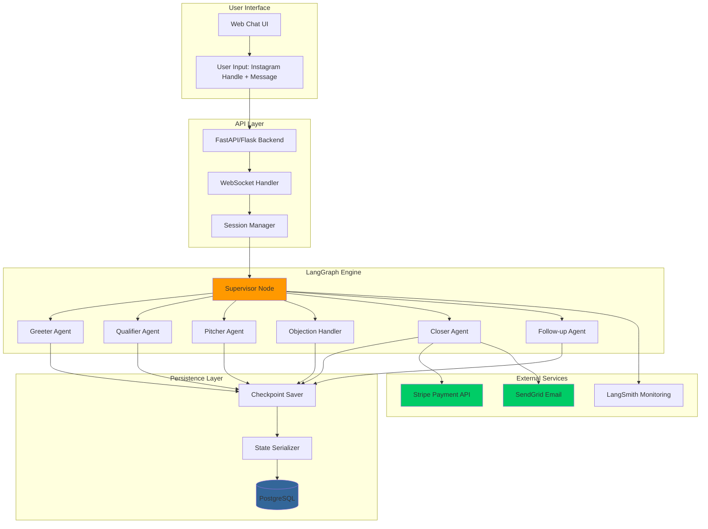
```mermaid
graph TB
    subgraph "User Interface"
        A[Web Chat UI]
        B[User Input: Instagram Handle + Message]
    end
    
    subgraph "API Layer"
        C[FastAPI/Flask Backend]
        D[WebSocket Handler]
        E[Session Manager]
    end
    
    subgraph "LangGraph Engine"
        F[Supervisor Node]
        G[Greeter Agent]
        H[Qualifier Agent]
        I[Pitcher Agent]
        J[Objection Handler]
        K[Closer Agent]
        L[Follow-up Agent]
    end
    
    subgraph "Persistence Layer"
        M[(PostgreSQL)]
        N[Checkpoint Saver]
        O[State Serializer]
    end
    
    subgraph "External Services"
        P[Stripe Payment API]
        Q[SendGrid Email]
        R[LangSmith Monitoring]
    end
    
    A --> B
    B --> C
    C --> D
    D --> E
    E --> F
    
    F --> G
    F --> H
    F --> I
    F --> J
    F --> K
    F --> L
    
    G --> N
    H --> N
    I --> N
    J --> N
    K --> N
    L --> N
    
    N --> O
    O --> M
    
    K --> P
    K --> Q
    
    F --> R
    
    style F fill:#ff9900
    style M fill:#336699
    style P fill:#00cc66
    style Q fill:#00cc66
```

---

## LangGraph Flow

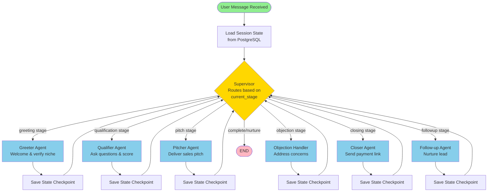
```mermaid
graph TD
    START([User Message Received])
    
    START --> LOAD[Load Session State<br/>from PostgreSQL]
    
    LOAD --> SUPER{Supervisor<br/>Routes based on<br/>current_stage}
    
    SUPER -->|greeting stage| GREET[Greeter Agent<br/>Welcome & verify niche]
    SUPER -->|qualification stage| QUAL[Qualifier Agent<br/>Ask questions & score]
    SUPER -->|pitch stage| PITCH[Pitcher Agent<br/>Deliver sales pitch]
    SUPER -->|objection stage| OBJ[Objection Handler<br/>Address concerns]
    SUPER -->|closing stage| CLOSE[Closer Agent<br/>Send payment link]
    SUPER -->|followup stage| FOLLOW[Follow-up Agent<br/>Nurture lead]
    SUPER -->|complete/nurture| END([END])
    
    GREET --> SAVE1[Save State Checkpoint]
    QUAL --> SAVE2[Save State Checkpoint]
    PITCH --> SAVE3[Save State Checkpoint]
    OBJ --> SAVE4[Save State Checkpoint]
    CLOSE --> SAVE5[Save State Checkpoint]
    FOLLOW --> SAVE6[Save State Checkpoint]
    
    SAVE1 --> SUPER
    SAVE2 --> SUPER
    SAVE3 --> SUPER
    SAVE4 --> SUPER
    SAVE5 --> SUPER
    SAVE6 --> SUPER
    
    style START fill:#90EE90
    style END fill:#FFB6C1
    style SUPER fill:#FFD700
    style GREET fill:#87CEEB
    style QUAL fill:#87CEEB
    style PITCH fill:#87CEEB
    style OBJ fill:#87CEEB
    style CLOSE fill:#87CEEB
    style FOLLOW fill:#87CEEB
```

---

## State Management Flow

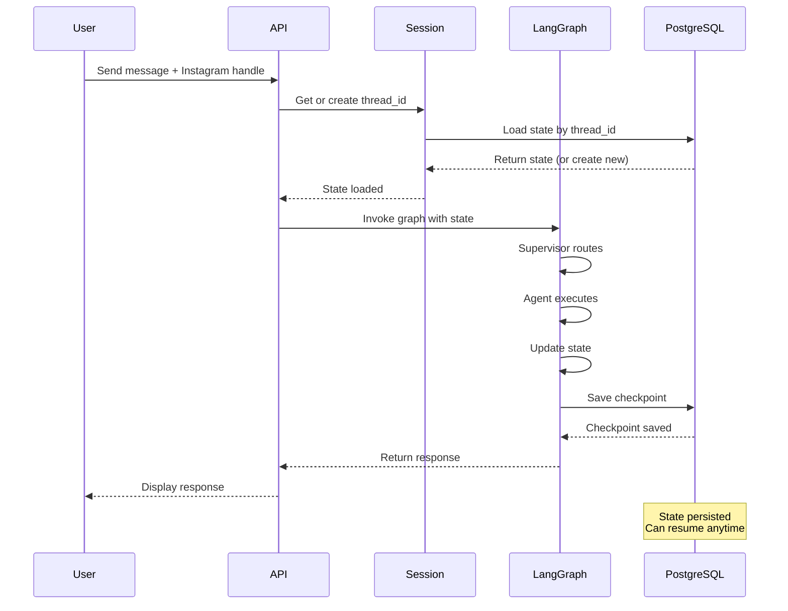
```mermaid
sequenceDiagram
    participant User
    participant API
    participant Session
    participant LangGraph
    participant PostgreSQL
    
    User->>API: Send message + Instagram handle
    API->>Session: Get or create thread_id
    Session->>PostgreSQL: Load state by thread_id
    PostgreSQL-->>Session: Return state (or create new)
    Session-->>API: State loaded
    
    API->>LangGraph: Invoke graph with state
    
    LangGraph->>LangGraph: Supervisor routes
    LangGraph->>LangGraph: Agent executes
    LangGraph->>LangGraph: Update state
    
    LangGraph->>PostgreSQL: Save checkpoint
    PostgreSQL-->>LangGraph: Checkpoint saved
    
    LangGraph-->>API: Return response
    API-->>User: Display response
    
    Note over PostgreSQL: State persisted<br/>Can resume anytime
```

---

## Conversation Flow - Full Journey

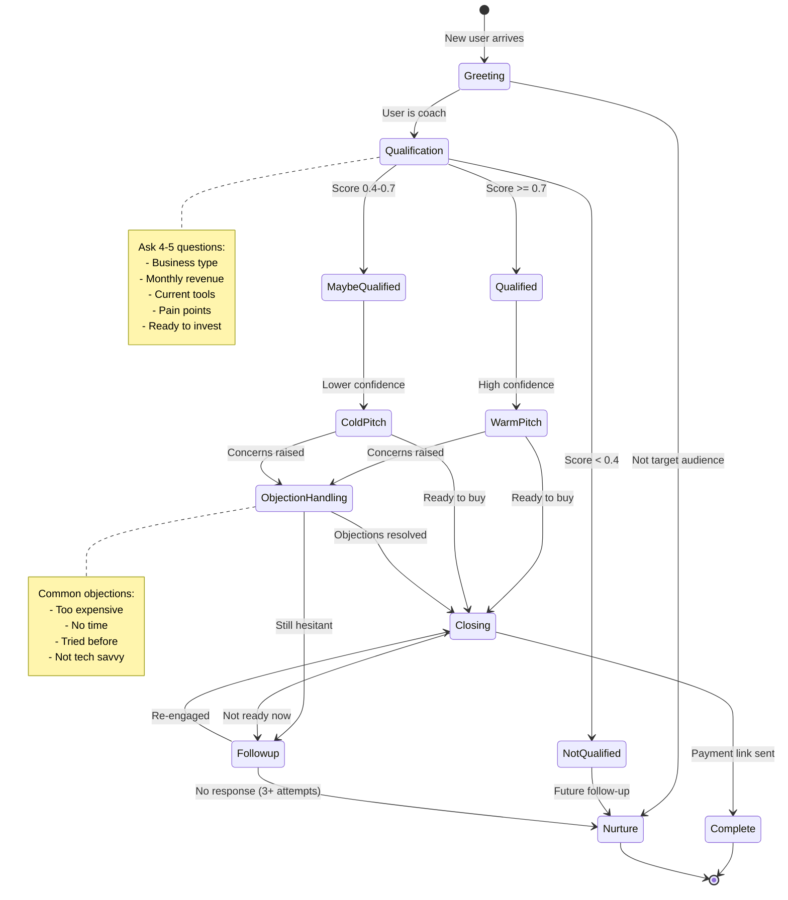
```mermaid
stateDiagram-v2
    [*] --> Greeting: New user arrives
    
    Greeting --> Qualification: User is coach
    Greeting --> Nurture: Not target audience
    
    Qualification --> Qualified: Score >= 0.7
    Qualification --> NotQualified: Score < 0.4
    Qualification --> MaybeQualified: Score 0.4-0.7
    
    Qualified --> WarmPitch: High confidence
    MaybeQualified --> ColdPitch: Lower confidence
    NotQualified --> Nurture: Future follow-up
    
    WarmPitch --> ObjectionHandling: Concerns raised
    WarmPitch --> Closing: Ready to buy
    
    ColdPitch --> ObjectionHandling: Concerns raised
    ColdPitch --> Closing: Ready to buy
    
    ObjectionHandling --> Closing: Objections resolved
    ObjectionHandling --> Followup: Still hesitant
    
    Closing --> Complete: Payment link sent
    Closing --> Followup: Not ready now
    
    Followup --> Closing: Re-engaged
    Followup --> Nurture: No response (3+ attempts)
    
    Complete --> [*]
    Nurture --> [*]
    
    note right of Qualification
        Ask 4-5 questions:
        - Business type
        - Monthly revenue
        - Current tools
        - Pain points
        - Ready to invest
    end note
    
    note right of ObjectionHandling
        Common objections:
        - Too expensive
        - No time
        - Tried before
        - Not tech savvy
    end note
```

---

## State Schema Visualization

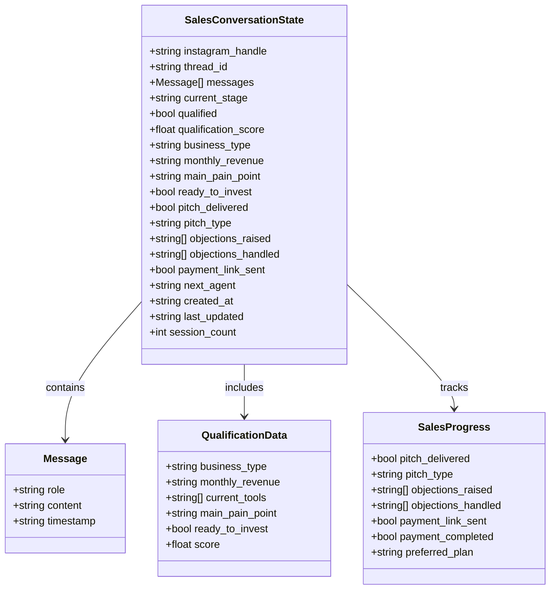
```mermaid
classDiagram
    class SalesConversationState {
        +string instagram_handle
        +string thread_id
        +Message[] messages
        +string current_stage
        +bool qualified
        +float qualification_score
        +string business_type
        +string monthly_revenue
        +string main_pain_point
        +bool ready_to_invest
        +bool pitch_delivered
        +string pitch_type
        +string[] objections_raised
        +string[] objections_handled
        +bool payment_link_sent
        +string next_agent
        +string created_at
        +string last_updated
        +int session_count
    }
    
    class Message {
        +string role
        +string content
        +string timestamp
    }
    
    class QualificationData {
        +string business_type
        +string monthly_revenue
        +string[] current_tools
        +string main_pain_point
        +bool ready_to_invest
        +float score
    }
    
    class SalesProgress {
        +bool pitch_delivered
        +string pitch_type
        +string[] objections_raised
        +string[] objections_handled
        +bool payment_link_sent
        +bool payment_completed
        +string preferred_plan
    }
    
    SalesConversationState --> Message : contains
    SalesConversationState --> QualificationData : includes
    SalesConversationState --> SalesProgress : tracks
```

---

## Agent Interaction Pattern

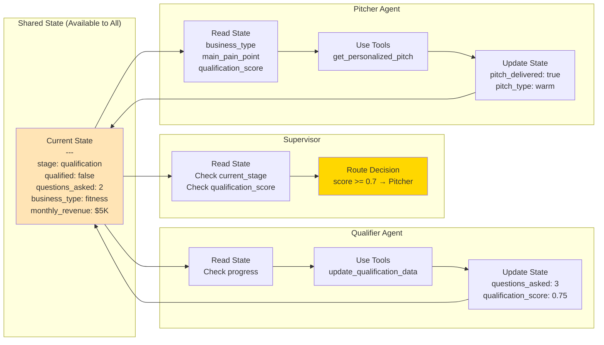
```mermaid
graph LR
    subgraph "Shared State (Available to All)"
        STATE[Current State<br/>---<br/>stage: qualification<br/>qualified: false<br/>questions_asked: 2<br/>business_type: fitness<br/>monthly_revenue: $5K]
    end
    
    subgraph "Qualifier Agent"
        QUAL_READ[Read State<br/>Check progress]
        QUAL_TOOL[Use Tools<br/>update_qualification_data]
        QUAL_WRITE[Update State<br/>questions_asked: 3<br/>qualification_score: 0.75]
    end
    
    subgraph "Supervisor"
        SUPER_READ[Read State<br/>Check current_stage<br/>Check qualification_score]
        SUPER_ROUTE[Route Decision<br/>score >= 0.7 → Pitcher]
    end
    
    subgraph "Pitcher Agent"
        PITCH_READ[Read State<br/>business_type<br/>main_pain_point<br/>qualification_score]
        PITCH_TOOL[Use Tools<br/>get_personalized_pitch]
        PITCH_WRITE[Update State<br/>pitch_delivered: true<br/>pitch_type: warm]
    end
    
    STATE --> QUAL_READ
    QUAL_READ --> QUAL_TOOL
    QUAL_TOOL --> QUAL_WRITE
    QUAL_WRITE --> STATE
    
    STATE --> SUPER_READ
    SUPER_READ --> SUPER_ROUTE
    
    STATE --> PITCH_READ
    PITCH_READ --> PITCH_TOOL
    PITCH_TOOL --> PITCH_WRITE
    PITCH_WRITE --> STATE
    
    style STATE fill:#FFE4B5
    style SUPER_ROUTE fill:#FFD700
```

---

## Database Schema (PostgreSQL)

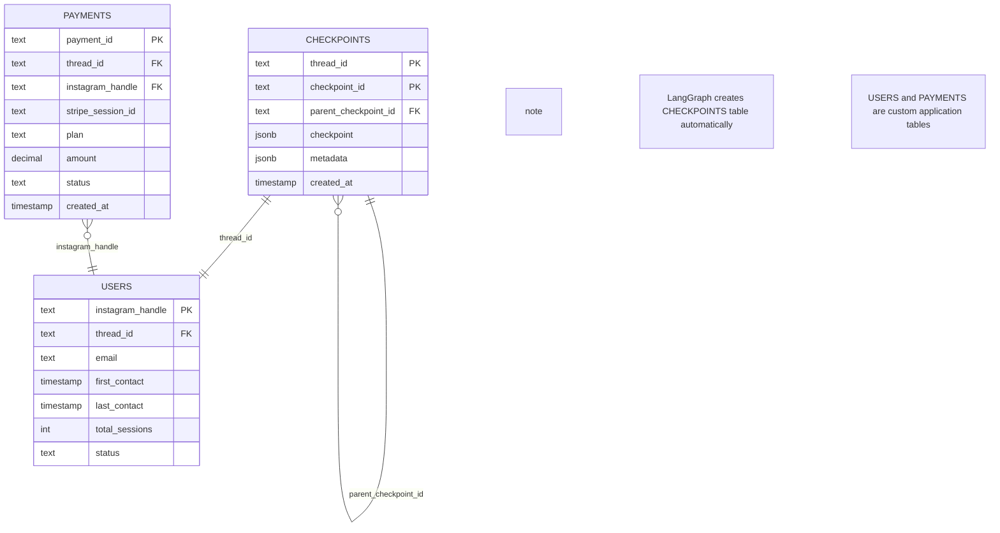
```mermaid
erDiagram
    CHECKPOINTS {
        text thread_id PK
        text checkpoint_id PK
        text parent_checkpoint_id FK
        jsonb checkpoint
        jsonb metadata
        timestamp created_at
    }
    
    USERS {
        text instagram_handle PK
        text thread_id FK
        text email
        timestamp first_contact
        timestamp last_contact
        int total_sessions
        text status
    }
    
    PAYMENTS {
        text payment_id PK
        text thread_id FK
        text instagram_handle FK
        text stripe_session_id
        text plan
        decimal amount
        text status
        timestamp created_at
    }
    
    CHECKPOINTS ||--o{ CHECKPOINTS : "parent_checkpoint_id"
    CHECKPOINTS ||--|| USERS : "thread_id"
    PAYMENTS }o--|| USERS : "instagram_handle"
    
    note "LangGraph creates CHECKPOINTS table automatically"
    note "USERS and PAYMENTS are custom application tables"
```

---

## Qualification Decision Tree

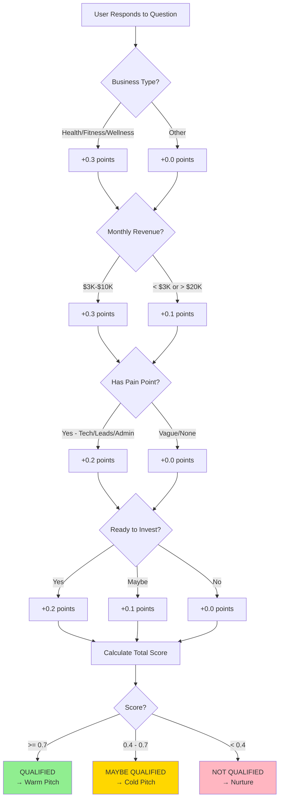
```mermaid
graph TD
    START[User Responds to Question]
    
    START --> Q1{Business Type?}
    
    Q1 -->|Health/Fitness/Wellness| SCORE1[+0.3 points]
    Q1 -->|Other| SCORE0A[+0.0 points]
    
    SCORE1 --> Q2{Monthly Revenue?}
    SCORE0A --> Q2
    
    Q2 -->|$3K-$10K| SCORE2[+0.3 points]
    Q2 -->|< $3K or > $20K| SCORE0B[+0.1 points]
    
    SCORE2 --> Q3{Has Pain Point?}
    SCORE0B --> Q3
    
    Q3 -->|Yes - Tech/Leads/Admin| SCORE3[+0.2 points]
    Q3 -->|Vague/None| SCORE0C[+0.0 points]
    
    SCORE3 --> Q4{Ready to Invest?}
    SCORE0C --> Q4
    
    Q4 -->|Yes| SCORE4[+0.2 points]
    Q4 -->|Maybe| SCORE0D[+0.1 points]
    Q4 -->|No| SCORE0E[+0.0 points]
    
    SCORE4 --> CALC[Calculate Total Score]
    SCORE0D --> CALC
    SCORE0E --> CALC
    
    CALC --> DECISION{Score?}
    
    DECISION -->|>= 0.7| QUALIFIED[QUALIFIED<br/>→ Warm Pitch]
    DECISION -->|0.4 - 0.7| MAYBE[MAYBE QUALIFIED<br/>→ Cold Pitch]
    DECISION -->|< 0.4| NOT[NOT QUALIFIED<br/>→ Nurture]
    
    style QUALIFIED fill:#90EE90
    style MAYBE fill:#FFD700
    style NOT fill:#FFB6C1
```

---

## Payment Flow Integration

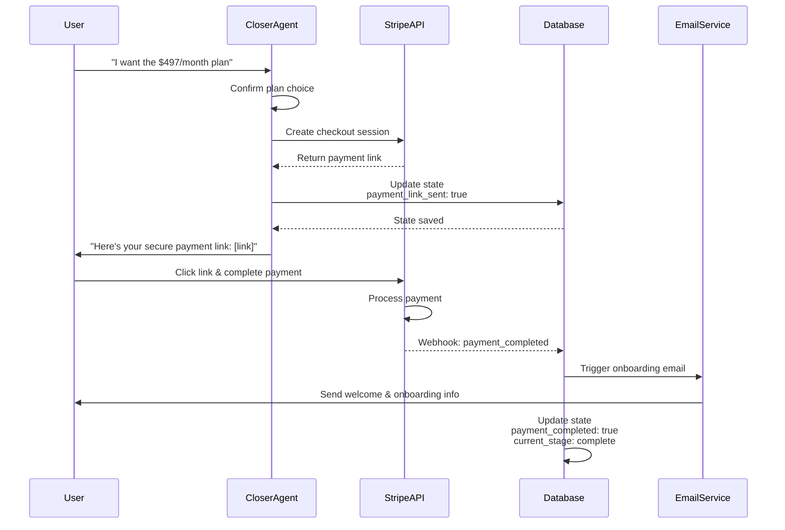
```mermaid
sequenceDiagram
    participant User
    participant CloserAgent
    participant StripeAPI
    participant Database
    participant EmailService
    
    User->>CloserAgent: "I want the $497/month plan"
    
    CloserAgent->>CloserAgent: Confirm plan choice
    CloserAgent->>StripeAPI: Create checkout session
    
    StripeAPI-->>CloserAgent: Return payment link
    
    CloserAgent->>Database: Update state<br/>payment_link_sent: true
    Database-->>CloserAgent: State saved
    
    CloserAgent->>User: "Here's your secure payment link: [link]"
    
    User->>StripeAPI: Click link & complete payment
    
    StripeAPI->>StripeAPI: Process payment
    StripeAPI-->>Database: Webhook: payment_completed
    
    Database->>EmailService: Trigger onboarding email
    EmailService->>User: Send welcome & onboarding info
    
    Database->>Database: Update state<br/>payment_completed: true<br/>current_stage: complete
```

---

## Multi-Session Resume Example

```mermaid
timeline
    title Lead Conversation Timeline
    
    section Day 1 (Monday)
        9:00 AM : User sends "START" via DM
        9:01 AM : Greeter welcomes user
        9:02 AM : Qualifier asks Question 1
        9:05 AM : User answers - business type
        9:06 AM : Qualifier asks Question 2
        9:10 AM : User answers - revenue
        9:11 AM : CHECKPOINT SAVED - Stage: qualification
    
    section Day 2 (Tuesday) 
        3:00 PM : User returns after 30 hours
        3:01 PM : STATE LOADED from database
        3:02 PM : Qualifier continues from Question 3
        3:05 PM : User answers - pain points
        3:06 PM : Qualifier calculates score: 0.75
        3:07 PM : Transitions to Pitcher
        3:08 PM : Warm pitch delivered
        3:09 PM : CHECKPOINT SAVED - Stage: pitch
    
    section Day 3 (Wednesday)
        11:00 AM : User has objections
        11:01 AM : STATE LOADED from database
        11:02 AM : Objection Handler addresses concerns
        11:10 AM : Objections resolved
        11:11 AM : Closer sends payment link
        11:15 AM : Payment completed
        11:16 AM : FINAL CHECKPOINT - Stage: complete
```

---

## Error Handling Flow

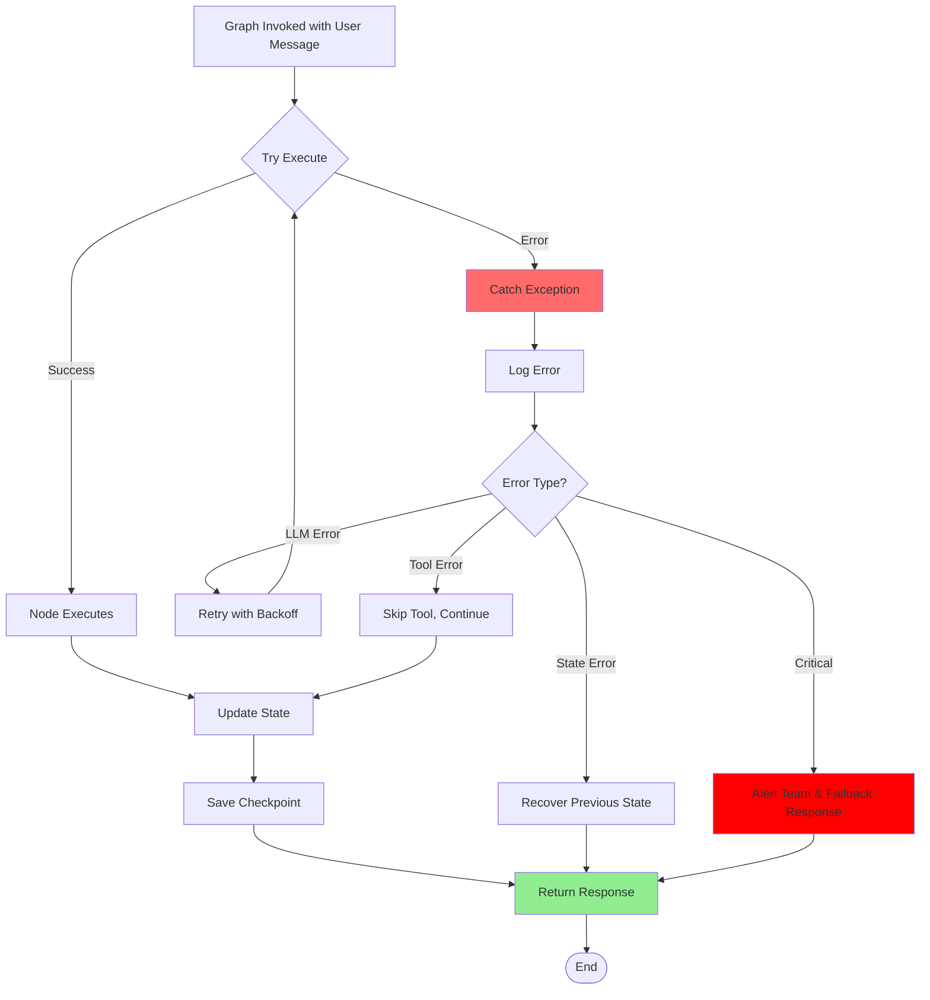
```mermaid
graph TD
    INVOKE[Graph Invoked with User Message]
    
    INVOKE --> TRY{Try Execute}
    
    TRY -->|Success| NODE[Node Executes]
    TRY -->|Error| CATCH[Catch Exception]
    
    NODE --> UPDATE[Update State]
    UPDATE --> SAVE[Save Checkpoint]
    SAVE --> RETURN[Return Response]
    
    CATCH --> LOG[Log Error]
    LOG --> FALLBACK{Error Type?}
    
    FALLBACK -->|LLM Error| RETRY[Retry with Backoff]
    FALLBACK -->|Tool Error| SKIP[Skip Tool, Continue]
    FALLBACK -->|State Error| RECOVER[Recover Previous State]
    FALLBACK -->|Critical| ALERT[Alert Team & Fallback Response]
    
    RETRY --> TRY
    SKIP --> UPDATE
    RECOVER --> RETURN
    ALERT --> RETURN
    
    RETURN --> END([End])
    
    style CATCH fill:#FF6B6B
    style ALERT fill:#FF0000
    style RETURN fill:#90EE90
```

---

## Deployment Architecture (Production)

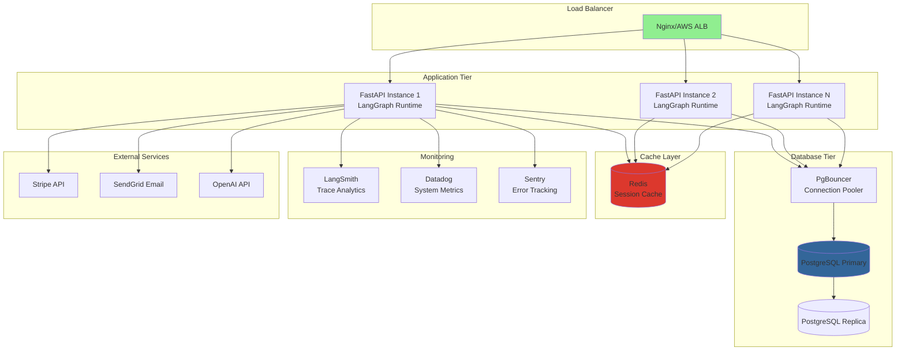
```mermaid
graph TB
    subgraph "Load Balancer"
        LB[Nginx/AWS ALB]
    end
    
    subgraph "Application Tier"
        APP1[FastAPI Instance 1<br/>LangGraph Runtime]
        APP2[FastAPI Instance 2<br/>LangGraph Runtime]
        APP3[FastAPI Instance N<br/>LangGraph Runtime]
    end
    
    subgraph "Database Tier"
        PG_PRIMARY[(PostgreSQL Primary)]
        PG_REPLICA[(PostgreSQL Replica)]
        PGBOUNCER[PgBouncer<br/>Connection Pooler]
    end
    
    subgraph "Cache Layer"
        REDIS[(Redis<br/>Session Cache)]
    end
    
    subgraph "Monitoring"
        LANGSMITH[LangSmith<br/>Trace Analytics]
        DATADOG[Datadog<br/>System Metrics]
        SENTRY[Sentry<br/>Error Tracking]
    end
    
    subgraph "External Services"
        STRIPE[Stripe API]
        SENDGRID[SendGrid Email]
        OPENAI[OpenAI API]
    end
    
    LB --> APP1
    LB --> APP2
    LB --> APP3
    
    APP1 --> PGBOUNCER
    APP2 --> PGBOUNCER
    APP3 --> PGBOUNCER
    
    PGBOUNCER --> PG_PRIMARY
    PG_PRIMARY --> PG_REPLICA
    
    APP1 --> REDIS
    APP2 --> REDIS
    APP3 --> REDIS
    
    APP1 --> OPENAI
    APP1 --> STRIPE
    APP1 --> SENDGRID
    
    APP1 --> LANGSMITH
    APP1 --> DATADOG
    APP1 --> SENTRY
    
    style PG_PRIMARY fill:#336699
    style REDIS fill:#DC382D
    style LB fill:#90EE90
```

---

## Architecture Comparison Matrix

```mermaid
quadrantChart
    title Architecture Pattern Selection
    x-axis Low Complexity --> High Complexity
    y-axis Low Cost --> High Cost
    
    quadrant-1 Expensive & Complex
    quadrant-2 Expensive & Simple
    quadrant-3 Cheap & Simple
    quadrant-4 Cheap & Complex
    
    Flat Supervisor: [0.2, 0.3]
    Hierarchical Teams: [0.9, 0.9]
    Subgraphs: [0.7, 0.6]
    Stateful + Shared State: [0.4, 0.4]
    
    note "Optimal: Bottom-left quadrant"
```

---

## System Capacity Planning

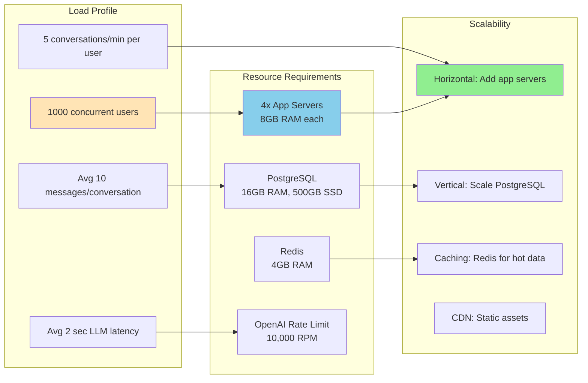
```mermaid
graph LR
    subgraph "Load Profile"
        A[1000 concurrent users]
        B[Avg 10 messages/conversation]
        C[Avg 2 sec LLM latency]
        D[5 conversations/min per user]
    end
    
    subgraph "Resource Requirements"
        E[4x App Servers<br/>8GB RAM each]
        F[PostgreSQL<br/>16GB RAM, 500GB SSD]
        G[Redis<br/>4GB RAM]
        H[OpenAI Rate Limit<br/>10,000 RPM]
    end
    
    subgraph "Scalability"
        I[Horizontal: Add app servers]
        J[Vertical: Scale PostgreSQL]
        K[Caching: Redis for hot data]
        L[CDN: Static assets]
    end
    
    A --> E
    B --> F
    C --> H
    D --> I
    
    E --> I
    F --> J
    G --> K
    
    style A fill:#FFE4B5
    style E fill:#87CEEB
    style I fill:#90EE90
```

---

## Campaign Access Flow

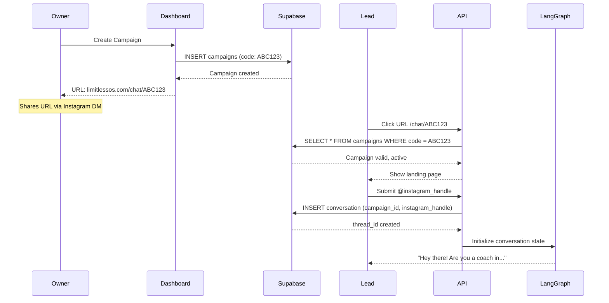
```mermaid
sequenceDiagram
    participant Owner
    participant Dashboard
    participant DB as Supabase
    participant Lead
    participant API
    participant Agent as LangGraph
    
    Owner->>Dashboard: Create Campaign
    Dashboard->>DB: INSERT campaigns (code: ABC123)
    DB-->>Dashboard: Campaign created
    Dashboard-->>Owner: URL: limitlessos.com/chat/ABC123
    
    Note over Owner: Shares URL via Instagram DM
    
    Lead->>API: Click URL /chat/ABC123
    API->>DB: SELECT * FROM campaigns WHERE code = ABC123
    DB-->>API: Campaign valid, active
    API-->>Lead: Show landing page
    
    Lead->>API: Submit @instagram_handle
    API->>DB: INSERT conversation (campaign_id, instagram_handle)
    DB-->>API: thread_id created
    API->>Agent: Initialize conversation state
    Agent-->>Lead: "Hey there! Are you a coach in..."
```

---

## RAG System Architecture

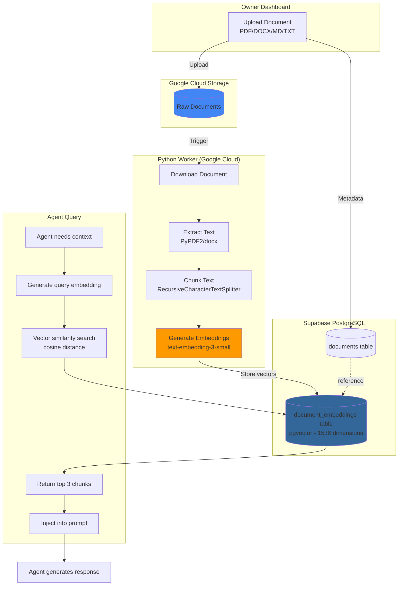
```mermaid
graph TB
    subgraph "Owner Dashboard"
        A[Upload Document<br/>PDF/DOCX/MD/TXT]
    end
    
    subgraph "Google Cloud Storage"
        B[(Raw Documents)]
    end
    
    subgraph "Python Worker (Google Cloud)"
        C[Download Document]
        D[Extract Text<br/>PyPDF2/docx]
        E[Chunk Text<br/>RecursiveCharacterTextSplitter]
        F[Generate Embeddings<br/>text-embedding-3-small]
    end
    
    subgraph "Supabase PostgreSQL"
        G[(documents table)]
        H[(document_embeddings table<br/>pgvector - 1536 dimensions)]
    end
    
    subgraph "Agent Query"
        I[Agent needs context]
        J[Generate query embedding]
        K[Vector similarity search<br/>cosine distance]
        L[Return top 3 chunks]
        M[Inject into prompt]
    end
    
    A -->|Upload| B
    A -->|Metadata| G
    B -->|Trigger| C
    C --> D
    D --> E
    E --> F
    F -->|Store vectors| H
    G -.reference.-> H
    
    I --> J
    J --> K
    K --> H
    H --> L
    L --> M
    M --> Agent[Agent generates response]
    
    style B fill:#4285F4
    style H fill:#336699
    style F fill:#FF9900
```

---

## Sequence Diagram: Greeter Agent

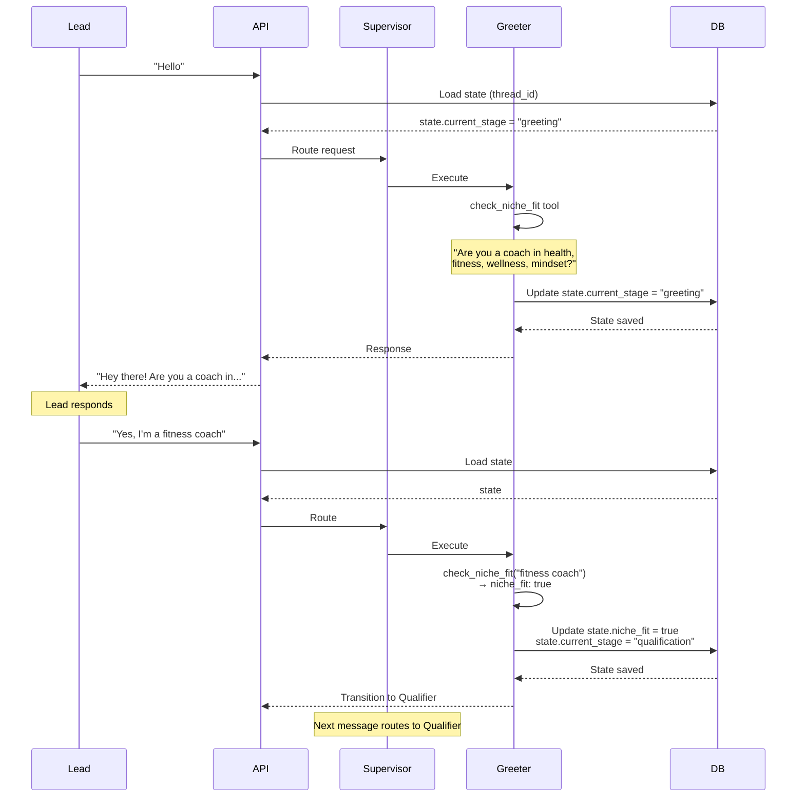
```mermaid
sequenceDiagram
    participant Lead
    participant API
    participant Supervisor
    participant Greeter
    participant DB
    
    Lead->>API: "Hello"
    API->>DB: Load state (thread_id)
    DB-->>API: state.current_stage = "greeting"
    API->>Supervisor: Route request
    Supervisor->>Greeter: Execute
    
    Greeter->>Greeter: check_niche_fit tool
    Note over Greeter: "Are you a coach in health,<br/>fitness, wellness, mindset?"
    
    Greeter->>DB: Update state.current_stage = "greeting"
    DB-->>Greeter: State saved
    Greeter-->>API: Response
    API-->>Lead: "Hey there! Are you a coach in..."
    
    Note over Lead: Lead responds
    
    Lead->>API: "Yes, I'm a fitness coach"
    API->>DB: Load state
    DB-->>API: state
    API->>Supervisor: Route
    Supervisor->>Greeter: Execute
    
    Greeter->>Greeter: check_niche_fit("fitness coach")<br/>→ niche_fit: true
    Greeter->>DB: Update state.niche_fit = true<br/>state.current_stage = "qualification"
    DB-->>Greeter: State saved
    Greeter-->>API: Transition to Qualifier
    
    Note over Supervisor: Next message routes to Qualifier
```

---

## Sequence Diagram: Qualifier Agent

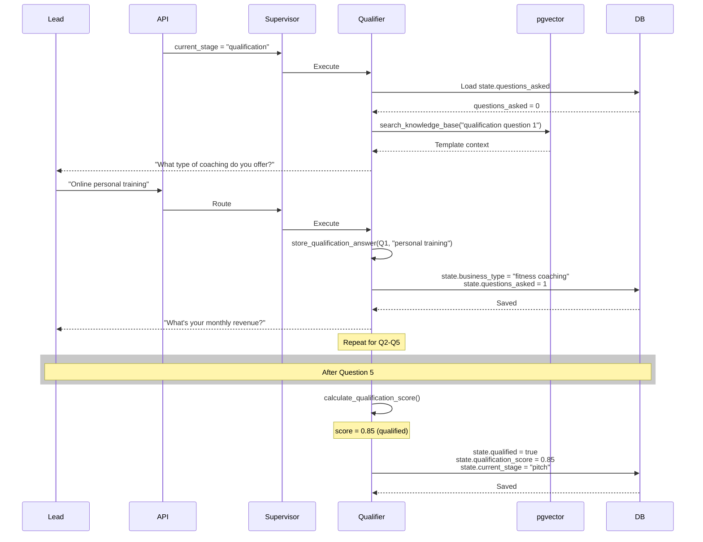
```mermaid
sequenceDiagram
    participant Lead
    participant API
    participant Supervisor
    participant Qualifier
    participant RAG as pgvector
    participant DB
    
    API->>Supervisor: current_stage = "qualification"
    Supervisor->>Qualifier: Execute
    
    Qualifier->>DB: Load state.questions_asked
    DB-->>Qualifier: questions_asked = 0
    
    Qualifier->>RAG: search_knowledge_base("qualification question 1")
    RAG-->>Qualifier: Template context
    
    Qualifier-->>Lead: "What type of coaching do you offer?"
    
    Lead->>API: "Online personal training"
    API->>Supervisor: Route
    Supervisor->>Qualifier: Execute
    
    Qualifier->>Qualifier: store_qualification_answer(Q1, "personal training")
    Qualifier->>DB: state.business_type = "fitness coaching"<br/>state.questions_asked = 1
    DB-->>Qualifier: Saved
    
    Qualifier-->>Lead: "What's your monthly revenue?"
    
    Note over Qualifier: Repeat for Q2-Q5
    
    rect rgb(200, 200, 200)
    Note over Lead,DB: After Question 5
    end
    
    Qualifier->>Qualifier: calculate_qualification_score()
    Note over Qualifier: score = 0.85 (qualified)
    Qualifier->>DB: state.qualified = true<br/>state.qualification_score = 0.85<br/>state.current_stage = "pitch"
    DB-->>Qualifier: Saved
```

---

## Sequence Diagram: Pitcher Agent with RAG

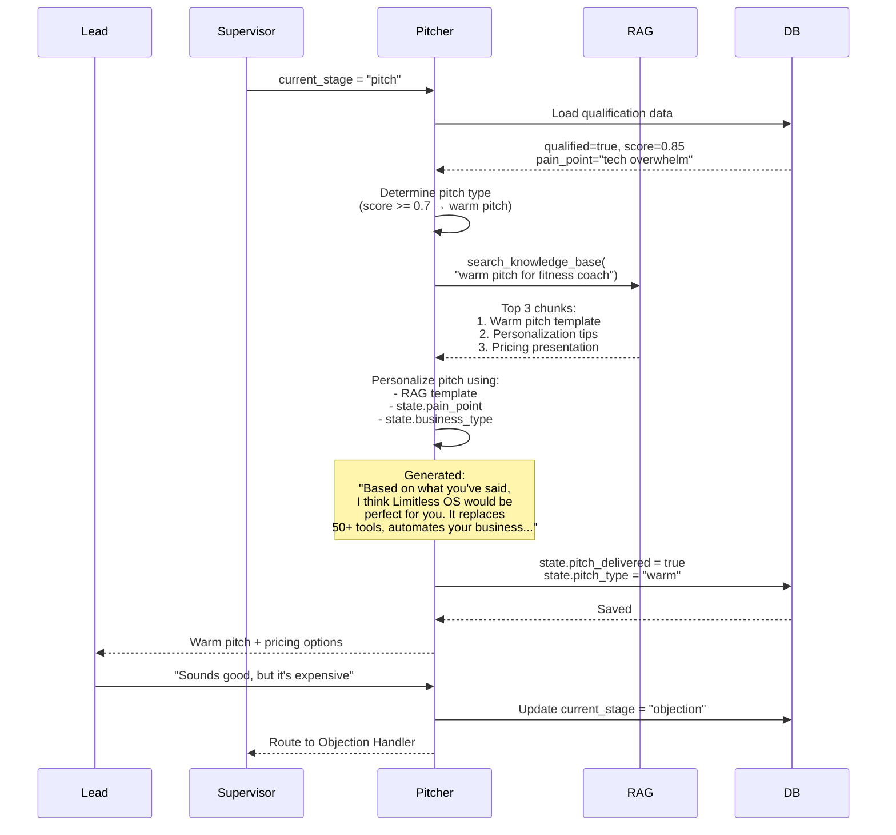
```mermaid
sequenceDiagram
    participant Lead
    participant Supervisor
    participant Pitcher
    participant RAG
    participant DB
    
    Supervisor->>Pitcher: current_stage = "pitch"
    Pitcher->>DB: Load qualification data
    DB-->>Pitcher: qualified=true, score=0.85<br/>pain_point="tech overwhelm"
    
    Pitcher->>Pitcher: Determine pitch type<br/>(score >= 0.7 → warm pitch)
    
    Pitcher->>RAG: search_knowledge_base(<br/>"warm pitch for fitness coach")
    RAG-->>Pitcher: Top 3 chunks:<br/>1. Warm pitch template<br/>2. Personalization tips<br/>3. Pricing presentation
    
    Pitcher->>Pitcher: Personalize pitch using:<br/>- RAG template<br/>- state.pain_point<br/>- state.business_type
    
    Note over Pitcher: Generated:<br/>"Based on what you've said,<br/>I think Limitless OS would be<br/>perfect for you. It replaces<br/>50+ tools, automates your business..."
    
    Pitcher->>DB: state.pitch_delivered = true<br/>state.pitch_type = "warm"
    DB-->>Pitcher: Saved
    
    Pitcher-->>Lead: Warm pitch + pricing options
    
    Lead->>Pitcher: "Sounds good, but it's expensive"
    
    Pitcher->>DB: Update current_stage = "objection"
    Pitcher-->>Supervisor: Route to Objection Handler
```

---

## Sequence Diagram: Payment Flow

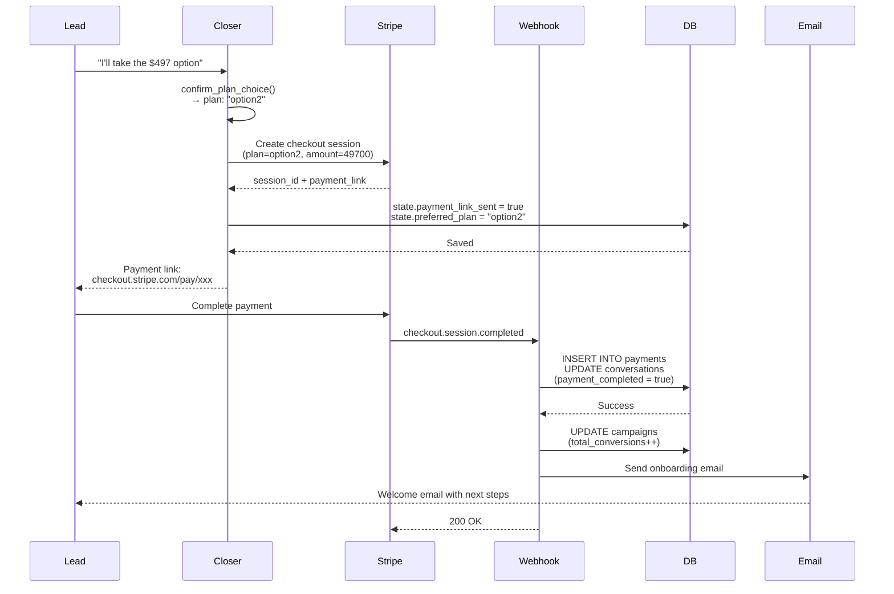
```mermaid
sequenceDiagram
    participant Lead
    participant Closer
    participant Stripe
    participant Webhook
    participant DB
    participant Email
    
    Lead->>Closer: "I'll take the $497 option"
    
    Closer->>Closer: confirm_plan_choice()<br/>→ plan: "option2"
    
    Closer->>Stripe: Create checkout session<br/>(plan=option2, amount=49700)
    Stripe-->>Closer: session_id + payment_link
    
    Closer->>DB: state.payment_link_sent = true<br/>state.preferred_plan = "option2"
    DB-->>Closer: Saved
    
    Closer-->>Lead: Payment link:<br/>checkout.stripe.com/pay/xxx
    
    Lead->>Stripe: Complete payment
    Stripe->>Webhook: checkout.session.completed
    
    Webhook->>DB: INSERT INTO payments<br/>UPDATE conversations<br/>(payment_completed = true)
    DB-->>Webhook: Success
    
    Webhook->>DB: UPDATE campaigns<br/>(total_conversions++)
    
    Webhook->>Email: Send onboarding email
    Email-->>Lead: Welcome email with next steps
    
    Webhook-->>Stripe: 200 OK
```

---

## State Transition Diagram

```mermaid
stateDiagram-v2
    [*] --> Greeting: Lead clicks campaign URL
    
    Greeting --> Qualification: Niche fit confirmed
    Greeting --> Nurture: Wrong niche
    
    Qualification --> Qualification: Questions 1-5
    Qualification --> Pitch: Qualified (score >= 0.4)
    Qualification --> Nurture: Not qualified (score < 0.4)
    
    Pitch --> Objection: Objection raised
    Pitch --> Closing: Ready to buy
    
    Objection --> Closing: Objection resolved
    Objection --> Followup: Multiple objections
    
    Followup --> Closing: Re-engaged
    Followup --> Nurture: Max follow-ups (3)
    
    Closing --> Complete: Payment link sent
    
    Complete --> [*]
    Nurture --> [*]
    
    note right of Greeting
        Tools: check_niche_fit
        Duration: 1 message
    end note
    
    note right of Qualification
        Tools: store_qualification_answer,
        calculate_qualification_score,
        search_knowledge_base
        Duration: 5 messages
    end note
    
    note right of Pitch
        Tools: get_personalized_pitch,
        search_knowledge_base,
        mark_pitch_delivered
        Duration: 1-2 messages
    end note
    
    note right of Objection
        Tools: identify_objection,
        search_knowledge_base,
        record_objection
        Duration: 1-3 messages
    end note
    
    note right of Closing
        Tools: create_stripe_link,
        send_payment_link
        Duration: 1 message
    end note
```

---

## Conversation Stage Flow with Metrics

```mermaid
graph TD
    START([Campaign Click<br/>100 leads]) --> GREETING{Greeter<br/>Niche Check}
    
    GREETING -->|75 qualified| QUAL[Qualification<br/>5 Questions]
    GREETING -->|25 wrong niche| NURTURE1[Nurture]
    
    QUAL --> QUAL_SCORE{Qualification<br/>Score}
    
    QUAL_SCORE -->|45 high score<br/>≥ 0.7| WARM[Warm Pitch]
    QUAL_SCORE -->|20 med score<br/>0.4-0.7| COLD[Cold Pitch]
    QUAL_SCORE -->|10 low score<br/>< 0.4| NURTURE2[Nurture]
    
    WARM -->|30 objections| OBJ1[Objection<br/>Handler]
    WARM -->|15 ready| CLOSE1[Closer]
    
    COLD -->|15 objections| OBJ2[Objection<br/>Handler]
    COLD -->|5 ready| CLOSE2[Closer]
    
    OBJ1 -->|20 resolved| CLOSE3[Closer]
    OBJ1 -->|10 hesitant| FOLLOW1[Follow-up]
    
    OBJ2 -->|10 resolved| CLOSE4[Closer]
    OBJ2 -->|5 hesitant| FOLLOW2[Follow-up]
    
    FOLLOW1 -->|6 converted| CLOSE5[Closer]
    FOLLOW1 -->|4 no response| NURTURE3[Nurture]
    
    FOLLOW2 -->|3 converted| CLOSE6[Closer]
    FOLLOW2 -->|2 no response| NURTURE4[Nurture]
    
    CLOSE1 --> COMPLETE1[Complete<br/>15 conversions]
    CLOSE2 --> COMPLETE2[Complete<br/>5 conversions]
    CLOSE3 --> COMPLETE3[Complete<br/>20 conversions]
    CLOSE4 --> COMPLETE4[Complete<br/>10 conversions]
    CLOSE5 --> COMPLETE5[Complete<br/>6 conversions]
    CLOSE6 --> COMPLETE6[Complete<br/>3 conversions]
    
    COMPLETE1 --> END([Total: 59 conversions<br/>59% conversion rate])
    COMPLETE2 --> END
    COMPLETE3 --> END
    COMPLETE4 --> END
    COMPLETE5 --> END
    COMPLETE6 --> END
    
    style START fill:#90EE90
    style END fill:#FFD700
    style NURTURE1 fill:#FFB6C1
    style NURTURE2 fill:#FFB6C1
    style NURTURE3 fill:#FFB6C1
    style NURTURE4 fill:#FFB6C1
    style COMPLETE1 fill:#FFD700
    style COMPLETE2 fill:#FFD700
    style COMPLETE3 fill:#FFD700
    style COMPLETE4 fill:#FFD700
    style COMPLETE5 fill:#FFD700
    style COMPLETE6 fill:#FFD700
```

---

## Full System Data Flow

```mermaid
graph TB
    subgraph "Owner Actions"
        A1[Create Campaign] --> A2[Upload Documents]
    end
    
    subgraph "Campaign Setup"
        A1 --> B1[(campaigns table)]
        A2 --> B2[Google Cloud Storage]
        A2 --> B3[Python Worker]
        B3 --> B4[(document_embeddings)]
    end
    
    subgraph "Lead Journey"
        C1[Click URL] --> C2[Validate Campaign]
        C2 --> C3[Enter Instagram Handle]
        C3 --> C4[Start Conversation]
    end
    
    subgraph "Conversation Processing"
        C4 --> D1[Load/Create State]
        D1 --> D2[LangGraph Supervisor]
        D2 --> D3[Route to Agent]
        D3 --> D4{Need Context?}
        D4 -->|Yes| D5[Query RAG]
        D4 -->|No| D6[Generate Response]
        D5 --> D6
        D6 --> D7[Update State]
        D7 --> D8[Save Checkpoint]
    end
    
    subgraph "Completion"
        D8 --> E1{Stage?}
        E1 -->|Closing| E2[Create Stripe Link]
        E1 -->|Other| E3[Return Response]
        E2 --> E4[Payment]
        E4 --> E5[Webhook]
        E5 --> E6[Update Analytics]
    end
    
    C2 --> B1
    D1 --> F1[(checkpoints table)]
    D5 --> B4
    D8 --> F1
    E6 --> F2[(analytics_events)]
    E6 --> B1
    
    style A1 fill:#4285F4
    style C1 fill:#90EE90
    style D2 fill:#FF9900
    style E2 fill:#00CC66
```

---

**All diagrams are rendered using Mermaid markdown syntax for easy visualization in GitHub/documentation tools.**
