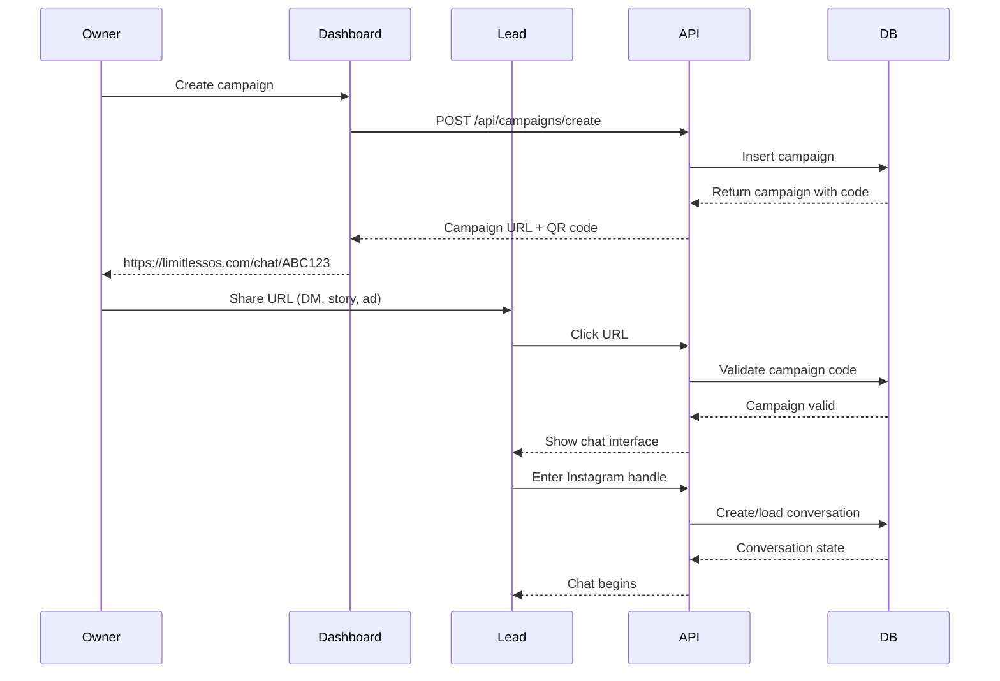
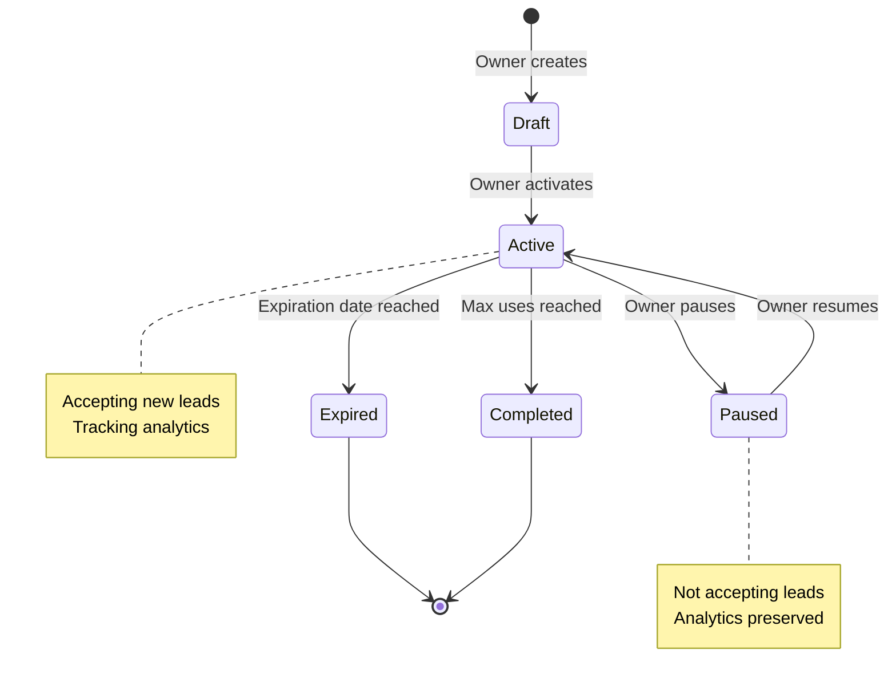

# Limitless OS - Campaign System

**Complete campaign code and access control documentation**

---

## Overview

The campaign system allows the owner to track lead sources and prevent unauthorized access to the AI sales agent.

### **Key Features**
- ✅ Unique campaign codes for tracking
- ✅ Embedded access codes in URL (no manual entry required)
- ✅ Usage limits and expiration
- ✅ Analytics per campaign
- ✅ Protection from abuse

---

## Campaign Code Generation

### **Code Format**
```
ABC123
```
- **Length**: 6 characters
- **Characters**: Uppercase letters + numbers
- **Uniqueness**: Enforced by database constraint

### **Generation Algorithm**

```typescript
function generateCampaignCode(): string {
  const chars = 'ABCDEFGHJKLMNPQRSTUVWXYZ23456789'; // Exclude confusing chars (0, O, 1, I)
  let code = '';
  for (let i = 0; i < 6; i++) {
    code += chars[Math.floor(Math.random() * chars.length)];
  }
  return code;
}
```

---

## Access Flow

### **Recommended Flow: Embedded Code**



### **User Experience**

**Step 1: Lead Clicks URL**
```
https://limitlessos.com/chat/ABC123
```

**Step 2: Landing Page**
```
┌─────────────────────────────────────┐
│  Limitless OS                       │
│                                     │
│  [Logo]                             │
│                                     │
│  Welcome! Let's get started.        │
│                                     │
│  ┌───────────────────────────────┐  │
│  │ @your_instagram_handle        │  │
│  └───────────────────────────────┘  │
│                                     │
│  [ Start Chat ]                     │
│                                     │
└─────────────────────────────────────┘
```

**Step 3: Chat Interface**
```
┌─────────────────────────────────────┐
│  Chat with Limitless OS             │
├─────────────────────────────────────┤
│                                     │
│  AI: Hey there! Thanks for reaching │
│      out. Are you a coach in...     │
│                                     │
│  You: Yes, I'm a fitness coach      │
│                                     │
├─────────────────────────────────────┤
│  [Type your message...]         [>] │
└─────────────────────────────────────┘
```

---

## Campaign Validation

### **Validation Checks**

```typescript
async function validateCampaign(code: string): Promise<ValidationResult> {
  const campaign = await db.query.campaigns.findFirst({
    where: eq(campaigns.code, code)
  });
  
  // Check 1: Campaign exists
  if (!campaign) {
    return { valid: false, error: 'CAMPAIGN_NOT_FOUND' };
  }
  
  // Check 2: Campaign is active
  if (!campaign.is_active) {
    return { valid: false, error: 'CAMPAIGN_INACTIVE' };
  }
  
  // Check 3: Campaign not expired
  if (campaign.expires_at && new Date() > campaign.expires_at) {
    return { valid: false, error: 'CAMPAIGN_EXPIRED' };
  }
  
  // Check 4: Usage limit not reached
  if (campaign.max_uses && campaign.total_clicks >= campaign.max_uses) {
    return { valid: false, error: 'CAMPAIGN_LIMIT_REACHED' };
  }
  
  return { valid: true, campaign };
}
```

### **Error Handling**

| Error Code | Message | User Action |
|------------|---------|-------------|
| `CAMPAIGN_NOT_FOUND` | "This link is invalid" | Contact support |
| `CAMPAIGN_INACTIVE` | "This campaign is no longer active" | Contact owner |
| `CAMPAIGN_EXPIRED` | "This link has expired" | Request new link |
| `CAMPAIGN_LIMIT_REACHED` | "This campaign has reached its limit" | Request new link |

---

## Campaign Creation

### **Owner Dashboard Flow**

**Step 1: Create Campaign Form**
```
┌─────────────────────────────────────┐
│  Create New Campaign                │
│                                     │
│  Campaign Name *                    │
│  ┌───────────────────────────────┐  │
│  │ Instagram Ads - Jan 2025      │  │
│  └───────────────────────────────┘  │
│                                     │
│  Description (optional)             │
│  ┌───────────────────────────────┐  │
│  │ Winter campaign for fitness   │  │
│  │ coaches                        │  │
│  └───────────────────────────────┘  │
│                                     │
│  Max Uses (optional)                │
│  ┌───────────────────────────────┐  │
│  │ 100                           │  │
│  └───────────────────────────────┘  │
│                                     │
│  Expires On (optional)              │
│  ┌───────────────────────────────┐  │
│  │ 2025-02-28                    │  │
│  └───────────────────────────────┘  │
│                                     │
│  [ Cancel ]  [ Create Campaign ]    │
└─────────────────────────────────────┘
```

**Step 2: Campaign Created**
```
┌─────────────────────────────────────┐
│  Campaign Created Successfully!     │
│                                     │
│  Campaign Code: ABC123              │
│                                     │
│  Share URL:                         │
│  https://limitlessos.com/chat/ABC123│
│  [ Copy Link ]                      │
│                                     │
│  QR Code:                           │
│  ┌─────────┐                        │
│  │ [QR]    │                        │
│  └─────────┘                        │
│  [ Download QR ]                    │
│                                     │
│  [ View Analytics ]  [ Done ]       │
└─────────────────────────────────────┘
```

---

## Campaign Analytics

### **Metrics Tracked**

```typescript
interface CampaignMetrics {
  // Traffic
  total_clicks: number;           // URL clicks
  unique_visitors: number;        // Unique Instagram handles
  
  // Engagement
  total_conversations: number;    // Conversations started
  total_messages: number;         // Total messages exchanged
  avg_messages_per_conversation: number;
  
  // Qualification
  total_qualified: number;        // Qualified leads
  qualification_rate: number;     // qualified / conversations
  avg_time_to_qualification: string; // "5 minutes"
  
  // Conversion
  total_pitch_delivered: number;  // Pitches delivered
  total_payment_links_sent: number;
  total_conversions: number;      // Payments completed
  conversion_rate: number;        // conversions / conversations
  
  // Revenue
  total_revenue: number;          // Total revenue (cents)
  avg_deal_size: number;          // Average payment
  
  // Objections
  top_objections: Array<{
    type: string;
    count: number;
  }>;
}
```

### **Dashboard View**

```
┌─────────────────────────────────────┐
│  Campaign: Instagram Ads - Jan 2025 │
│  Code: ABC123                       │
├─────────────────────────────────────┤
│  Overview                           │
│  ┌─────────┐ ┌─────────┐ ┌────────┐│
│  │  150    │ │   45    │ │   8    ││
│  │ Clicks  │ │  Convos │ │ Sales  ││
│  └─────────┘ └─────────┘ └────────┘│
│                                     │
│  Conversion Rate: 17.8%             │
│  Revenue: $3,976                    │
├─────────────────────────────────────┤
│  Timeline (Last 7 Days)             │
│   [Chart: Clicks, Conversations,    │
│    Conversions over time]           │
├─────────────────────────────────────┤
│  Top Objections                     │
│  • Price (15)                       │
│  • Time (8)                         │
│  • Past failures (5)                │
└─────────────────────────────────────┘
```

---

## Usage Tracking

### **Event Tracking**

```typescript
// Track campaign click
await trackEvent({
  type: 'campaign_click',
  campaign_id: campaign.id,
  campaign_code: campaign.code,
  data: {
    referrer: req.headers.referer,
    user_agent: req.headers['user-agent']
  }
});

// Track conversation start
await trackEvent({
  type: 'conversation_started',
  campaign_id: campaign.id,
  conversation_id: threadId,
  data: {
    instagram_handle: instagramHandle
  }
});

// Track qualification
await trackEvent({
  type: 'lead_qualified',
  campaign_id: campaign.id,
  conversation_id: threadId,
  data: {
    qualification_score: 0.85,
    business_type: 'fitness coaching'
  }
});

// Track conversion
await trackEvent({
  type: 'payment_completed',
  campaign_id: campaign.id,
  conversation_id: threadId,
  data: {
    plan: 'option2',
    amount: 49700
  }
});
```

---

## Security Considerations

### **Abuse Prevention**

**1. Rate Limiting**
```typescript
// Limit: 10 conversations per hour per Instagram handle
const rateLimit = {
  window: 3600, // 1 hour in seconds
  max: 10,
  keyGenerator: (instagramHandle) => `ratelimit:${instagramHandle}`
};
```

**2. Campaign Validation Caching**
```typescript
// Cache valid campaigns for 5 minutes
const cacheKey = `campaign:${code}`;
const cached = await redis.get(cacheKey);
if (cached) return JSON.parse(cached);

const campaign = await validateCampaign(code);
await redis.setex(cacheKey, 300, JSON.stringify(campaign));
```

**3. Instagram Handle Validation**
```typescript
function validateInstagramHandle(handle: string): boolean {
  // Must start with @
  // 1-30 characters
  // Alphanumeric + underscores
  const regex = /^@[a-zA-Z0-9_.]{1,30}$/;
  return regex.test(handle);
}
```

---

## Multi-Campaign Strategy

### **Use Cases**

| Campaign Type | Example | Settings |
|---------------|---------|----------|
| **Time-Limited** | "Black Friday Sale" | expires_at: 2025-11-29 |
| **Usage-Limited** | "First 50 Sign-Ups" | max_uses: 50 |
| **Channel-Specific** | "Instagram Story Swipe-Up" | Unique code per channel |
| **Evergreen** | "Website Link" | No limits |
| **Testing** | "A/B Test Variant A" | Compare metrics |

### **Best Practices**

✅ **Create separate campaigns for:**
- Different marketing channels (Instagram vs Facebook)
- Different time periods (Q1 2025 vs Q2 2025)
- Different audiences (existing followers vs new leads)
- A/B testing variations

✅ **Naming conventions:**
```
[Channel] - [Audience] - [Time Period]
Examples:
- "Instagram Ads - Fitness Coaches - Jan 2025"
- "Story Swipe-Up - Warm Leads - Week 1"
- "Website Banner - All Traffic - Q1"
```

---

## Campaign Lifecycle



---

## Integration with Other Systems

### **1. QR Code Generation**

```typescript
import QRCode from 'qrcode';

async function generateQRCode(campaignCode: string): Promise<string> {
  const url = `https://limitlessos.com/chat/${campaignCode}`;
  const qrCodeDataUrl = await QRCode.toDataURL(url, {
    width: 300,
    margin: 2,
    color: {
      dark: '#000000',
      light: '#FFFFFF'
    }
  });
  
  // Upload to Google Cloud Storage
  const storageUrl = await uploadToGCS(qrCodeDataUrl, `qr/${campaignCode}.png`);
  return storageUrl;
}
```

### **2. URL Shortening (Optional)**

```typescript
// Original: https://limitlessos.com/chat/ABC123
// Shortened: https://lmtls.co/ABC123

async function createShortLink(campaignCode: string): Promise<string> {
  // Use service like Bitly or custom shortener
  return `https://lmtls.co/${campaignCode}`;
}
```

### **3. UTM Parameters (Optional)**

```typescript
// For detailed tracking in Google Analytics
const url = `https://limitlessos.com/chat/${code}?utm_source=instagram&utm_medium=story&utm_campaign=jan2025`;
```

---

**This campaign system provides complete tracking and access control for lead acquisition.**
