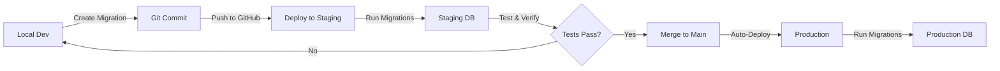

# Limitless OS - Database Schema

**Complete database design for Supabase PostgreSQL with Drizzle ORM**

---

## Table of Contents

1. [Overview](#overview)
2. [Database Tables](#database-tables)
3. [Drizzle Schema Definitions](#drizzle-schema-definitions)
4. [Indexes & Performance](#indexes--performance)
5. [pgvector Setup](#pgvector-setup)
6. [Migration Strategy](#migration-strategy)
7. [Branching Strategy](#branching-strategy)
8. [Data Flow](#data-flow)

---

## Overview

### **Database Provider**
- **Provider**: Supabase PostgreSQL
- **ORM**: Drizzle ORM
- **Extensions**: pgvector (for embeddings)
- **Branching**: Staging + Production

### **Key Design Decisions**
- ✅ LangGraph checkpoints stored by LangGraph (automatic)
- ✅ Application tables managed by Drizzle migrations
- ✅ pgvector for RAG embeddings
- ✅ Separate tables for owners, campaigns, documents, conversations
- ✅ Optimized indexes for query performance

---

## Database Tables

### **Table Overview**

| Table | Purpose | Managed By | Records |
|-------|---------|------------|---------|
| `checkpoints` | LangGraph conversation state | LangGraph | Per conversation step |
| `checkpoint_writes` | LangGraph write operations | LangGraph | Per state update |
| `owners` | Owner authentication & profile | Drizzle | Single owner |
| `campaigns` | Campaign codes & tracking | Drizzle | Per campaign |
| `documents` | Uploaded documents metadata | Drizzle | Per document |
| `document_embeddings` | RAG embeddings storage | Drizzle | Per document chunk |
| `conversations` | Conversation metadata | Drizzle | Per lead |
| `analytics_events` | Conversion tracking | Drizzle | Per event |
| `payments` | Stripe payment records | Drizzle | Per payment |

---

## Drizzle Schema Definitions

### **1. LangGraph Tables (Auto-Created)**

**Note**: These tables are automatically created by LangGraph's PostgresSaver. Do not modify.

```typescript
// checkpoints table (managed by LangGraph)
// Structure (reference only, do not create):
{
  thread_id: text (PK)
  checkpoint_id: text (PK)
  parent_checkpoint_id: text | null
  checkpoint: jsonb  // Full conversation state
  metadata: jsonb
  created_at: timestamp
}

// checkpoint_writes table (managed by LangGraph)
{
  thread_id: text
  checkpoint_id: text
  task_id: text
  idx: integer
  channel: text
  value: jsonb
  created_at: timestamp
}
```

---

### **2. Owners Table**

**Purpose**: Store owner authentication and profile data

```typescript
// Drizzle Schema (drizzle/schema/owners.ts)

import { pgTable, text, timestamp, boolean } from 'drizzle-orm/pg-core';

export const owners = pgTable('owners', {
  id: text('id').primaryKey().default('owner-001'),
  email: text('email').notNull().unique(),
  name: text('name').notNull(),
  instagram_handle: text('instagram_handle'),
  
  // Supabase Auth integration
  supabase_user_id: text('supabase_user_id').notNull().unique(),
  
  // Metadata
  created_at: timestamp('created_at').defaultNow().notNull(),
  last_login_at: timestamp('last_login_at'),
  is_active: boolean('is_active').default(true).notNull()
});
```

**Indexes**:
```sql
CREATE INDEX idx_owners_supabase_user_id ON owners(supabase_user_id);
CREATE INDEX idx_owners_email ON owners(email);
```

---

### **3. Campaigns Table**

**Purpose**: Track campaign codes and usage

```typescript
// Drizzle Schema (drizzle/schema/campaigns.ts)

import { pgTable, text, timestamp, integer, boolean } from 'drizzle-orm/pg-core';

export const campaigns = pgTable('campaigns', {
  id: text('id').primaryKey().default(sql`gen_random_uuid()`),
  
  // Campaign identification
  code: text('code').notNull().unique(), // e.g., "ABC123"
  name: text('name').notNull(), // e.g., "Instagram Ads - Jan 2025"
  description: text('description'),
  
  // Owner relationship
  owner_id: text('owner_id').references(() => owners.id).notNull(),
  
  // Optional: Platform/source tracking
  platform: text('platform'), // "instagram", "facebook", "youtube", etc.
  
  // Simple on/off switch
  is_active: boolean('is_active').default(true).notNull(),
  
  // Analytics tracking
  total_clicks: integer('total_clicks').default(0).notNull(),
  total_conversations: integer('total_conversations').default(0).notNull(),
  total_qualified: integer('total_qualified').default(0).notNull(),
  total_conversions: integer('total_conversions').default(0).notNull(),
  
  // Metadata
  created_at: timestamp('created_at').defaultNow().notNull(),
  updated_at: timestamp('updated_at').defaultNow().notNull()
});
```

**Indexes**:
```sql
CREATE UNIQUE INDEX idx_campaigns_code ON campaigns(code);
CREATE INDEX idx_campaigns_owner_id ON campaigns(owner_id);
CREATE INDEX idx_campaigns_is_active ON campaigns(is_active) WHERE is_active = true;
```

---

### **4. Documents Table**

**Purpose**: Store metadata for uploaded documents

```typescript
// Drizzle Schema (drizzle/schema/documents.ts)

import { pgTable, text, timestamp, integer, jsonb } from 'drizzle-orm/pg-core';

export const documents = pgTable('documents', {
  id: text('id').primaryKey().default(sql`gen_random_uuid()`),
  
  // Document info
  filename: text('filename').notNull(),
  file_type: text('file_type').notNull(), // "pdf", "docx", "txt", "md"
  file_size: integer('file_size').notNull(), // bytes
  
  // Storage
  storage_url: text('storage_url').notNull(), // Google Cloud Storage URL
  storage_bucket: text('storage_bucket').notNull(),
  
  // Owner relationship
  owner_id: text('owner_id').references(() => owners.id).notNull(),
  
  // Document categorization
  category: text('category'), // "pitch", "objection", "faq", "product_info"
  tags: jsonb('tags').$type<string[]>(), // ["pricing", "features"]
  
  // Processing status
  processing_status: text('processing_status').notNull().default('pending'), // "pending", "processing", "completed", "failed"
  embeddings_created: boolean('embeddings_created').default(false).notNull(),
  total_chunks: integer('total_chunks').default(0),
  
  // Version tracking
  version: integer('version').default(1).notNull(),
  replaced_by_id: text('replaced_by_id').references(() => documents.id),
  
  // Metadata
  created_at: timestamp('created_at').defaultNow().notNull(),
  processed_at: timestamp('processed_at')
});
```

**Indexes**:
```sql
CREATE INDEX idx_documents_owner_id ON documents(owner_id);
CREATE INDEX idx_documents_category ON documents(category);
CREATE INDEX idx_documents_processing_status ON documents(processing_status);
CREATE INDEX idx_documents_created_at ON documents(created_at DESC);
```

---

### **5. Document Embeddings Table**

**Purpose**: Store vector embeddings for RAG

```typescript
// Drizzle Schema (drizzle/schema/document_embeddings.ts)

import { pgTable, text, timestamp, integer, real, vector } from 'drizzle-orm/pg-core';

export const documentEmbeddings = pgTable('document_embeddings', {
  id: text('id').primaryKey().default(sql`gen_random_uuid()`),
  
  // Document relationship
  document_id: text('document_id').references(() => documents.id, { onDelete: 'cascade' }).notNull(),
  
  // Chunk information
  chunk_index: integer('chunk_index').notNull(),
  chunk_text: text('chunk_text').notNull(),
  chunk_metadata: jsonb('chunk_metadata').$type<{
    page?: number;
    section?: string;
    start_char?: number;
    end_char?: number;
  }>(),
  
  // Embedding vector (1536 dimensions for text-embedding-3-small)
  embedding: vector('embedding', { dimensions: 1536 }).notNull(),
  
  // Metadata
  created_at: timestamp('created_at').defaultNow().notNull()
});
```

**Indexes** (Critical for Performance):
```sql
-- Vector similarity search index (HNSW algorithm)
CREATE INDEX idx_document_embeddings_vector 
ON document_embeddings 
USING hnsw (embedding vector_cosine_ops);

-- Filter indexes
CREATE INDEX idx_document_embeddings_document_id ON document_embeddings(document_id);
CREATE INDEX idx_document_embeddings_chunk_index ON document_embeddings(chunk_index);
```

---

### **6. Conversations Table**

**Purpose**: Track conversation metadata and analytics

```typescript
// Drizzle Schema (drizzle/schema/conversations.ts)

import { pgTable, text, timestamp, boolean, real, integer } from 'drizzle-orm/pg-core';

export const conversations = pgTable('conversations', {
  id: text('id').primaryKey(), // Same as thread_id from LangGraph
  
  // Lead identification
  instagram_handle: text('instagram_handle').notNull(),
  email: text('email'),
  
  // Campaign tracking
  campaign_id: text('campaign_id').references(() => campaigns.id).notNull(),
  campaign_code: text('campaign_code').notNull(),
  
  // Conversation status
  current_stage: text('current_stage').notNull(), // "greeting", "qualification", etc.
  qualified: boolean('qualified').default(false).notNull(),
  qualification_score: real('qualification_score').default(0),
  
  // Business data
  business_type: text('business_type'),
  monthly_revenue: text('monthly_revenue'),
  main_pain_point: text('main_pain_point'),
  
  // Sales progress
  pitch_delivered: boolean('pitch_delivered').default(false).notNull(),
  pitch_type: text('pitch_type'), // "warm" | "cold"
  payment_link_sent: boolean('payment_link_sent').default(false).notNull(),
  payment_completed: boolean('payment_completed').default(false).notNull(),
  preferred_plan: text('preferred_plan'), // "option1" | "option2"
  
  // Interaction metrics
  total_messages: integer('total_messages').default(0).notNull(),
  total_sessions: integer('total_sessions').default(1).notNull(),
  followup_count: integer('followup_count').default(0).notNull(),
  
  // Timestamps
  created_at: timestamp('created_at').defaultNow().notNull(),
  last_message_at: timestamp('last_message_at').defaultNow().notNull(),
  completed_at: timestamp('completed_at')
});
```

**Indexes**:
```sql
CREATE INDEX idx_conversations_instagram_handle ON conversations(instagram_handle);
CREATE INDEX idx_conversations_campaign_id ON conversations(campaign_id);
CREATE INDEX idx_conversations_current_stage ON conversations(current_stage);
CREATE INDEX idx_conversations_qualified ON conversations(qualified) WHERE qualified = true;
CREATE INDEX idx_conversations_created_at ON conversations(created_at DESC);
CREATE INDEX idx_conversations_last_message_at ON conversations(last_message_at DESC);
```

---

### **7. Analytics Events Table**

**Purpose**: Track conversion funnel events

```typescript
// Drizzle Schema (drizzle/schema/analytics_events.ts)

import { pgTable, text, timestamp, jsonb } from 'drizzle-orm/pg-core';

export const analyticsEvents = pgTable('analytics_events', {
  id: text('id').primaryKey().default(sql`gen_random_uuid()`),
  
  // Relationships
  conversation_id: text('conversation_id').references(() => conversations.id),
  campaign_id: text('campaign_id').references(() => campaigns.id),
  
  // Event data
  event_type: text('event_type').notNull(), // "campaign_click", "conversation_started", "qualified", "pitch_delivered", "objection_raised", "payment_completed"
  event_data: jsonb('event_data'),
  
  // Metadata
  created_at: timestamp('created_at').defaultNow().notNull()
});
```

**Indexes**:
```sql
CREATE INDEX idx_analytics_events_conversation_id ON analytics_events(conversation_id);
CREATE INDEX idx_analytics_events_campaign_id ON analytics_events(campaign_id);
CREATE INDEX idx_analytics_events_event_type ON analytics_events(event_type);
CREATE INDEX idx_analytics_events_created_at ON analytics_events(created_at DESC);
```

---

### **8. Payments Table**

**Purpose**: Track Stripe payment records

```typescript
// Drizzle Schema (drizzle/schema/payments.ts)

import { pgTable, text, timestamp, integer } from 'drizzle-orm/pg-core';

export const payments = pgTable('payments', {
  id: text('id').primaryKey().default(sql`gen_random_uuid()`),
  
  // Relationships
  conversation_id: text('conversation_id').references(() => conversations.id).notNull(),
  campaign_id: text('campaign_id').references(() => campaigns.id).notNull(),
  
  // Lead info
  instagram_handle: text('instagram_handle').notNull(),
  email: text('email').notNull(),
  
  // Stripe data
  stripe_session_id: text('stripe_session_id').notNull().unique(),
  stripe_customer_id: text('stripe_customer_id'),
  stripe_subscription_id: text('stripe_subscription_id'),
  
  // Payment details
  plan: text('plan').notNull(), // "option1" | "option2"
  amount_monthly: integer('amount_monthly').notNull(), // cents
  amount_onetime: integer('amount_onetime'), // cents (for option1)
  currency: text('currency').default('usd').notNull(),
  
  // Status
  payment_status: text('payment_status').notNull(), // "pending", "completed", "failed", "refunded"
  
  // Timestamps
  created_at: timestamp('created_at').defaultNow().notNull(),
  completed_at: timestamp('completed_at')
});
```

**Indexes**:
```sql
CREATE INDEX idx_payments_conversation_id ON payments(conversation_id);
CREATE INDEX idx_payments_campaign_id ON payments(campaign_id);
CREATE INDEX idx_payments_stripe_session_id ON payments(stripe_session_id);
CREATE INDEX idx_payments_payment_status ON payments(payment_status);
CREATE INDEX idx_payments_created_at ON payments(created_at DESC);
```

---

## Indexes & Performance

### **Critical Indexes Summary**

```sql
-- LangGraph checkpoints (for conversation resume)
CREATE INDEX idx_checkpoints_thread_id ON checkpoints(thread_id);

-- Campaign lookups
CREATE UNIQUE INDEX idx_campaigns_code ON campaigns(code);

-- Document RAG queries
CREATE INDEX idx_document_embeddings_vector 
ON document_embeddings 
USING hnsw (embedding vector_cosine_ops);

-- Conversation queries
CREATE INDEX idx_conversations_instagram_handle ON conversations(instagram_handle);
CREATE INDEX idx_conversations_last_message_at ON conversations(last_message_at DESC);

-- Analytics
CREATE INDEX idx_analytics_events_event_type ON analytics_events(event_type);
CREATE INDEX idx_analytics_events_created_at ON analytics_events(created_at DESC);
```

### **Query Performance Targets**

| Query Type | Target Latency | Index Used |
|------------|----------------|------------|
| Campaign code lookup | < 10ms | idx_campaigns_code |
| Vector similarity search | < 100ms | idx_document_embeddings_vector |
| Conversation resume | < 50ms | idx_checkpoints_thread_id |
| Analytics dashboard | < 500ms | idx_analytics_events_created_at |

---

## pgvector Setup

### **Extension Installation**

```sql
-- Enable pgvector extension (run once per database)
CREATE EXTENSION IF NOT EXISTS vector;
```

### **Embedding Configuration**

```typescript
// Embedding model configuration
{
  model: "text-embedding-3-small",
  dimensions: 1536,
  distance_metric: "cosine"  // Also supports: euclidean, inner_product
}
```

### **Vector Search Query Example**

```sql
-- Find top 3 most similar chunks to a query embedding
SELECT 
  de.chunk_text,
  de.chunk_metadata,
  d.filename,
  d.category,
  1 - (de.embedding <=> $1::vector) AS similarity
FROM document_embeddings de
JOIN documents d ON de.document_id = d.id
WHERE d.processing_status = 'completed'
  AND d.category = $2  -- Optional filter
ORDER BY de.embedding <=> $1::vector
LIMIT 3;
```

**Parameters**:
- `$1`: Query embedding (vector)
- `$2`: Category filter (optional)

---

## Migration Strategy

### **Drizzle Migrations Setup**

```typescript
// drizzle.config.ts

import type { Config } from 'drizzle-kit';

export default {
  schema: './drizzle/schema/*',
  out: './drizzle/migrations',
  driver: 'pg',
  dbCredentials: {
    connectionString: process.env.DATABASE_URL!
  }
} satisfies Config;
```

### **Migration Workflow**

**1. Create Migration**
```bash
# Generate migration from schema changes
npx drizzle-kit generate:pg

# Creates: drizzle/migrations/0001_create_owners_table.sql
```

**2. Apply Migration (Staging)**
```bash
# Set staging database URL
export DATABASE_URL="postgresql://staging-connection-string"

# Run migration
npx drizzle-kit push:pg
```

**3. Test in Staging**
```bash
# Verify schema
npx drizzle-kit introspect:pg

# Run integration tests
npm run test:integration
```

**4. Apply Migration (Production)**
```bash
# Set production database URL
export DATABASE_URL="postgresql://prod-connection-string"

# Run migration
npx drizzle-kit push:pg
```

### **Migration Files Structure**

```
drizzle/
├── schema/
│   ├── owners.ts
│   ├── campaigns.ts
│   ├── documents.ts
│   ├── document_embeddings.ts
│   ├── conversations.ts
│   ├── analytics_events.ts
│   └── payments.ts
├── migrations/
│   ├── 0001_create_owners.sql
│   ├── 0002_create_campaigns.sql
│   ├── 0003_create_documents.sql
│   ├── 0004_enable_pgvector.sql
│   ├── 0005_create_document_embeddings.sql
│   ├── 0006_create_conversations.sql
│   ├── 0007_create_analytics_events.sql
│   └── 0008_create_payments.sql
└── meta/
    └── _journal.json
```

---

## Branching Strategy

### **Supabase Branch Setup**

**Environments**:
1. **Production** - Main branch (live customer data)
2. **Staging** - Preview branch (testing)

**Configuration**:
```typescript
// lib/supabase.ts

const supabaseUrl = process.env.NEXT_PUBLIC_SUPABASE_URL!;
const supabaseKey = process.env.NODE_ENV === 'production'
  ? process.env.SUPABASE_ANON_KEY_PROD!
  : process.env.SUPABASE_ANON_KEY_STAGING!;

export const supabase = createClient(supabaseUrl, supabaseKey);
```

**Environment Variables**:
```bash
# Production
DATABASE_URL_PROD=postgresql://prod.supabase.co/postgres
SUPABASE_ANON_KEY_PROD=eyJhbGc...

# Staging
DATABASE_URL_STAGING=postgresql://staging.supabase.co/postgres
SUPABASE_ANON_KEY_STAGING=eyJhbGc...
```

### **Branch Workflow**



---

## Data Flow

### **1. Campaign Creation Flow**

```
Owner Dashboard (Next.js)
    ↓
POST /api/campaigns/create
    ↓
Drizzle Insert → campaigns table
    ↓
Generate campaign URL
    ↓
Return to owner
```

### **2. Document Upload Flow**

```
Owner Dashboard (Next.js)
    ↓
POST /api/documents/upload
    ↓
Upload file → Google Cloud Storage
    ↓
Drizzle Insert → documents table (status: "pending")
    ↓
Trigger Python worker (Google Cloud)
    ↓
Process document → Create embeddings
    ↓
Drizzle Insert → document_embeddings table
    ↓
Update documents table (status: "completed")
```

### **3. Conversation Flow**

```
Lead clicks campaign URL
    ↓
Validate campaign code (campaigns table)
    ↓
Create/load conversation (conversations table)
    ↓
Load LangGraph state (checkpoints table)
    ↓
Agent processes message (uses RAG via document_embeddings)
    ↓
Update state → LangGraph saves checkpoint
    ↓
Update conversation metadata (conversations table)
    ↓
Log analytics event (analytics_events table)
```

### **4. Payment Flow**

```
Closer agent sends Stripe link
    ↓
Update conversation (payment_link_sent: true)
    ↓
Lead completes payment on Stripe
    ↓
Stripe webhook → POST /api/webhooks/stripe
    ↓
Drizzle Insert → payments table
    ↓
Update conversation (payment_completed: true)
    ↓
Update campaign stats (total_conversions++)
    ↓
Trigger onboarding email
```

---

## Data Retention & Cleanup

### **Retention Policies**

| Table | Retention | Cleanup Strategy |
|-------|-----------|------------------|
| checkpoints | 90 days | Archive old completed conversations |
| conversations | Indefinite | Archive after 1 year of inactivity |
| documents | Indefinite | Owner manages |
| document_embeddings | Indefinite | Delete when document deleted (cascade) |
| analytics_events | 2 years | Archive to data warehouse |
| payments | Indefinite | Required for accounting |

### **Cleanup Scripts**

```sql
-- Archive completed conversations older than 90 days
WITH old_conversations AS (
  SELECT id FROM conversations
  WHERE current_stage IN ('complete', 'nurture')
    AND completed_at < NOW() - INTERVAL '90 days'
)
DELETE FROM checkpoints
WHERE thread_id IN (SELECT id FROM old_conversations);
```

---

## Security Considerations

### **Row-Level Security (RLS)**

```sql
-- Enable RLS on all tables
ALTER TABLE owners ENABLE ROW LEVEL SECURITY;
ALTER TABLE campaigns ENABLE ROW LEVEL SECURITY;
ALTER TABLE documents ENABLE ROW LEVEL SECURITY;
ALTER TABLE conversations ENABLE ROW LEVEL SECURITY;

-- Owner can only access their own data
CREATE POLICY "Owners can only access their own campaigns"
ON campaigns FOR ALL
USING (owner_id = auth.uid());

CREATE POLICY "Owners can only access their own documents"
ON documents FOR ALL
USING (owner_id = auth.uid());
```

### **Encryption**

- ✅ All data encrypted in transit (TLS)
- ✅ All data encrypted at rest (Supabase default)
- ✅ Sensitive fields (email, stripe_customer_id) encrypted with pgcrypto

---

**This schema provides a complete foundation for the Limitless OS application with optimized performance, security, and scalability.**
