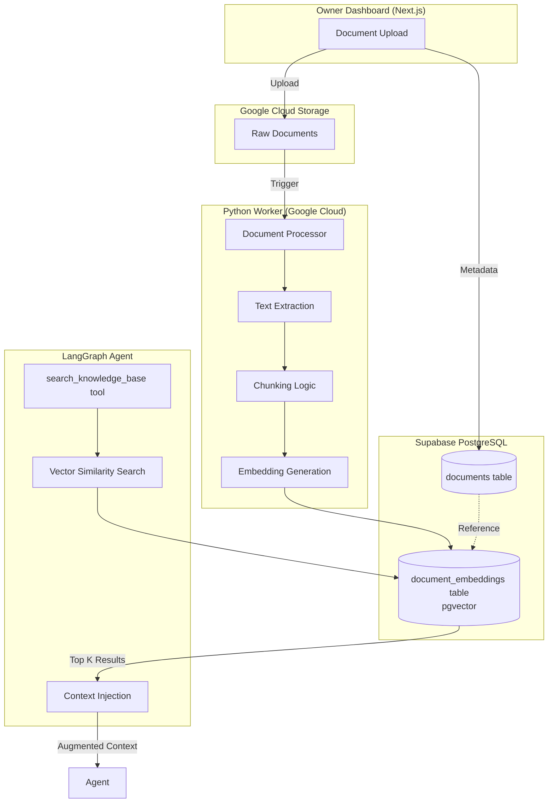

# Limitless OS - RAG System Architecture

**Retrieval Augmented Generation for dynamic knowledge base**

---

## Overview

The RAG (Retrieval Augmented Generation) system allows the owner to upload documents that become the AI agent's knowledge base. This enables dynamic updates to sales scripts, objection responses, and product information without code changes.

### **Key Features**
- ✅ Document upload (PDF, DOCX, TXT, Markdown)
- ✅ Automatic chunking and embedding generation
- ✅ Vector similarity search
- ✅ Real-time knowledge updates
- ✅ Source attribution

---

## Architecture



---

## Document Processing Pipeline

### **Step 1: Document Upload**

```typescript
// Next.js API Route: /api/documents/upload

export async function POST(req: Request) {
  const formData = await req.formData();
  const file = formData.get('file') as File;
  const category = formData.get('category') as string;
  
  // 1. Upload to Google Cloud Storage
  const storageUrl = await uploadToGCS(file);
  
  // 2. Insert metadata to Supabase
  const document = await db.insert(documents).values({
    filename: file.name,
    file_type: getFileExtension(file.name),
    file_size: file.size,
    storage_url: storageUrl,
    storage_bucket: 'limitlessos-documents',
    owner_id: ownerId,
    category: category,
    processing_status: 'pending'
  }).returning();
  
  // 3. Trigger Python worker
  await triggerDocumentProcessor(document.id);
  
  return Response.json({ success: true, document });
}
```

---

### **Step 2: Text Extraction**

**Python Worker** (Google Cloud Run):

```python
# document_processor.py

import PyPDF2
import docx
from google.cloud import storage

async def extract_text(document_id: str) -> str:
    # 1. Fetch document metadata
    doc = await db.query(
        "SELECT * FROM documents WHERE id = $1",
        document_id
    )
    
    # 2. Download from GCS
    storage_client = storage.Client()
    bucket = storage_client.bucket(doc['storage_bucket'])
    blob = bucket.blob(doc['storage_url'])
    file_content = blob.download_as_bytes()
    
    # 3. Extract text based on file type
    if doc['file_type'] == 'pdf':
        text = extract_pdf_text(file_content)
    elif doc['file_type'] == 'docx':
        text = extract_docx_text(file_content)
    elif doc['file_type'] == 'txt':
        text = file_content.decode('utf-8')
    elif doc['file_type'] == 'md':
        text = file_content.decode('utf-8')
    
    return text
```

**Supported Formats**:
- **PDF**: PyPDF2, pdfplumber
- **DOCX**: python-docx
- **TXT**: Direct read
- **Markdown**: Direct read

---

### **Step 3: Chunking**

**Chunking Strategy**: Recursive character text splitter

```python
from langchain.text_splitter import RecursiveCharacterTextSplitter

def chunk_document(text: str, document_id: str) -> list[dict]:
    splitter = RecursiveCharacterTextSplitter(
        chunk_size=800,      # tokens per chunk
        chunk_overlap=200,   # overlap between chunks
        separators=["\n\n", "\n", ". ", " ", ""]
    )
    
    chunks = splitter.split_text(text)
    
    # Create chunk metadata
    chunk_data = []
    for idx, chunk in enumerate(chunks):
        chunk_data.append({
            'document_id': document_id,
            'chunk_index': idx,
            'chunk_text': chunk,
            'chunk_metadata': {
                'start_char': idx * 600,  # Approximate
                'end_char': (idx + 1) * 600
            }
        })
    
    return chunk_data
```

**Chunking Parameters**:
- **Chunk Size**: 800 characters (~200 tokens)
- **Overlap**: 200 characters (preserve context)
- **Separators**: Prioritize paragraph > sentence > word boundaries

---

### **Step 4: Embedding Generation**

```python
from openai import OpenAI

client = OpenAI(api_key=os.getenv('OPENAI_API_KEY'))

async def generate_embeddings(chunks: list[dict]) -> list[dict]:
    # Batch process for efficiency
    batch_size = 100
    
    for i in range(0, len(chunks), batch_size):
        batch = chunks[i:i + batch_size]
        texts = [chunk['chunk_text'] for chunk in batch]
        
        # Generate embeddings
        response = client.embeddings.create(
            model="text-embedding-3-small",
            input=texts,
            dimensions=1536
        )
        
        # Add embeddings to chunks
        for j, chunk in enumerate(batch):
            chunk['embedding'] = response.data[j].embedding
    
    return chunks
```

**Embedding Model**:
- **Model**: `text-embedding-3-small`
- **Dimensions**: 1536
- **Cost**: $0.02 / 1M tokens
- **Performance**: ~50ms per batch of 100 chunks

---

### **Step 5: Storage**

```python
from pgvector.psycopg import register_vector

async def store_embeddings(chunks: list[dict]):
    conn = await asyncpg.connect(database_url)
    await register_vector(conn)
    
    # Batch insert
    values = []
    for chunk in chunks:
        values.append((
            chunk['document_id'],
            chunk['chunk_index'],
            chunk['chunk_text'],
            chunk['chunk_metadata'],
            chunk['embedding']  # vector type
        ))
    
    await conn.executemany(
        """
        INSERT INTO document_embeddings 
        (document_id, chunk_index, chunk_text, chunk_metadata, embedding)
        VALUES ($1, $2, $3, $4, $5)
        """,
        values
    )
    
    # Update document status
    await conn.execute(
        """
        UPDATE documents 
        SET processing_status = 'completed',
            embeddings_created = true,
            total_chunks = $1,
            processed_at = NOW()
        WHERE id = $2
        """,
        len(chunks),
        chunks[0]['document_id']
    )
```

---

## Vector Search

### **Search Query**

```python
async def search_knowledge_base(
    query: str,
    top_k: int = 3,
    category: str | None = None,
    min_similarity: float = 0.7
) -> list[dict]:
    # 1. Generate query embedding
    response = client.embeddings.create(
        model="text-embedding-3-small",
        input=query
    )
    query_embedding = response.data[0].embedding
    
    # 2. Vector similarity search
    sql = """
    SELECT 
        de.chunk_text,
        de.chunk_metadata,
        d.filename,
        d.category,
        1 - (de.embedding <=> $1::vector) AS similarity
    FROM document_embeddings de
    JOIN documents d ON de.document_id = d.id
    WHERE d.processing_status = 'completed'
    """
    
    params = [query_embedding]
    
    # Optional: Filter by category
    if category:
        sql += " AND d.category = $2"
        params.append(category)
    
    # Order by similarity and limit
    sql += """
    ORDER BY de.embedding <=> $1::vector
    LIMIT ${}
    """.format(len(params) + 1)
    params.append(top_k)
    
    results = await conn.fetch(sql, *params)
    
    # Filter by minimum similarity
    return [
        r for r in results 
        if r['similarity'] >= min_similarity
    ]
```

### **Distance Metrics**

| Metric | Operator | Use Case |
|--------|----------|----------|
| Cosine | `<=>` | **Recommended** - Best for semantic similarity |
| Euclidean | `<->` | When magnitude matters |
| Inner Product | `<#>` | For normalized vectors |

**Chosen**: Cosine similarity (`<=>`)

---

## Integration with LangGraph

### **Tool Implementation**

```python
# tools/search_knowledge_base.py

from langchain.tools import Tool

def create_search_tool():
    return Tool(
        name="search_knowledge_base",
        description="""Search uploaded documents for relevant information.
        Use this to find pitch scripts, objection responses, product details, etc.
        
        Args:
            query (str): Search query (e.g., 'warm pitch for fitness coach')
            category (str, optional): Filter by document category
        
        Returns:
            List of relevant text chunks with sources
        """,
        func=search_knowledge_base_wrapper
    )

async def search_knowledge_base_wrapper(
    query: str,
    category: str | None = None
) -> str:
    results = await search_knowledge_base(
        query=query,
        top_k=3,
        category=category
    )
    
    if not results:
        return "No relevant information found."
    
    # Format results
    output = []
    for r in results:
        output.append(f"""
Source: {r['filename']}
Similarity: {r['similarity']:.2f}
Content: {r['chunk_text']}
---
        """)
    
    return "\n".join(output)
```

### **Agent Usage Example**

```python
# Agent receives query: "What should I say about pricing?"

# 1. Agent calls search_knowledge_base tool
results = search_knowledge_base(
    query="pricing objection response",
    category="objection"
)

# 2. Results returned:
"""
Source: objection_responses.pdf
Similarity: 0.89
Content: When handling the "too expensive" objection, emphasize 
that most clients save $2,000+ per month by replacing their 
current tools, so Limitless OS often pays for itself in month one.
---
"""

# 3. Agent uses context to craft response
agent_response = """
Totally understand. Most of our clients actually save $2,000+ per 
month by replacing their current tools — so it often pays for 
itself in month one.
"""
```

---

## Document Categories

### **Predefined Categories**

| Category | Purpose | Example Content |
|----------|---------|-----------------|
| `pitch` | Sales pitch scripts | Warm pitch, cold pitch templates |
| `objection` | Objection responses | Price, time, past failure responses |
| `product_info` | Product details | Features, pricing, inclusions |
| `faq` | Frequently asked questions | Common questions and answers |
| `testimonial` | Customer testimonials | Success stories, case studies |
| `onboarding` | Onboarding instructions | Next steps after payment |

### **Custom Categories**

Owner can create custom categories for specific use cases:
- `promotion` - Limited-time offers
- `comparison` - Competitor comparisons
- `demo` - Product demo scripts

---

## Performance Optimization

### **1. Index Optimization**

```sql
-- HNSW index for fast vector search
CREATE INDEX idx_document_embeddings_vector 
ON document_embeddings 
USING hnsw (embedding vector_cosine_ops)
WITH (m = 16, ef_construction = 64);

-- Parameters:
-- m: Max connections per layer (higher = better recall, slower build)
-- ef_construction: Size of dynamic candidate list (higher = better recall)
```

**Query Performance**:
- Without index: ~2-5 seconds
- With HNSW index: ~50-100ms

### **2. Caching**

```python
import redis

async def search_with_cache(query: str, category: str | None = None):
    cache_key = f"rag:{query}:{category}"
    
    # Check cache
    cached = await redis.get(cache_key)
    if cached:
        return json.loads(cached)
    
    # Query database
    results = await search_knowledge_base(query, category=category)
    
    # Cache for 1 hour
    await redis.setex(cache_key, 3600, json.dumps(results))
    
    return results
```

### **3. Batch Processing**

```python
# Process multiple documents in parallel
async def process_documents_batch(document_ids: list[str]):
    tasks = [process_document(doc_id) for doc_id in document_ids]
    await asyncio.gather(*tasks)
```

---

## Monitoring & Debugging

### **Processing Status**

```typescript
// Owner dashboard: Document processing status

interface DocumentStatus {
  id: string;
  filename: string;
  processing_status: 'pending' | 'processing' | 'completed' | 'failed';
  progress?: {
    current_step: string;  // "extracting" | "chunking" | "embedding" | "storing"
    chunks_processed: number;
    total_chunks: number;
  };
  error?: string;
}
```

### **Search Quality Metrics**

```python
# Track search performance
await log_search_metrics({
    'query': query,
    'category': category,
    'results_count': len(results),
    'avg_similarity': avg_similarity,
    'latency_ms': latency,
    'used_cache': used_cache
})
```

---

## Document Versioning

### **Version Control**

```typescript
// When owner uploads new version of document

async function replaceDocument(oldDocId: string, newFile: File) {
  // 1. Upload new document
  const newDoc = await uploadDocument(newFile);
  
  // 2. Link to old document
  await db.update(documents)
    .set({ replaced_by_id: newDoc.id })
    .where(eq(documents.id, oldDocId));
  
  // 3. Mark old document as inactive
  await db.update(documents)
    .set({ is_active: false })
    .where(eq(documents.id, oldDocId));
  
  // 4. Process new document
  await triggerDocumentProcessor(newDoc.id);
}
```

---

## Cost Analysis

### **Embedding Generation Costs**

**Example Document**:
- Size: 10,000 words
- Tokens: ~13,000 tokens
- Cost: $0.026 (at $0.02 / 1M tokens)

**Monthly Costs (10 documents uploaded)**:
- Embedding generation: $0.26
- Storage: ~$0.01 (pgvector)
- **Total**: ~$0.27/month

**Very affordable** ✅

---

## Best Practices

### **For Owners**

✅ **Do:**
- Upload separate documents for different topics
- Use clear filenames (e.g., "warm_pitch_script.pdf")
- Categorize documents correctly
- Update documents when strategy changes
- Review search results in test mode

❌ **Don't:**
- Upload duplicate content
- Mix unrelated topics in one document
- Upload extremely large files (>10MB)
- Change documents during active campaigns (finish campaigns first)

### **For Developers**

✅ **Do:**
- Monitor embedding generation errors
- Track search quality metrics
- Implement retry logic for failed processing
- Cache frequent queries
- Use appropriate chunk sizes

❌ **Don't:**
- Re-generate embeddings unnecessarily
- Skip error handling
- Ignore failed documents
- Over-chunk (too many small pieces)
- Under-chunk (lose context)

---

**This RAG system enables dynamic, document-driven AI agent behavior without code deployments.**
