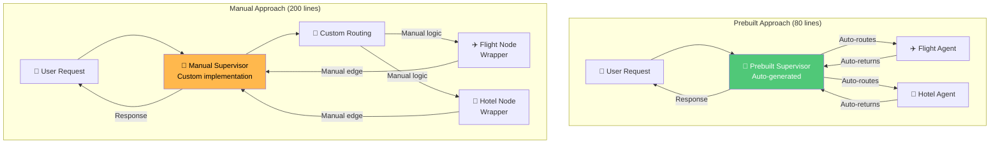
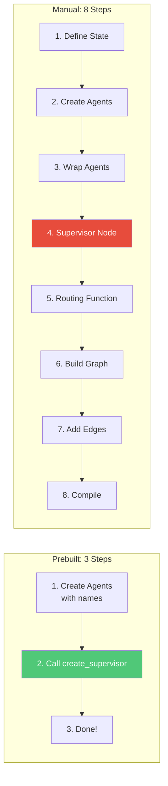
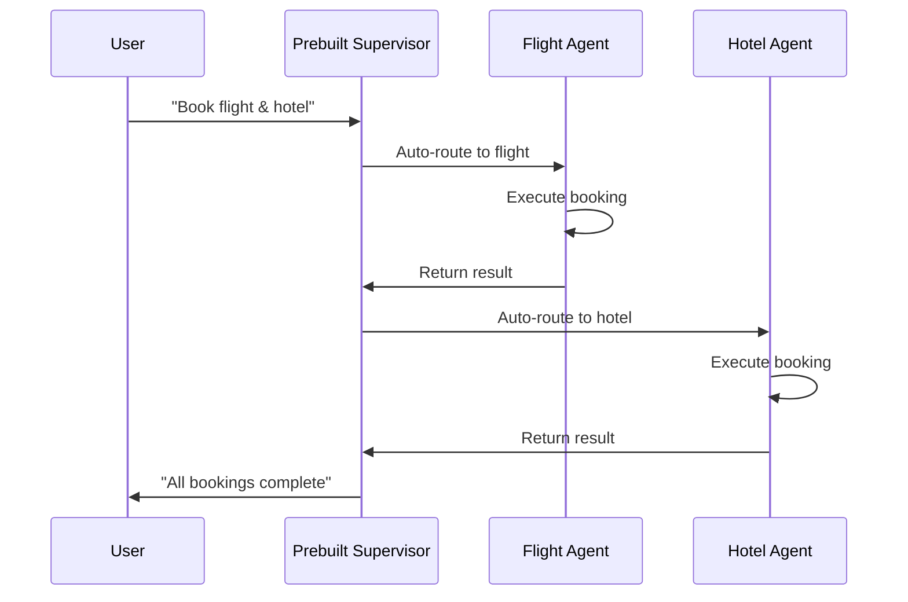
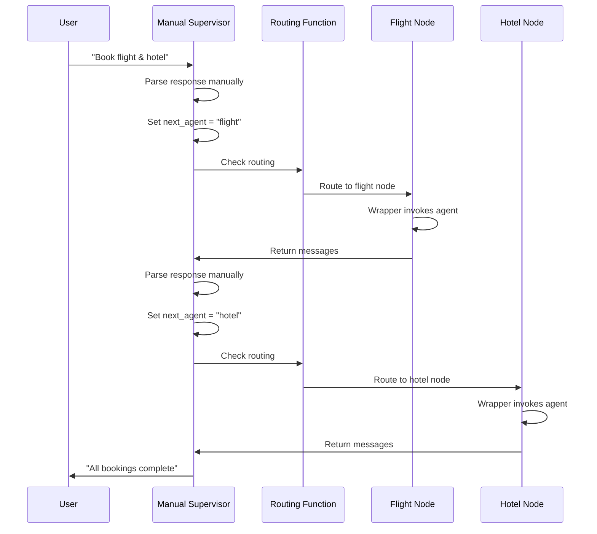
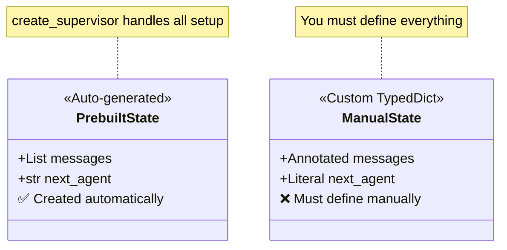
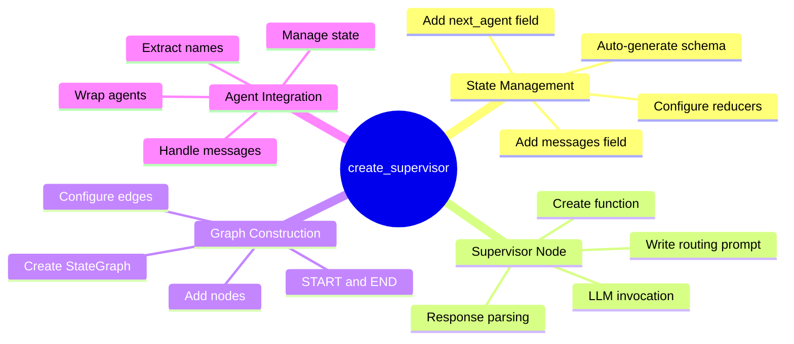
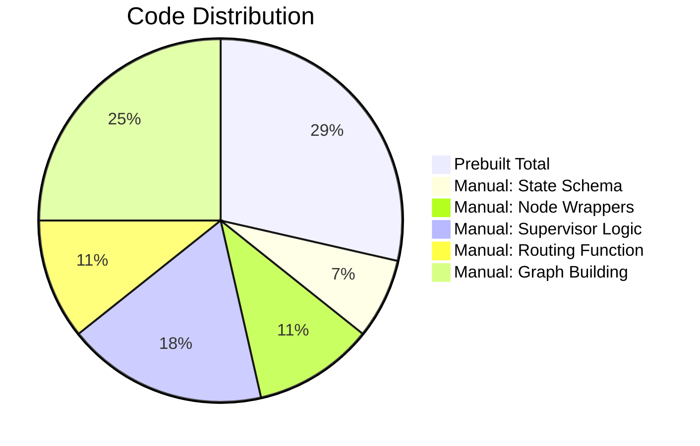
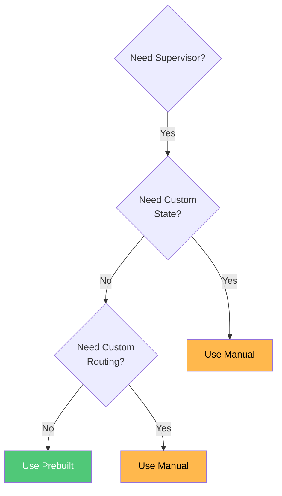
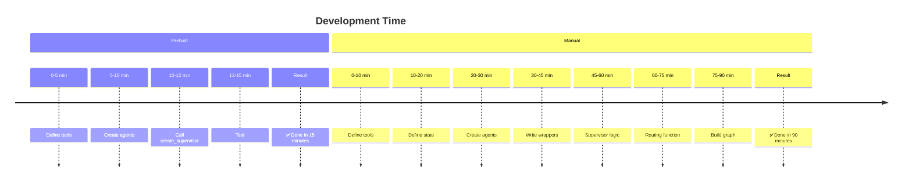

# Prebuilt vs Manual Supervisor - Architecture Diagrams

This document provides comprehensive visual explanations comparing the **prebuilt** (`create_supervisor`) and **manual** approaches to building supervisor multi-agent systems.

---

## 1. High-Level Architecture Comparison

---

## 2. Code Complexity Comparison

---

## 3. Prebuilt Supervisor Flow

---

## 4. Manual Supervisor Flow

---

## 5. State Management Comparison

---

## 6. What create_supervisor Does Automatically

---

## 7. Lines of Code Breakdown

**Total:** Prebuilt ~80 lines vs Manual ~200 lines

---

## 8. Feature Comparison Matrix

| Feature | Prebuilt | Manual |
|---------|----------|--------|
| State Schema | ✅ Auto | ❌ Manual |
| Supervisor Node | ✅ Auto | ❌ Manual |
| Routing Logic | ✅ Auto | ❌ Manual |
| Graph Construction | ✅ Auto | ❌ Manual |
| Agent Wrapping | ✅ Auto | ❌ Manual |
| Customization | ⚠️ Limited | ✅ Full |
| Learning Curve | ✅ Easy | ❌ Steep |
| Development Time | ⚡ 15 min | 🐌 90 min |

---

## 9. Use Case Decision Tree

---

## 10. Time Investment Comparison

**Time Savings:** Prebuilt is **6x faster**!

---

## Key Concepts Summary

### Prebuilt Approach
- ⚡ **Fast**: 15 minutes to working system
- 📝 **Simple**: Just 80 lines of code
- ✅ **Reliable**: Battle-tested implementation
- 🚀 **Production-ready**: Best practices built-in
- ⚠️ **Limited customization**: Fixed patterns

### Manual Approach
- 🎯 **Full control**: Customize everything
- 🔧 **Flexible**: Any graph structure
- 💡 **Learning**: Understand internals
- 🐌 **Slower**: 90 minutes to build
- 📝 **Complex**: 200+ lines of code

---

## When to Use Each

### Use Prebuilt When:
- ✅ Quick prototypes needed
- ✅ Standard supervisor pattern sufficient
- ✅ Production apps with best practices
- ✅ Team projects (easier to understand)

### Use Manual When:
- ✅ Custom state fields needed
- ✅ Special routing logic required
- ✅ Learning LangGraph internals
- ✅ Advanced features (persistence, etc.)

---

**Recommendation:** Start with prebuilt for 90% of use cases. Only go manual when you need custom features.

**Built with LangGraph v1** 🦜🔗
