# Shared State Multi-Agent Collaboration - Architecture Diagrams

This document provides comprehensive visual explanations of the **shared state pattern** where agents collaborate by reading from and writing to a common state object.

---

## 1. High-Level Architecture

```mermaid
graph TB
    User[👤 User Query:<br/>"What are latest AI developments?"]
    
    subgraph "Shared State Object"
        State[📦 ResearchState<br/>research_query<br/>web_results<br/>analysis<br/>final_report]
    end
    
    subgraph "Supervisor"
        Sup[🎯 Supervisor<br/>State-Aware Routing]
    end
    
    subgraph "Worker Agents"
        Research[🔍 Research Agent<br/>WRITES: web_results]
        Analysis[📊 Analysis Agent<br/>READS: web_results<br/>WRITES: analysis]
        Report[📝 Report Agent<br/>READS: analysis<br/>WRITES: final_report]
    end
    
    User -->|Query| Sup
    Sup <-->|Read/Write| State
    
    Sup -->|Route based on state| Research
    Sup -->|Route based on state| Analysis
    Sup -->|Route based on state| Report
    
    Research -->|Update state| State
    Analysis -->|Update state| State
    Report -->|Update state| State
    
    Research -->|Return| Sup
    Analysis -->|Return| Sup
    Report -->|Return| Sup
    
    Sup -->|Final Result| User
    
    style State fill:#FFD700,color:#000
    style Sup fill:#4A90E2,color:#fff
    style Research fill:#50C878,color:#fff
    style Analysis fill:#9B59B6,color:#fff
    style Report fill:#E74C3C,color:#fff
```

**Key Concept:** All agents share and build upon a common state object, enabling sequential collaboration.

---

## 2. State Evolution Timeline

```mermaid
sequenceDiagram
    participant U as User
    participant S as Supervisor
    participant State as Shared State
    participant R as Research Agent
    participant A as Analysis Agent
    participant Rep as Report Agent
    
    U->>S: "What are AI agents?"
    S->>State: Check state (empty)
    State->>S: web_results: []
    S->>R: Route to Research
    
    Note over R: Searches web
    R->>State: WRITE web_results: [{...}, {...}]
    R->>S: Done
    
    S->>State: Check state
    State->>S: web_results: ✅, analysis: ❌
    S->>A: Route to Analysis
    
    Note over A: Reads web_results
    A->>State: READ web_results
    State->>A: [{...}, {...}]
    A->>State: WRITE analysis: "..."
    A->>S: Done
    
    S->>State: Check state
    State->>S: analysis: ✅, final_report: ❌
    S->>Rep: Route to Report
    
    Note over Rep: Reads analysis
    Rep->>State: READ analysis
    State->>Rep: "..."
    Rep->>State: WRITE final_report: "..."
    Rep->>S: Done
    
    S->>State: Check state
    State->>S: All fields populated ✅
    S->>U: Return final_report
```



---

## 3. State Schema Structure


---

## 4. State Flow: Field Population


---

## 5. State-Aware Routing Logic


**Key Insight:** Routing decisions are based on what's in the state, not just messages.

---

## 6. Agent Collaboration Pattern


---

## 7. Complete Graph Structure


---

## 8. Data Flow: Complete Workflow


---

## 9. State Read/Write Permissions


**Legend:**
- Dotted lines (-.->): READ operations
- Solid lines (==>): WRITE operations

---

## 10. Comparison with Other Patterns


---

## 11. File Saving Feature

```mermaid
flowchart LR
    Report[Report Agent<br/>Completes] --> Extract[Extract Data:<br/>query, report,<br/>web_results, sources]
    
    Extract --> Generate[Generate Markdown:<br/>- Executive summary<br/>- Key findings<br/>- Sources<br/>- Raw data]
    
    Generate --> UUID[Create Unique ID<br/>+ Timestamp]
    
    UUID --> Save[Save to:<br/>results/research_results_<br/>YYYYMMDD_HHMMSS_<id>.md]
    
    Save --> Confirm[✅ File saved<br/>Path returned]
    
    style Save fill:#50C878,color:#fff
    style Confirm fill:#4A90E2,color:#fff
```



**File Structure:**
```
results/
  research_results_20251027_143022_a7b3c4d5.md
  research_results_20251027_150133_e8f9g0h1.md
```

---

## 12. State Accumulation Over Time


**Timeline:**
- **0-1s**: Initial state with query
- **1-4s**: Research agent populates web data
- **4-6s**: Analysis agent processes and adds insights
- **6-8s**: Report agent creates final output

---

## 13. Agent Dependencies


**Dependency Chain:** Each agent depends on the previous agent's output.

---

## 14. Error Handling & Fallbacks


**Example Fallbacks:**
- No web results → Empty list `[]`
- No analysis → Default string `"No data available"`
- API error → Error message in state

---

## 15. Real-World Use Cases


---

## Key Concepts Summary

| Aspect | Description |
|--------|-------------|
| **Pattern Name** | Shared State Collaboration |
| **Key Concept** | Agents build knowledge together through shared state |
| **State Schema** | Rich domain data (not just messages) |
| **Routing** | State-aware (decisions based on state contents) |
| **Collaboration** | Sequential (each agent builds on previous work) |
| **Best For** | Complex workflows with data dependencies |

---

## State Management Best Practices

### 1. Type Your State
```python
class ResearchState(TypedDict):
    field: str  # Clear types
    data: list[dict]  # Specific structures
```

### 2. Document Fields
```python
# Research Agent populates this
web_results: list[dict]  # Raw web search results

# Analysis Agent reads web_results, populates this
analysis: str  # Detailed analysis
```

### 3. Use Reducers
```python
messages: Annotated[list, add_messages]  # Merges messages
```

### 4. Validate Updates
```python
def agent_node(state: MyState) -> dict:
    result = process(state)
    if not result:
        raise ValueError("Invalid result")
    return {"field": result}
```

---

## When to Use This Pattern

### ✅ Use Shared State When:
- Agents need to build upon each other's work
- Workflow has clear sequential dependencies
- You need rich domain data (not just messages)
- State inspection is important for debugging
- Multiple agents contribute to a final output

### ❌ Don't Use When:
- Agents work independently (use flat supervisor)
- Simple routing is sufficient
- No data dependencies between agents
- State would be too complex to manage

---

## Conclusion

The **Shared State Pattern** enables sophisticated multi-agent collaboration by:

1. **Centralized Knowledge**: All agents contribute to shared state
2. **Sequential Building**: Each agent builds on previous work
3. **State-Aware Routing**: Decisions based on state contents
4. **Rich Data**: Beyond messages, full domain objects
5. **Debuggability**: Inspect state at any point
6. **Scalability**: Add agents without changing architecture

**Perfect for:** Research workflows, data pipelines, content creation, and any scenario where agents need to collaborate through shared data.

**Built with LangGraph v1** 🦜🔗
