# Sales Qualification with Supabase Persistence - Architecture Diagrams

This document provides comprehensive visual explanations of the **stateful sales qualification workflow** with Supabase persistence using LangGraph checkpointing.

---

## 1. High-Level Architecture

```mermaid
graph TB
    User[👤 User<br/>@username]
    
    subgraph "LangGraph Application"
        Qualifier[🔍 Qualifier Agent<br/>Can afford $300?]
        Closer[💰 Closer Agent<br/>Send Stripe link]
    end
    
    subgraph "Supabase Database"
        Checkpoints[(💾 checkpoints table<br/>Complete state snapshots)]
        Writes[(📝 checkpoint_writes table<br/>Incremental updates)]
    end
    
    subgraph "External Services"
        Stripe[💳 Stripe<br/>Payment Links]
        OpenAI[🤖 OpenAI<br/>GPT-4o-mini]
    end
    
    User -->|Message| Qualifier
    Qualifier -->|Qualified| Closer
    Qualifier -->|Disqualified| End[❌ End]
    Closer -->|Payment Link| User
    
    Qualifier -.->|Save state| Checkpoints
    Closer -.->|Save state| Checkpoints
    Checkpoints -.->|Restore state| Qualifier
    Checkpoints -.->|Restore state| Closer
    
    Qualifier -->|LLM calls| OpenAI
    Closer -->|Generate link| Stripe
    
    Checkpoints <-->|Sync| Writes
    
    style Checkpoints fill:#FFD700,color:#000
    style Writes fill:#FFA500,color:#000
    style Qualifier fill:#4ECDC4,color:#fff
    style Closer fill:#50C878,color:#fff
```



**Key Feature:** State persists in Supabase - conversations survive app restarts and work across sessions!

---

## 2. Multi-Session Conversation Flow

```mermaid
sequenceDiagram
    participant U as User (@sarah_coach)
    participant App as LangGraph App
    participant Q as Qualifier Agent
    participant C as Closer Agent
    participant DB as Supabase DB
    
    Note over U,DB: Session 1 - Monday
    U->>App: "Hi, I'm interested"
    App->>DB: Load state (thread_id: @sarah_coach)
    DB->>App: No existing state
    App->>Q: Route to Qualifier
    Q->>Q: Ask: "Can you afford $300?"
    Q->>DB: Save state (stage: qualifying)
    Q->>U: "Can you afford $300?"
    
    Note over U,DB: App closes, state saved ✅
    
    Note over U,DB: Session 2 - Wednesday (2 days later)
    U->>App: "Yes, I can afford it"
    App->>DB: Load state (thread_id: @sarah_coach)
    DB->>App: Restore state (stage: qualifying)
    App->>Q: Route to Qualifier
    Q->>Q: Process response: Qualified!
    Q->>DB: Save state (stage: closing)
    Q->>U: "Excellent! Connecting to closer..."
    App->>C: Route to Closer
    C->>C: Generate Stripe link
    C->>DB: Save state (stage: complete)
    C->>U: "🎉 Here's your payment link"
    
    Note over U,DB: Conversation complete, all history preserved
```



---

## 3. State Schema & Persistence


---

## 4. Qualification Workflow


---

## 5. Graph Structure


**Key Pattern:** No self-loops! Graph ENDs after each step, state persists, next invoke resumes.

---

## 6. Checkpointing Mechanism

```mermaid
flowchart LR
    subgraph "Graph Execution"
        Node[Agent Node<br/>Executes]
        Update[State Update]
    end
    
    subgraph "PostgresSaver"
        Serialize[Serialize State]
        ThreadID[thread_id:<br/>@username]
        Checkpoint[Create Checkpoint]
    end
    
    subgraph "Supabase Database"
        Insert[INSERT INTO<br/>checkpoints]
        Write[INSERT INTO<br/>checkpoint_writes]
        Store[(Stored State)]
    end
    
    Node --> Update
    Update --> Serialize
    Serialize --> ThreadID
    ThreadID --> Checkpoint
    Checkpoint --> Insert
    Checkpoint --> Write
    Insert --> Store
    Write --> Store
    
    style Serialize fill:#9B59B6,color:#fff
    style Checkpoint fill:#FFD700,color:#000
    style Store fill:#50C878,color:#fff
```

**Process:**
1. Agent updates state
2. PostgresSaver serializes state
3. State saved to Supabase with thread_id
4. Next invoke loads state by thread_id

---

## 7. State Restoration Flow


---

## 8. Qualifier Agent Logic

```mermaid
flowchart TD
    Start[Qualifier Agent<br/>Receives State] --> Check{can_afford<br/>set?}
    
    Check -->|No| AskQuestion[Generate Question:<br/>"Can you afford $300?"]
    Check -->|Yes| Analyze[Analyze User Response]
    
    AskQuestion --> Return1[Return:<br/>- message<br/>- stage: qualifying]
    
    Analyze --> Keywords{Keyword<br/>Detection}
    
    Keywords -->|Positive<br/>yes, sure, can| Qualified[Return:<br/>- qualification: true<br/>- can_afford: true<br/>- budget: 300<br/>- stage: closing]
    
    Keywords -->|Negative<br/>no, can't| Disqualified[Return:<br/>- qualification: false<br/>- can_afford: false<br/>- stage: disqualified]
    
    Keywords -->|Unclear| Clarify[Return:<br/>- message: "Please answer yes/no"<br/>- stage: qualifying]
    
    style Qualified fill:#50C878,color:#fff
    style Disqualified fill:#E74C3C,color:#fff
    style AskQuestion fill:#4ECDC4,color:#fff
```

---

## 9. Closer Agent Logic

```mermaid
flowchart TD
    Start[Closer Agent<br/>Receives State] --> Check{stripe_link_sent?}
    
    Check -->|No| Generate[Generate Stripe Link<br/>https://buy.stripe.com/test_...]
    Check -->|Yes| Acknowledge[Acknowledge:<br/>"Link already sent"]
    
    Generate --> Format[Format Message:<br/>"🎉 Here's your payment link"]
    
    Format --> Return1[Return:<br/>- message<br/>- stripe_link_sent: true<br/>- stripe_link: URL<br/>- stage: complete]
    
    Acknowledge --> Return2[Return:<br/>- message<br/>- stage: complete]
    
    style Generate fill:#9B59B6,color:#fff
    style Return1 fill:#50C878,color:#fff
```

---

## 10. Database Schema


**Tables:**
- **checkpoints**: Complete state snapshots
- **checkpoint_writes**: Incremental state updates

---

## 11. Thread ID Pattern

```mermaid
graph LR
    subgraph "User Identification"
        IG[@instagram_handle]
        Phone[+1234567890]
        Email[user@email.com]
        Custom[custom_id_123]
    end
    
    subgraph "Thread ID"
        ThreadID[thread_id]
    end
    
    subgraph "Supabase Storage"
        State1[State for @sarah_coach]
        State2[State for +1234567890]
        State3[State for user@email.com]
    end
    
    IG -->|Used as| ThreadID
    Phone -->|Used as| ThreadID
    Email -->|Used as| ThreadID
    Custom -->|Used as| ThreadID
    
    ThreadID -->|Stores| State1
    ThreadID -->|Stores| State2
    ThreadID -->|Stores| State3
    
    style ThreadID fill:#FFD700,color:#000
```

**Pattern:** Any unique identifier can be a thread_id - Instagram handle, phone number, email, etc.

---

## 12. Multi-Session Timeline


---

## 13. Use Case: Instagram DM Bot

```mermaid
sequenceDiagram
    participant IG as Instagram
    participant Bot as DM Bot
    participant Graph as LangGraph
    participant DB as Supabase
    
    IG->>Bot: User DMs: "I'm interested"
    Bot->>Bot: Extract: @username
    Bot->>Graph: invoke(message, thread_id=@username)
    Graph->>DB: Load state for @username
    DB->>Graph: Return state (if exists)
    Graph->>Graph: Process with Qualifier
    Graph->>DB: Save updated state
    Graph->>Bot: Return response
    Bot->>IG: Send DM reply
    
    Note over IG,DB: Days later...
    
    IG->>Bot: Same user DMs: "Yes, I can afford it"
    Bot->>Graph: invoke(message, thread_id=@username)
    Graph->>DB: Load state for @username
    DB->>Graph: Return previous state ✅
    Graph->>Graph: Continue from where left off
    Graph->>DB: Save updated state
    Graph->>Bot: Return response with Stripe link
    Bot->>IG: Send DM with payment link
```



---

## 14. Comparison: With vs Without Persistence

```mermaid
graph TB
    subgraph "Without Persistence (MemorySaver)"
        W1[Session 1:<br/>User qualifies] --> W2[App Closes]
        W2 --> W3[❌ State Lost]
        W3 --> W4[Session 2:<br/>User returns]
        W4 --> W5[❌ Must re-qualify<br/>Bad UX]
    end
    
    subgraph "With Persistence (Supabase)"
        P1[Session 1:<br/>User qualifies] --> P2[App Closes]
        P2 --> P3[✅ State Saved<br/>to Supabase]
        P3 --> P4[Session 2:<br/>User returns]
        P4 --> P5[✅ State Restored<br/>Continues seamlessly]
    end
    
    style W3 fill:#E74C3C,color:#fff
    style W5 fill:#E74C3C,color:#fff
    style P3 fill:#50C878,color:#fff
    style P5 fill:#50C878,color:#fff
```



---

## 15. Helper Functions Architecture


---

## Key Concepts Summary

| Aspect | Description |
|--------|-------------|
| **Pattern** | Sales Qualification with Persistence |
| **Persistence** | Supabase (PostgreSQL) via PostgresSaver |
| **Key Feature** | Multi-session conversations |
| **Thread ID** | User identifier (@username, phone, etc.) |
| **Agents** | Qualifier → Closer |
| **State** | Persists across app restarts |
| **Use Cases** | Instagram DM, WhatsApp, SMS bots |

---

## Persistence Benefits


---

## Configuration Pattern

```mermaid
flowchart LR
    subgraph "Application Code"
        UserID[user_id:<br/>@sarah_coach]
        Config[config = <br/>thread_id: @sarah_coach]
    end
    
    subgraph "LangGraph"
        Graph[graph.invoke<br/>or graph.stream]
        Checkpointer[PostgresSaver<br/>checkpointer]
    end
    
    subgraph "Supabase"
        Query[SELECT * FROM checkpoints<br/>WHERE thread_id = '@sarah_coach']
        Result[Return state for<br/>@sarah_coach]
    end
    
    UserID --> Config
    Config --> Graph
    Graph --> Checkpointer
    Checkpointer --> Query
    Query --> Result
    Result --> Checkpointer
    Checkpointer --> Graph
    
    style Config fill:#FFD700,color:#000
    style Checkpointer fill:#9B59B6,color:#fff
    style Result fill:#50C878,color:#fff
```

---

## Real-World Integration


---

## Conclusion

This **Sales Qualification with Supabase Persistence** pattern demonstrates:

1. **Persistent State**: Conversations survive app restarts
2. **Multi-Session**: Users can leave and return days later
3. **Cloud Storage**: Supabase PostgreSQL for reliability
4. **Simple API**: `start_new_conversation()` and `continue_conversation()`
5. **Thread-Based**: Each user has unique thread_id
6. **Production-Ready**: Works with Instagram, WhatsApp, SMS, etc.

### Key Innovation

**No more lost conversations!** State automatically persists to Supabase, enabling:
- ✅ Multi-day conversations
- ✅ Cross-device continuity
- ✅ No re-qualification
- ✅ Scalable to thousands of users
- ✅ Cloud-based reliability

**Perfect for:** Instagram DM bots, WhatsApp sales automation, SMS qualification, any messaging platform requiring persistent state.

**Built with LangGraph + Supabase** 🦜🔗💾
