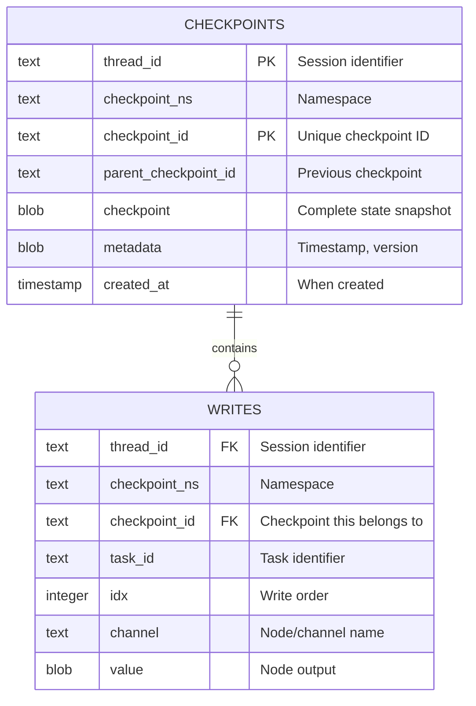
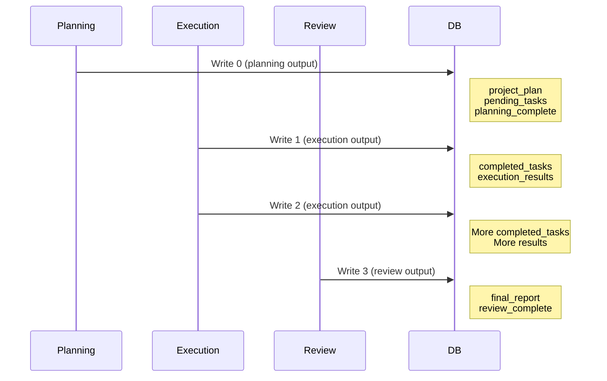
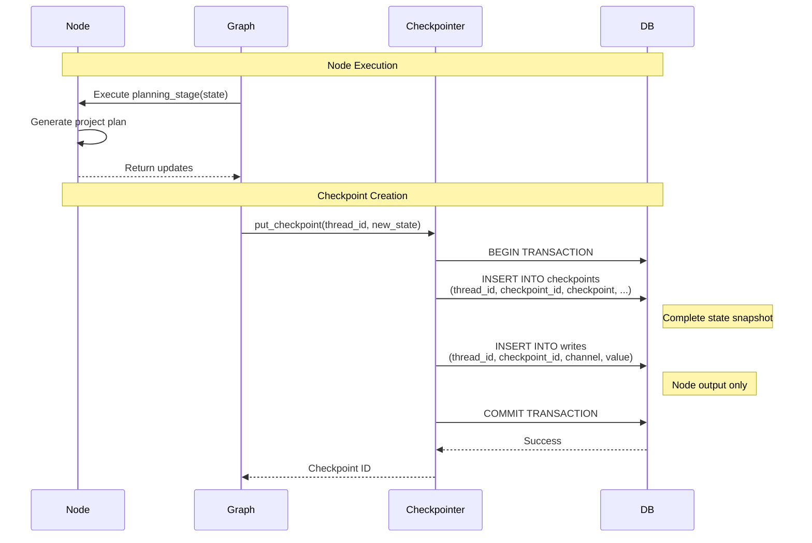
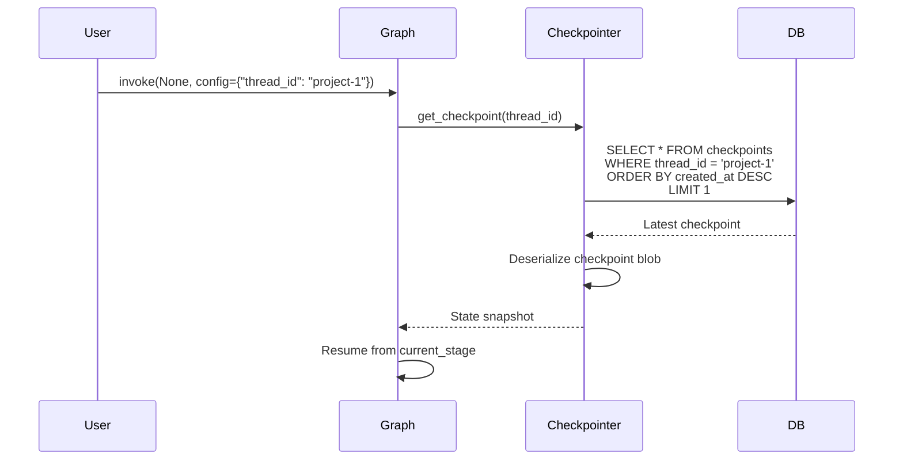
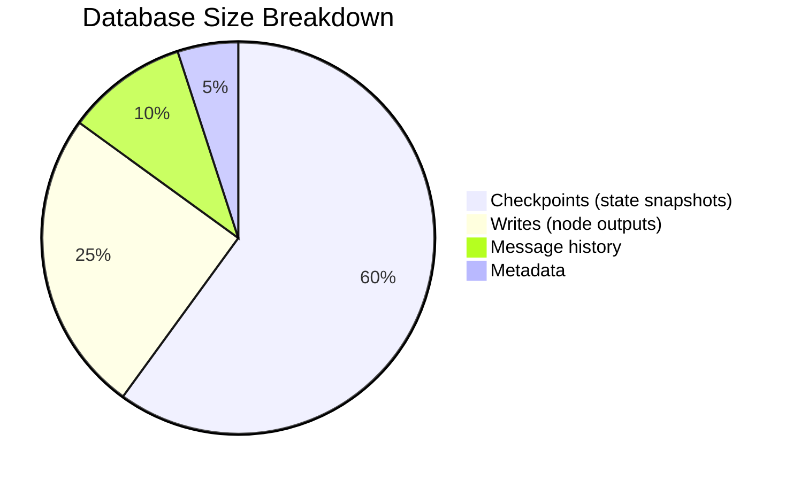

# 🗄️ Database Guide: What's Stored in SQLite

This guide explains exactly what data is stored in the SQLite database and how to inspect it.

## 📋 Table of Contents

1. [Database Schema](#database-schema)
2. [Checkpoints Table](#checkpoints-table)
3. [Writes Table](#writes-table)
4. [Example Data](#example-data)
5. [Querying the Database](#querying-the-database)

---

## Database Schema

The `SqliteSaver` creates two main tables:



---

## Checkpoints Table

### Purpose
Stores **complete state snapshots** after each node execution.

### Schema

| Column | Type | Description | Example |
|--------|------|-------------|---------|
| `thread_id` | TEXT | Session/project identifier | `"project-1"` |
| `checkpoint_ns` | TEXT | Namespace (usually empty) | `""` |
| `checkpoint_id` | TEXT | Unique UUID for this checkpoint | `"1ef2a3b4-5678-90cd..."` |
| `parent_checkpoint_id` | TEXT | Previous checkpoint (for history) | `"1ef2a3b3-1234-56cd..."` |
| `checkpoint` | BLOB | Complete state as JSON | `{...}` |
| `metadata` | BLOB | Timestamp, version info | `{...}` |
| `created_at` | TIMESTAMP | When checkpoint was created | `2025-10-27 00:00:00` |

### Checkpoint Structure

The `checkpoint` blob contains:

```json
{
  "v": 1,
  "ts": "2025-10-27T00:00:00.000000",
  "channel_values": {
    "messages": [
      {
        "type": "human",
        "content": "Create a project plan"
      },
      {
        "type": "ai",
        "content": "Here's the plan..."
      }
    ],
    "project_name": "AI Agent Platform",
    "project_description": "Build an AI agent system...",
    "planning_complete": true,
    "execution_complete": false,
    "review_complete": false,
    "project_plan": "1. Research requirements\n2. Design architecture...",
    "execution_results": [],
    "final_report": "",
    "current_stage": "execution",
    "completed_tasks": [],
    "pending_tasks": ["Research requirements", "Design architecture"],
    "started_at": "2025-10-27T00:00:00",
    "last_updated": "2025-10-27T00:00:00",
    "session_count": 1
  },
  "channel_versions": {
    "__start__": 1,
    "planning": 1,
    "execution": 0,
    "review": 0
  },
  "versions_seen": {
    "__input__": {},
    "__start__": {
      "__start__": 1
    },
    "planning": {
      "__start__": 1
    }
  }
}
```

### Checkpoint Evolution

```mermaid
graph LR
    A[Checkpoint 1<br/>Planning] -->|parent_id| B[Checkpoint 2<br/>Execution Start]
    B -->|parent_id| C[Checkpoint 3<br/>Task 1 Done]
    C -->|parent_id| D[Checkpoint 4<br/>Task 2 Done]
    D -->|parent_id| E[Checkpoint 5<br/>Review]
    
    A -.->|State| A1[planning_complete: true<br/>current_stage: execution]
    B -.->|State| B1[completed_tasks: []<br/>pending_tasks: [1,2,3]]
    C -.->|State| C1[completed_tasks: [1]<br/>pending_tasks: [2,3]]
    D -.->|State| D1[completed_tasks: [1,2]<br/>pending_tasks: [3]]
    E -.->|State| E1[review_complete: true<br/>current_stage: complete]
    
    style A fill:#FFE4B5
    style B fill:#E0BBE4
    style C fill:#E0BBE4
    style D fill:#E0BBE4
    style E fill:#B4E7CE
```

---

## Writes Table

### Purpose
Stores **incremental updates** from each node execution.

### Schema

| Column | Type | Description | Example |
|--------|------|-------------|---------|
| `thread_id` | TEXT | Session identifier | `"project-1"` |
| `checkpoint_ns` | TEXT | Namespace | `""` |
| `checkpoint_id` | TEXT | Checkpoint this write belongs to | `"1ef2a3b4..."` |
| `task_id` | TEXT | Task identifier | `"planning"` |
| `idx` | INTEGER | Order of write (0, 1, 2...) | `0` |
| `channel` | TEXT | Node/channel name | `"planning"` |
| `value` | BLOB | Node output as JSON | `{...}` |

### Write Structure

The `value` blob contains the node's output:

```json
{
  "messages": [
    {
      "type": "ai",
      "content": "I've created a detailed project plan..."
    }
  ],
  "project_plan": "1. Research requirements\n2. Design architecture...",
  "planning_complete": true,
  "pending_tasks": ["Research requirements", "Design architecture"],
  "current_stage": "execution",
  "last_updated": "2025-10-27T00:00:00"
}
```

### Writes Timeline



---

## Example Data

### After Planning Stage

**Checkpoints Table:**
```
thread_id: "project-1"
checkpoint_id: "1ef2a3b4-5678-90cd-ef12-34567890abcd"
parent_checkpoint_id: null
created_at: 2025-10-27 00:00:00

checkpoint (JSON):
{
  "channel_values": {
    "project_name": "AI Agent Platform",
    "project_plan": "1. Research requirements...",
    "planning_complete": true,
    "current_stage": "execution",
    "pending_tasks": ["Research", "Design", "Implement"]
  }
}
```

**Writes Table:**
```
thread_id: "project-1"
checkpoint_id: "1ef2a3b4-5678-90cd-ef12-34567890abcd"
channel: "planning"
idx: 0

value (JSON):
{
  "project_plan": "1. Research requirements...",
  "planning_complete": true,
  "pending_tasks": ["Research", "Design", "Implement"],
  "current_stage": "execution"
}
```

### After First Execution

**Checkpoints Table:**
```
thread_id: "project-1"
checkpoint_id: "1ef2a3b5-6789-01de-f234-567890abcdef"
parent_checkpoint_id: "1ef2a3b4-5678-90cd-ef12-34567890abcd"
created_at: 2025-10-27 01:00:00

checkpoint (JSON):
{
  "channel_values": {
    "project_name": "AI Agent Platform",
    "project_plan": "1. Research requirements...",
    "planning_complete": true,
    "execution_complete": false,
    "current_stage": "execution",
    "completed_tasks": ["Research"],
    "pending_tasks": ["Design", "Implement"],
    "execution_results": ["Research completed: Found 10 relevant papers"]
  }
}
```

**Writes Table:**
```
thread_id: "project-1"
checkpoint_id: "1ef2a3b5-6789-01de-f234-567890abcdef"
channel: "execution"
idx: 0

value (JSON):
{
  "completed_tasks": ["Research"],
  "pending_tasks": ["Design", "Implement"],
  "execution_results": ["Research completed: Found 10 relevant papers"],
  "current_stage": "execution"
}
```

---

## Querying the Database

### Connect to Database

```python
import sqlite3
import json

conn = sqlite3.connect("project_checkpoints.db")
cursor = conn.cursor()
```

### Query 1: List All Projects

```sql
SELECT DISTINCT thread_id, COUNT(*) as checkpoint_count
FROM checkpoints
GROUP BY thread_id;
```

```python
cursor.execute("""
    SELECT DISTINCT thread_id, COUNT(*) as checkpoint_count
    FROM checkpoints
    GROUP BY thread_id
""")
for row in cursor.fetchall():
    print(f"Project: {row[0]}, Checkpoints: {row[1]}")
```

### Query 2: View Project History

```sql
SELECT 
    checkpoint_id,
    created_at,
    json_extract(checkpoint, '$.channel_values.current_stage') as stage,
    json_extract(checkpoint, '$.channel_values.planning_complete') as planning_done,
    json_extract(checkpoint, '$.channel_values.execution_complete') as execution_done
FROM checkpoints
WHERE thread_id = 'project-1'
ORDER BY created_at;
```

```python
cursor.execute("""
    SELECT 
        checkpoint_id,
        created_at,
        json_extract(checkpoint, '$.channel_values.current_stage') as stage
    FROM checkpoints
    WHERE thread_id = ?
    ORDER BY created_at
""", ("project-1",))

for row in cursor.fetchall():
    print(f"{row[1]}: Stage = {row[2]}")
```

### Query 3: Get Complete State at Checkpoint

```sql
SELECT json_extract(checkpoint, '$.channel_values') as state
FROM checkpoints
WHERE checkpoint_id = '1ef2a3b4-5678-90cd-ef12-34567890abcd';
```

```python
cursor.execute("""
    SELECT checkpoint
    FROM checkpoints
    WHERE checkpoint_id = ?
""", ("1ef2a3b4-5678-90cd-ef12-34567890abcd",))

checkpoint_data = cursor.fetchone()[0]
state = json.loads(checkpoint_data)["channel_values"]
print(json.dumps(state, indent=2))
```

### Query 4: View All Writes for a Checkpoint

```sql
SELECT 
    channel,
    idx,
    value
FROM writes
WHERE checkpoint_id = '1ef2a3b4-5678-90cd-ef12-34567890abcd'
ORDER BY idx;
```

```python
cursor.execute("""
    SELECT channel, value
    FROM writes
    WHERE checkpoint_id = ?
    ORDER BY idx
""", ("1ef2a3b4-5678-90cd-ef12-34567890abcd",))

for row in cursor.fetchall():
    channel = row[0]
    value = json.loads(row[1])
    print(f"\nChannel: {channel}")
    print(json.dumps(value, indent=2))
```

### Query 5: Track Task Progress

```sql
SELECT 
    created_at,
    json_extract(checkpoint, '$.channel_values.completed_tasks') as completed,
    json_extract(checkpoint, '$.channel_values.pending_tasks') as pending
FROM checkpoints
WHERE thread_id = 'project-1'
ORDER BY created_at;
```

---

## Data Flow Visualization

### Complete Database Write Flow



### Read Flow (Resume)



---

## Database Size Considerations

### What Affects Database Size?

1. **Number of checkpoints**: One per node execution
2. **State size**: Larger states = larger checkpoints
3. **Message history**: Grows with conversation length
4. **Execution results**: Accumulated data

### Example Sizes



### Typical Sizes

| Project Stage | Checkpoints | DB Size |
|--------------|-------------|---------|
| After Planning | 1 | ~5 KB |
| After 5 Tasks | 6 | ~30 KB |
| Complete Project | 10 | ~50 KB |

---

## 🎯 Key Takeaways

1. **Two tables**: `checkpoints` (full state) + `writes` (incremental updates)
2. **Thread ID**: Links all checkpoints for a project
3. **Checkpoint chain**: Each points to parent (history)
4. **JSON blobs**: State stored as JSON in BLOB columns
5. **Query with JSON**: Use `json_extract()` to query state fields
6. **Immutable**: Checkpoints never modified, only new ones added
7. **Complete history**: Can reconstruct any point in time

### Quick Reference

```python
# Create checkpointer
conn = sqlite3.connect("project_checkpoints.db")
checkpointer = SqliteSaver(conn)

# Compile graph with checkpointer
graph = workflow.compile(checkpointer=checkpointer)

# Use with thread_id
config = {"configurable": {"thread_id": "project-1"}}
result = graph.invoke(initial_state, config)

# Resume later (same thread_id)
result = graph.invoke(None, config)  # Loads from DB automatically
```
