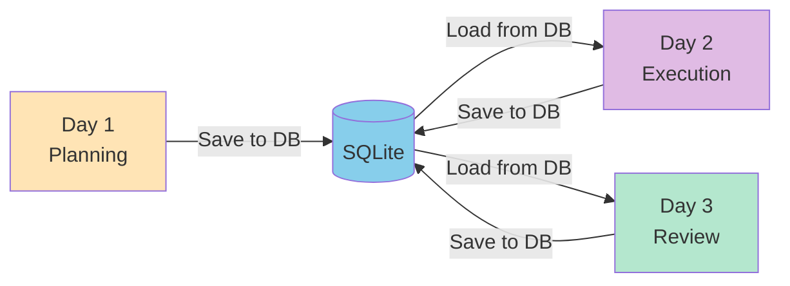
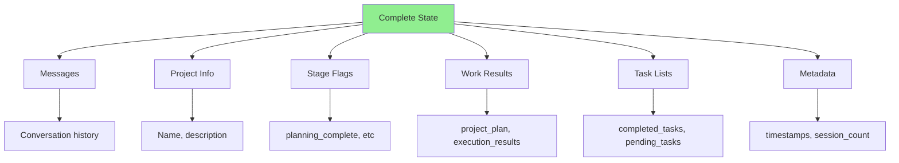

# 📚 Complete Guide to Stateful Workflow Persistence

Welcome! This guide will help you understand how the stateful workflow persistence demo works.

## 🎯 What You'll Learn

- How state is managed across multiple sessions
- What gets saved to the SQLite database
- How to resume workflows after days/weeks
- How to time-travel to previous states
- Practical examples and patterns

---

## 📖 Documentation Structure

We've created comprehensive guides with Mermaid diagrams to help you understand:

### 1. **[HOW_IT_WORKS.md](./HOW_IT_WORKS.md)** 📘
**The complete conceptual guide**

- Overview of stateful workflows
- State schema explained
- Database operations in detail
- Workflow execution flow
- Checkpointing mechanism
- Resume & time-travel features

**Best for**: Understanding the concepts and architecture

### 2. **[DATABASE_GUIDE.md](./DATABASE_GUIDE.md)** 🗄️
**Deep dive into database structure**

- SQLite schema (tables, columns)
- What gets written to each table
- Example data at each stage
- SQL queries to inspect data
- Database size considerations

**Best for**: Understanding what's in the database

### 3. **[PRACTICAL_EXAMPLES.md](./PRACTICAL_EXAMPLES.md)** 💻
**Hands-on code examples**

- Basic usage patterns
- Multi-session workflows
- Inspecting state
- Time-travel examples
- Error recovery
- Advanced patterns

**Best for**: Learning by doing

---

## 🚀 Quick Start

### 1. Run the Demo

```bash
# Install dependencies
uv sync

# Run the demo
python main.py
```

### 2. Inspect the Database

```bash
# Open SQLite database
sqlite3 project_checkpoints.db

# View all projects
SELECT DISTINCT thread_id FROM checkpoints;

# View project history
SELECT 
    created_at,
    json_extract(checkpoint, '$.channel_values.current_stage') as stage
FROM checkpoints
WHERE thread_id = 'project-1'
ORDER BY created_at;
```

### 3. Try Multi-Session Workflow

```python
from main import create_project_workflow

graph = create_project_workflow()
config = {"configurable": {"thread_id": "my-project"}}

# Day 1: Start
result1 = graph.invoke(initial_state, config)

# Day 2: Resume (no initial_state needed!)
result2 = graph.invoke(None, config)
```

---

## 🎨 Visual Overview

### State Flow



### What Gets Saved



---

## 🔑 Key Concepts

### 1. Thread ID = Project ID

```python
config = {"configurable": {"thread_id": "project-1"}}
```

- Same thread ID = Same project
- Different thread ID = Different project
- Thread ID links all checkpoints together

### 2. Checkpoint = State Snapshot

- Saved after every node execution
- Contains complete state
- Immutable (never modified)
- Linked to parent checkpoint

### 3. Resume = Automatic

```python
# First session
result1 = graph.invoke(initial_state, config)

# Later session (same thread_id)
result2 = graph.invoke(None, config)  # Resumes automatically!
```

### 4. Time-Travel = Load Old Checkpoint

```python
# Get history
history = list(graph.get_state_history(config))

# Go back to checkpoint 2
old_checkpoint = history[2]
graph.update_state(config, old_checkpoint.values)
```

---

## 📊 State Schema

```python
class ProjectState(TypedDict):
    # Conversation
    messages: list
    
    # Project info
    project_name: str
    project_description: str
    
    # Stage flags
    planning_complete: bool
    execution_complete: bool
    review_complete: bool
    
    # Work outputs
    project_plan: str
    execution_results: list[str]
    final_report: str
    
    # Workflow tracking
    current_stage: Literal["planning", "execution", "review", "complete"]
    completed_tasks: list[str]
    pending_tasks: list[str]
    
    # Metadata
    started_at: str
    last_updated: str
    session_count: int
```

---

## 🗄️ Database Tables

### Checkpoints Table
Stores complete state snapshots

| Column | Description |
|--------|-------------|
| `thread_id` | Project identifier |
| `checkpoint_id` | Unique checkpoint ID |
| `parent_checkpoint_id` | Previous checkpoint |
| `checkpoint` | Complete state (JSON) |
| `created_at` | Timestamp |

### Writes Table
Stores incremental node outputs

| Column | Description |
|--------|-------------|
| `thread_id` | Project identifier |
| `checkpoint_id` | Checkpoint this belongs to |
| `channel` | Node name |
| `value` | Node output (JSON) |

---

## 💡 Common Use Cases

### 1. Long-Running Projects
```
Day 1: Plan → Save
Day 2: Execute → Save
Day 3: Review → Save
```

### 2. Fault Tolerance
```
Process crashes → State saved
Restart → Resume automatically
```

### 3. Audit Trail
```
View complete history
See who did what when
```

### 4. Debugging
```
Go back to any checkpoint
Replay from that point
```

### 5. Collaboration
```
Multiple users
Same project
Shared state
```

---

## 🎯 Quick Reference

### Create Graph with Persistence
```python
from main import create_project_workflow

graph = create_project_workflow("project_checkpoints.db")
```

### Start New Project
```python
config = {"configurable": {"thread_id": "project-1"}}
result = graph.invoke(initial_state, config)
```

### Resume Project
```python
config = {"configurable": {"thread_id": "project-1"}}
result = graph.invoke(None, config)  # No initial_state!
```

### Check Current State
```python
state = graph.get_state(config)
print(state.values["current_stage"])
```

### View History
```python
history = list(graph.get_state_history(config))
for checkpoint in history:
    print(checkpoint.values["current_stage"])
```

### Time-Travel
```python
history = list(graph.get_state_history(config))
old_checkpoint = history[2]
graph.update_state(config, old_checkpoint.values)
```

---

## 📚 Learn More

### Read the Guides

1. **[HOW_IT_WORKS.md](./HOW_IT_WORKS.md)** - Conceptual understanding
2. **[DATABASE_GUIDE.md](./DATABASE_GUIDE.md)** - Database deep dive
3. **[PRACTICAL_EXAMPLES.md](./PRACTICAL_EXAMPLES.md)** - Code examples

### Explore the Code

- `main.py` - Complete implementation
- `test_simple.py` - Simple test example
- `project_checkpoints.db` - SQLite database (created when you run)

### Try It Yourself

```bash
# Run the demo
python main.py

# Inspect the database
sqlite3 project_checkpoints.db
.tables
.schema checkpoints
SELECT * FROM checkpoints;
```

---

## 🎓 Key Takeaways

1. ✅ **State persists across sessions** - Work can span days/weeks
2. ✅ **Automatic resume** - Just use same thread_id
3. ✅ **Complete history** - Every step is saved
4. ✅ **Time-travel enabled** - Go back to any point
5. ✅ **Fault tolerant** - Crash recovery built-in
6. ✅ **SQLite simple** - Just a file, no server
7. ✅ **Production ready** - Used in real applications

---

## 🤔 Common Questions

### Q: What if I lose the database file?
**A:** All state is lost. Backup the `.db` file regularly.

### Q: Can multiple processes access the same database?
**A:** Yes, SQLite supports concurrent reads. Use `check_same_thread=False`.

### Q: How big does the database get?
**A:** Depends on state size. Typical: 5-50 KB per project.

### Q: Can I use a different database?
**A:** Yes! LangGraph supports PostgreSQL, Redis, and custom checkpointers.

### Q: What happens if a node fails?
**A:** Last checkpoint is preserved. Resume from there.

### Q: Can I delete old checkpoints?
**A:** Yes, delete from `checkpoints` and `writes` tables by `thread_id`.

---

## 🚀 Next Steps

1. **Read [HOW_IT_WORKS.md](./HOW_IT_WORKS.md)** - Understand the concepts
2. **Read [DATABASE_GUIDE.md](./DATABASE_GUIDE.md)** - See what's in the DB
3. **Read [PRACTICAL_EXAMPLES.md](./PRACTICAL_EXAMPLES.md)** - Try the examples
4. **Run the demo** - See it in action
5. **Inspect the database** - Query the data
6. **Build your own** - Apply to your use case

---

## 📞 Need Help?

- Check the guides above
- Look at `main.py` for implementation details
- Try the examples in `PRACTICAL_EXAMPLES.md`
- Inspect the database with SQLite

Happy coding! 🎉
