# 🔍 How Stateful Workflow Persistence Works

This document explains in detail how the stateful workflow persistence demo works, focusing on state management and database operations.

## 📋 Table of Contents

1. [Overview](#overview)
2. [State Schema](#state-schema)
3. [Database Operations](#database-operations)
4. [Workflow Execution](#workflow-execution)
5. [Checkpointing Mechanism](#checkpointing-mechanism)
6. [Resume & Time-Travel](#resume--time-travel)

---

## Overview

This demo shows how to build **long-running workflows** that can:
- ✅ Save state at every step
- ✅ Resume from where they left off
- ✅ Work across multiple sessions (days/weeks)
- ✅ Support time-travel (go back to previous states)
- ✅ Handle interruptions gracefully

### Use Case: Multi-Day Project Management

```
Day 1: Plan project → Save to DB
Day 2: Execute tasks → Save to DB
Day 3: Review results → Save to DB
```

---

## State Schema

### What Gets Stored?

The `ProjectState` contains everything needed to resume the workflow:

```python
class ProjectState(TypedDict):
    # Message history (conversation with AI)
    messages: Annotated[list, add_messages]
    
    # Project information
    project_name: str
    project_description: str
    
    # Workflow stages (boolean flags)
    planning_complete: bool
    execution_complete: bool
    review_complete: bool
    
    # Stage outputs (actual work done)
    project_plan: str              # From planning stage
    execution_results: list[str]   # From execution stage
    final_report: str              # From review stage
    
    # Workflow tracking
    current_stage: Literal["planning", "execution", "review", "complete", "start"]
    completed_tasks: list[str]
    pending_tasks: list[str]
    
    # Metadata
    started_at: str
    last_updated: str
    session_count: int
```

### State Flow Diagram

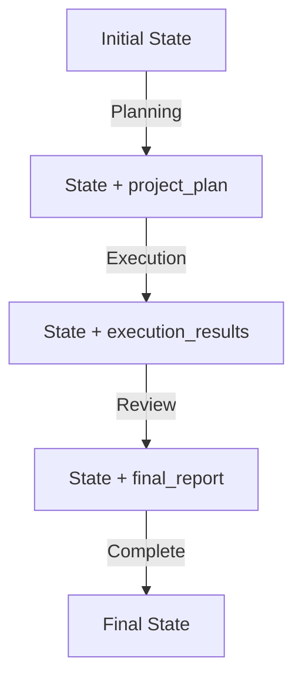

---

## Database Operations

### SQLite Database Structure

The `SqliteSaver` creates and manages checkpoint tables:

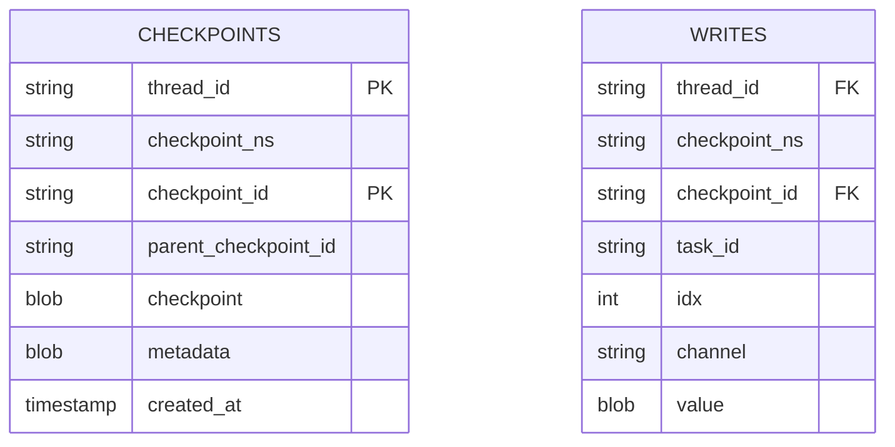

### What Gets Written to Database?

#### 1. **Checkpoint Record** (Main State Snapshot)

Every time a node completes, a checkpoint is saved:

```json
{
  "thread_id": "project-1",
  "checkpoint_id": "1ef2a3b4-5678-90cd-ef12-34567890abcd",
  "checkpoint": {
    "v": 1,
    "ts": "2025-10-27T00:00:00",
    "channel_values": {
      "messages": [...],
      "project_name": "AI Agent Platform",
      "project_plan": "...",
      "current_stage": "execution",
      "planning_complete": true,
      "execution_complete": false,
      "completed_tasks": ["Task 1", "Task 2"],
      "pending_tasks": ["Task 3", "Task 4"],
      ...
    }
  }
}
```

#### 2. **Writes Record** (Incremental Updates)

Each node's output is recorded:

```json
{
  "thread_id": "project-1",
  "checkpoint_id": "1ef2a3b4-...",
  "channel": "planning",
  "value": {
    "project_plan": "...",
    "planning_complete": true,
    "pending_tasks": [...]
  }
}
```

### Database Operations Timeline

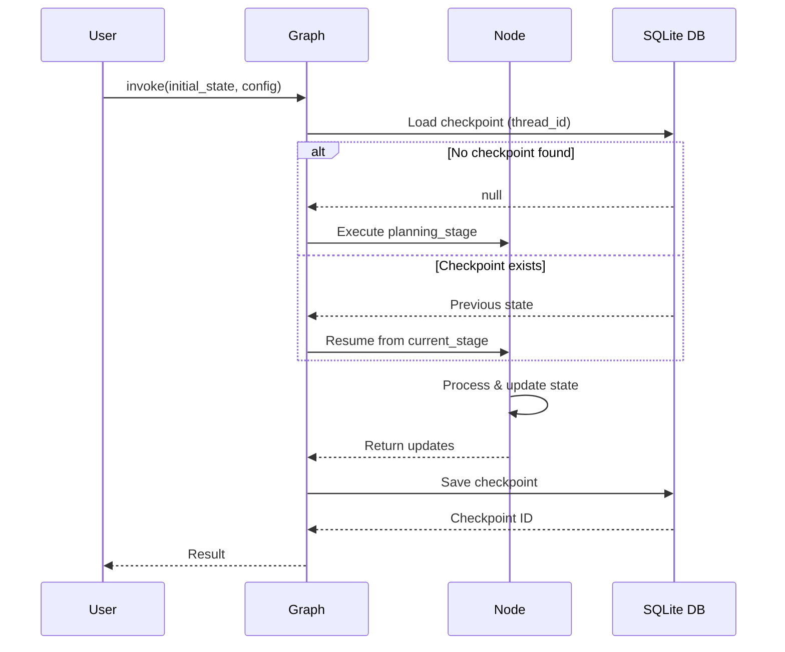

---

## Workflow Execution

### Complete Workflow Diagram

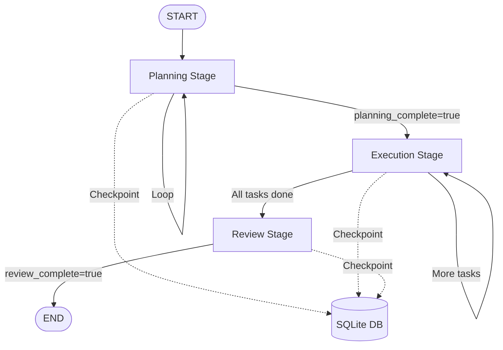

### Stage-by-Stage Breakdown

#### **Stage 1: Planning**

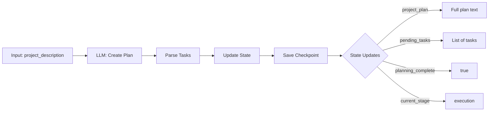

**What's Written to DB:**
```python
{
    "project_plan": "Detailed project plan...",
    "pending_tasks": ["Task 1", "Task 2", "Task 3"],
    "planning_complete": True,
    "current_stage": "execution",
    "last_updated": "2025-10-27T00:00:00"
}
```

#### **Stage 2: Execution**

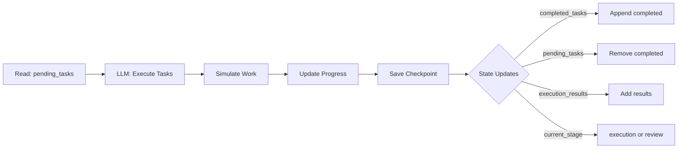

**What's Written to DB:**
```python
{
    "completed_tasks": ["Task 1", "Task 2"],
    "pending_tasks": ["Task 3", "Task 4"],
    "execution_results": ["Result 1", "Result 2"],
    "execution_complete": False,  # or True if done
    "current_stage": "execution",  # or "review"
    "last_updated": "2025-10-27T01:00:00"
}
```

#### **Stage 3: Review**

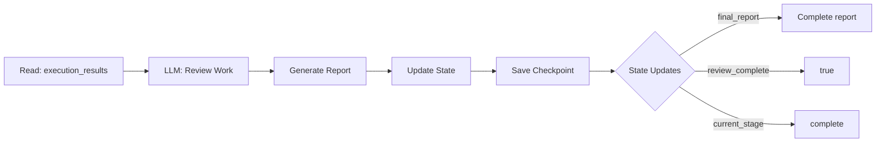

**What's Written to DB:**
```python
{
    "final_report": "Project completed successfully...",
    "review_complete": True,
    "current_stage": "complete",
    "last_updated": "2025-10-27T02:00:00"
}
```

---

## Checkpointing Mechanism

### How Checkpointing Works

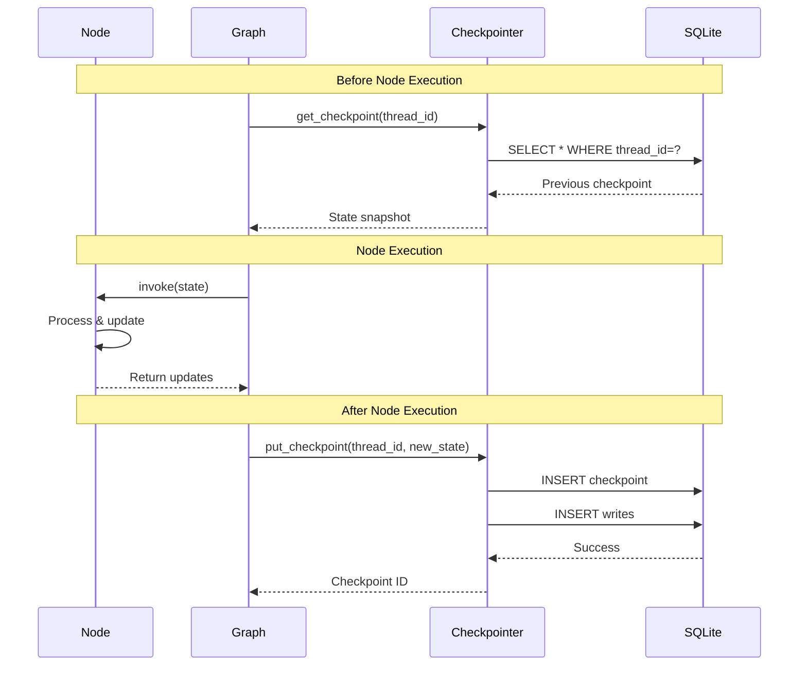

### Checkpoint Anatomy

Each checkpoint contains:

1. **Checkpoint ID**: Unique identifier (UUID)
2. **Thread ID**: Session identifier (e.g., "project-1")
3. **Parent Checkpoint ID**: Previous checkpoint (for time-travel)
4. **Channel Values**: Complete state snapshot
5. **Metadata**: Timestamp, version, etc.

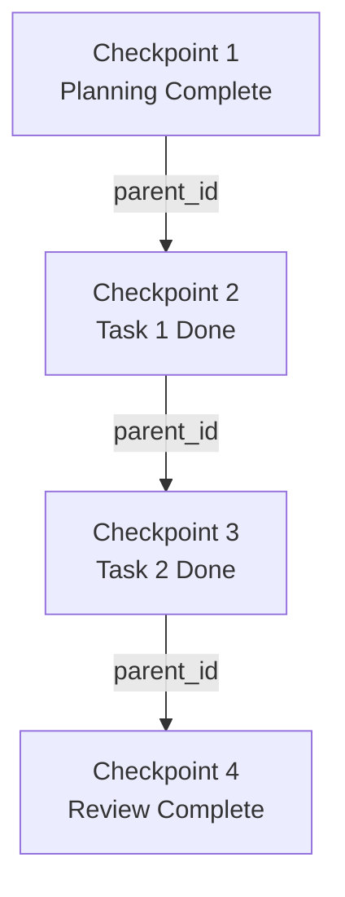

---

## Resume & Time-Travel

### Resume from Last Checkpoint

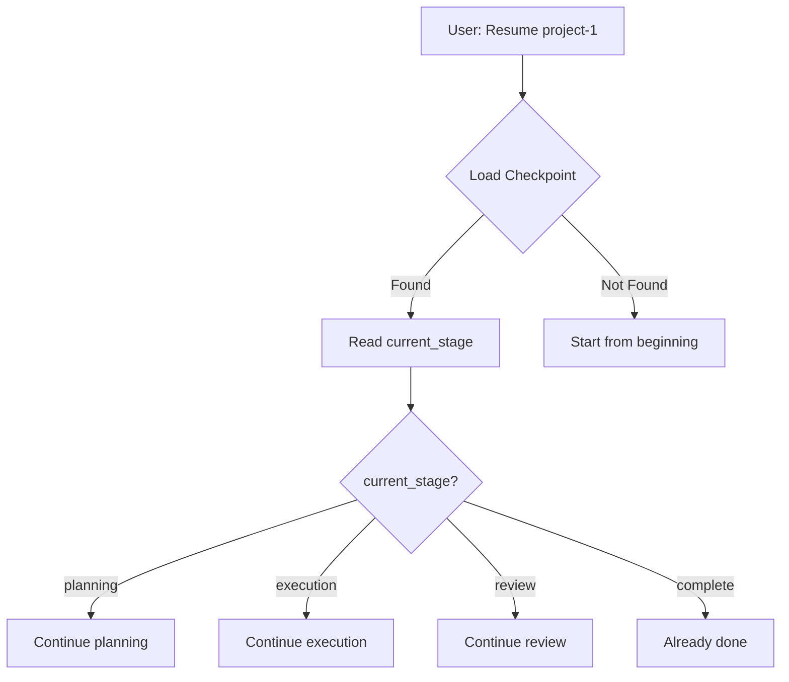

### Time-Travel to Previous State

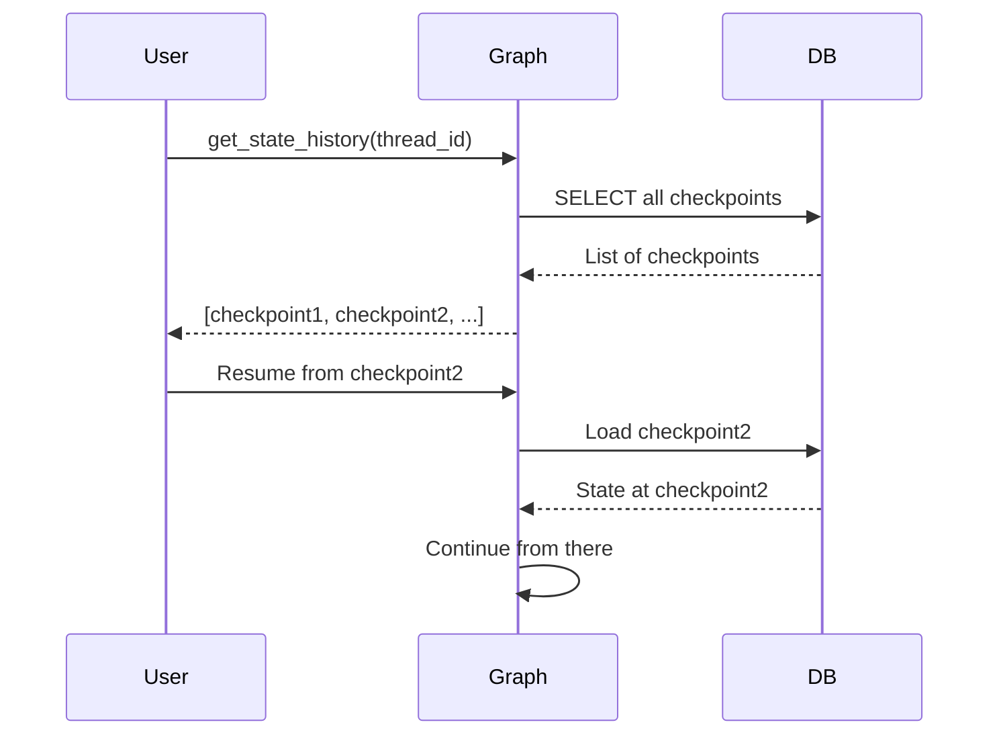

### Example: Resume After 3 Days

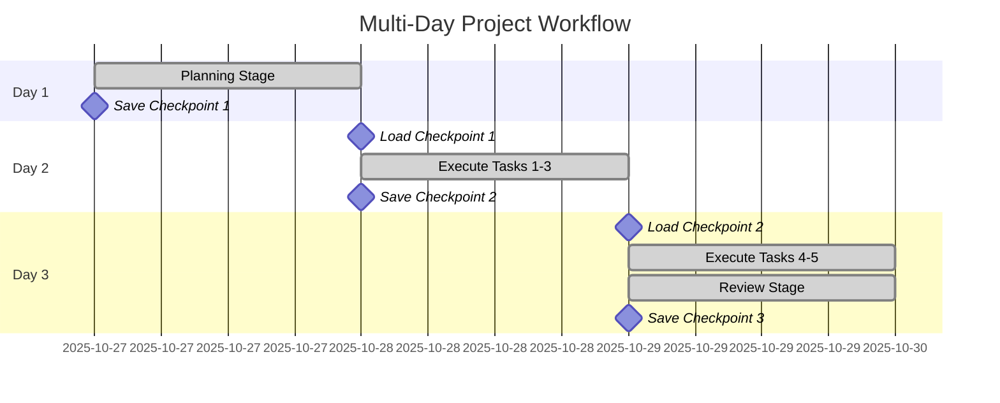

---

## Key Concepts Summary

### 1. **Thread ID** = Session Identifier

```python
config = {"configurable": {"thread_id": "project-1"}}
```

- Same thread ID = Same project/session
- Different thread ID = Different project/session
- Thread ID links all checkpoints together

### 2. **Checkpoint** = State Snapshot

- Saved after every node execution
- Contains complete state
- Immutable (never modified, only new ones created)

### 3. **Resume** = Load + Continue

```python
# First session
result1 = graph.invoke(initial_state, config)

# Later session (same thread_id)
result2 = graph.invoke(None, config)  # Resumes automatically
```

### 4. **Time-Travel** = Load Old Checkpoint

```python
# Get history
history = list(graph.get_state_history(config))

# Go back to checkpoint 2
old_state = history[2]
graph.update_state(config, old_state.values)
```

---

## Database Query Examples

### What's in the Database?

```sql
-- View all checkpoints for a project
SELECT 
    checkpoint_id,
    thread_id,
    created_at,
    json_extract(checkpoint, '$.channel_values.current_stage') as stage
FROM checkpoints
WHERE thread_id = 'project-1'
ORDER BY created_at;

-- View state at specific checkpoint
SELECT 
    json_extract(checkpoint, '$.channel_values') as state
FROM checkpoints
WHERE checkpoint_id = '1ef2a3b4-...';

-- View all writes for a checkpoint
SELECT 
    channel,
    value
FROM writes
WHERE thread_id = 'project-1'
AND checkpoint_id = '1ef2a3b4-...'
ORDER BY idx;
```

---

## Complete Data Flow

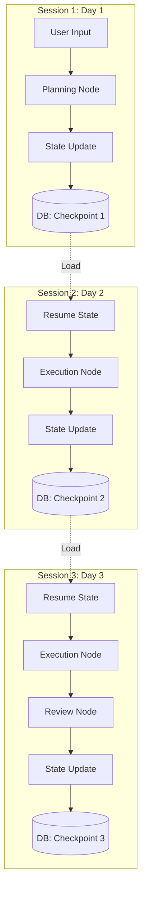

---

## 🎯 Key Takeaways

1. **Everything is saved**: Complete state after every node
2. **Thread ID is key**: Links all checkpoints for a project
3. **Immutable checkpoints**: Never modified, only new ones created
4. **Resume is automatic**: Just use same thread_id
5. **Time-travel is possible**: Access any previous checkpoint
6. **SQLite is simple**: Just a file, no server needed
7. **State is complete**: Can reconstruct entire workflow history

This pattern enables:
- ✅ Long-running workflows (days/weeks)
- ✅ Fault tolerance (crash recovery)
- ✅ Audit trails (who did what when)
- ✅ Debugging (replay from any point)
- ✅ Collaboration (multiple users, same project)
