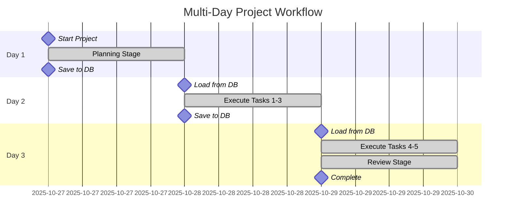
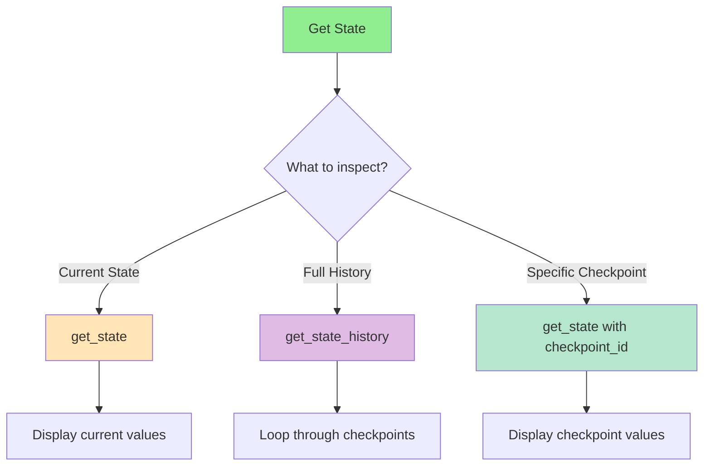
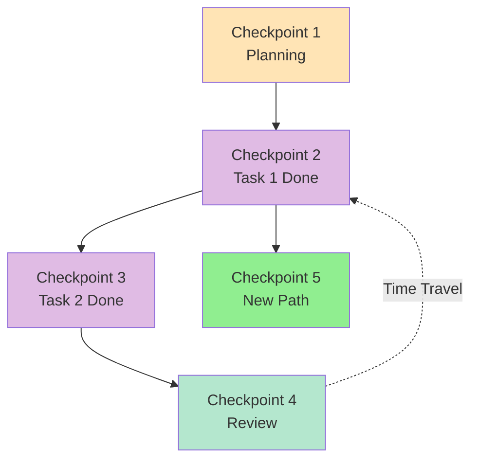
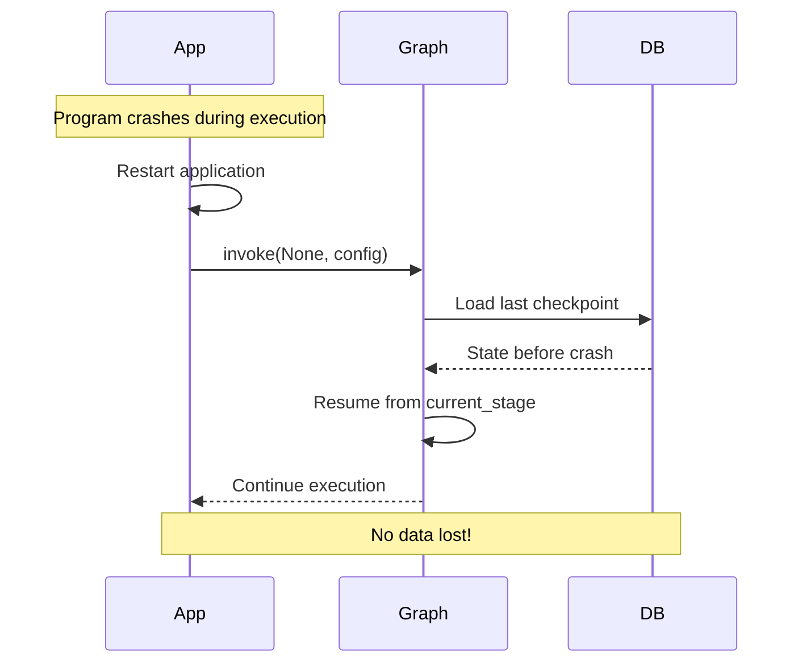
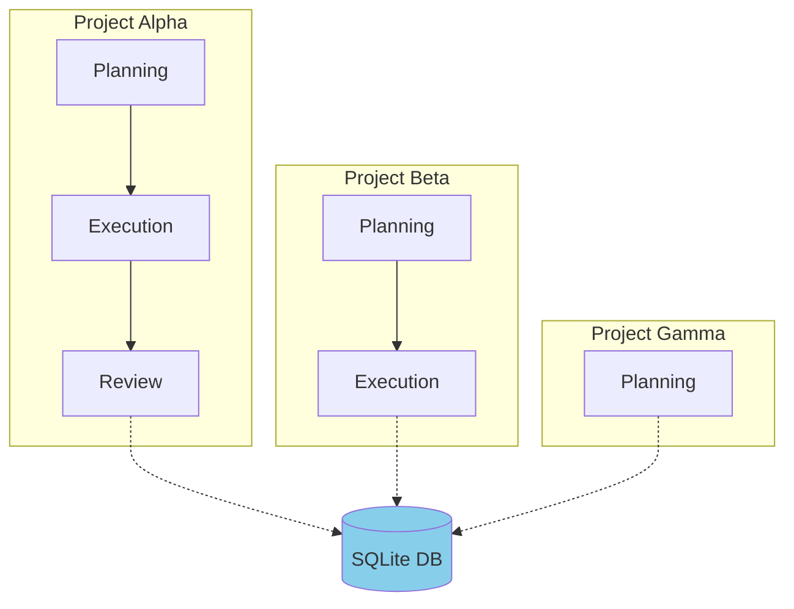
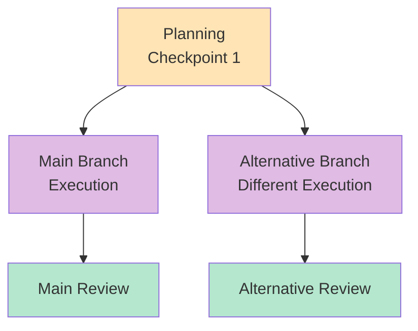

# 🎯 Practical Examples: Using Stateful Workflows

This guide shows practical examples of how to use the stateful workflow with persistence.

## 📋 Table of Contents

1. [Basic Usage](#basic-usage)
2. [Multi-Session Workflow](#multi-session-workflow)
3. [Inspecting State](#inspecting-state)
4. [Time-Travel](#time-travel)
5. [Error Recovery](#error-recovery)

---

## Basic Usage

### Example 1: Complete Workflow in One Session

```python
from main import create_project_workflow

# Create graph with persistence
graph = create_project_workflow()

# Initial state
initial_state = {
    "messages": [],
    "project_name": "AI Agent Platform",
    "project_description": "Build a multi-agent system for customer support",
    "planning_complete": False,
    "execution_complete": False,
    "review_complete": False,
    "project_plan": "",
    "execution_results": [],
    "final_report": "",
    "current_stage": "start",
    "completed_tasks": [],
    "pending_tasks": [],
    "started_at": datetime.now().isoformat(),
    "last_updated": datetime.now().isoformat(),
    "session_count": 1
}

# Configuration with thread ID
config = {"configurable": {"thread_id": "project-1"}}

# Run workflow
result = graph.invoke(initial_state, config)

print(f"Final stage: {result['current_stage']}")
print(f"Project plan: {result['project_plan'][:100]}...")
```

### Flow Diagram

```mermaid
graph LR
    A[Start] --> B[invoke with initial_state]
    B --> C[Planning Stage]
    C --> D[Save Checkpoint 1]
    D --> E[Execution Stage]
    E --> F[Save Checkpoint 2]
    F --> G[Review Stage]
    G --> H[Save Checkpoint 3]
    H --> I[Complete]
    
    style A fill:#90EE90
    style I fill:#FFB6C1
    style D fill:#87CEEB
    style F fill:#87CEEB
    style H fill:#87CEEB
```



---

## Multi-Session Workflow

### Example 2: Work Across Multiple Days

#### Day 1: Start Planning

```python
from main import create_project_workflow
from datetime import datetime

# Create graph
graph = create_project_workflow()

# Day 1: Initial state
initial_state = {
    "project_name": "E-commerce Platform",
    "project_description": "Build a scalable e-commerce platform with AI recommendations",
    "current_stage": "start",
    "started_at": datetime.now().isoformat(),
    "session_count": 1,
    # ... other fields
}

# Use consistent thread_id
config = {"configurable": {"thread_id": "ecommerce-project"}}

# Run Day 1
print("=== Day 1: Planning ===")
result_day1 = graph.invoke(initial_state, config)

print(f"Stage completed: {result_day1['current_stage']}")
print(f"Planning complete: {result_day1['planning_complete']}")
print(f"Pending tasks: {len(result_day1['pending_tasks'])}")

# State is saved to database automatically!
```

#### Day 2: Continue Execution

```python
# Day 2: Resume from where we left off
print("\n=== Day 2: Execution ===")

# Same thread_id, no initial state needed!
config = {"configurable": {"thread_id": "ecommerce-project"}}

# Graph loads state from database automatically
result_day2 = graph.invoke(None, config)

print(f"Stage: {result_day2['current_stage']}")
print(f"Completed tasks: {len(result_day2['completed_tasks'])}")
print(f"Pending tasks: {len(result_day2['pending_tasks'])}")
```

#### Day 3: Finish Review

```python
# Day 3: Final review
print("\n=== Day 3: Review ===")

config = {"configurable": {"thread_id": "ecommerce-project"}}

# Continue from last checkpoint
result_day3 = graph.invoke(None, config)

print(f"Stage: {result_day3['current_stage']}")
print(f"Review complete: {result_day3['review_complete']}")
print(f"Final report: {result_day3['final_report'][:100]}...")
```

### Timeline Visualization



---

## Inspecting State

### Example 3: Check Current State

```python
from main import create_project_workflow

graph = create_project_workflow()
config = {"configurable": {"thread_id": "project-1"}}

# Get current state
current_state = graph.get_state(config)

print("=== Current State ===")
print(f"Current stage: {current_state.values['current_stage']}")
print(f"Planning complete: {current_state.values['planning_complete']}")
print(f"Execution complete: {current_state.values['execution_complete']}")
print(f"Review complete: {current_state.values['review_complete']}")
print(f"\nCompleted tasks: {len(current_state.values['completed_tasks'])}")
print(f"Pending tasks: {len(current_state.values['pending_tasks'])}")
print(f"\nLast updated: {current_state.values['last_updated']}")
```

### Example 4: View Complete History

```python
# Get all checkpoints for this project
history = list(graph.get_state_history(config))

print(f"=== Project History ({len(history)} checkpoints) ===\n")

for i, checkpoint in enumerate(history):
    print(f"Checkpoint {i + 1}:")
    print(f"  Stage: {checkpoint.values['current_stage']}")
    print(f"  Completed tasks: {len(checkpoint.values['completed_tasks'])}")
    print(f"  Timestamp: {checkpoint.values['last_updated']}")
    print()
```

### State Inspection Flow



---

## Time-Travel

### Example 5: Go Back to Previous State

```python
from main import create_project_workflow

graph = create_project_workflow()
config = {"configurable": {"thread_id": "project-1"}}

# Get history
history = list(graph.get_state_history(config))

print(f"Found {len(history)} checkpoints")

# Go back to checkpoint 2 (after planning)
if len(history) >= 3:
    checkpoint_2 = history[2]  # 0=latest, 1=previous, 2=before that
    
    print(f"\n=== Going back to checkpoint 2 ===")
    print(f"Stage at that time: {checkpoint_2.values['current_stage']}")
    print(f"Completed tasks: {checkpoint_2.values['completed_tasks']}")
    
    # Update state to that checkpoint
    graph.update_state(config, checkpoint_2.values)
    
    # Continue from there
    result = graph.invoke(None, config)
    print(f"\nResumed from checkpoint 2")
    print(f"New stage: {result['current_stage']}")
```

### Time-Travel Visualization



### Example 6: Compare States

```python
# Compare two checkpoints
history = list(graph.get_state_history(config))

if len(history) >= 2:
    latest = history[0]
    previous = history[1]
    
    print("=== State Comparison ===\n")
    
    print("Latest:")
    print(f"  Stage: {latest.values['current_stage']}")
    print(f"  Completed: {len(latest.values['completed_tasks'])}")
    
    print("\nPrevious:")
    print(f"  Stage: {previous.values['current_stage']}")
    print(f"  Completed: {len(previous.values['completed_tasks'])}")
    
    # What changed?
    new_tasks = set(latest.values['completed_tasks']) - set(previous.values['completed_tasks'])
    print(f"\nNew completed tasks: {new_tasks}")
```

---

## Error Recovery

### Example 7: Recover from Crash

```python
from main import create_project_workflow

# Simulate: Your program crashed during execution
# When you restart, the state is still in the database!

graph = create_project_workflow()
config = {"configurable": {"thread_id": "project-1"}}

# Check what state we're in
current_state = graph.get_state(config)

if current_state.values:
    print("=== Recovering from crash ===")
    print(f"Last known stage: {current_state.values['current_stage']}")
    print(f"Last updated: {current_state.values['last_updated']}")
    
    # Resume from where we left off
    result = graph.invoke(None, config)
    print(f"\nResumed successfully!")
    print(f"Current stage: {result['current_stage']}")
else:
    print("No previous state found. Starting fresh.")
```

### Recovery Flow



### Example 8: Handle Interruptions

```python
# Workflow with manual interruption
graph = create_project_workflow()
config = {"configurable": {"thread_id": "project-1"}}

try:
    # Start workflow
    result = graph.invoke(initial_state, config)
except KeyboardInterrupt:
    print("\n=== Workflow interrupted ===")
    
    # State is already saved!
    current_state = graph.get_state(config)
    print(f"Last saved stage: {current_state.values['current_stage']}")
    print("You can resume later with the same thread_id")

# Later...
print("\n=== Resuming after interruption ===")
result = graph.invoke(None, config)
print(f"Resumed at stage: {result['current_stage']}")
```

---

## Advanced Patterns

### Example 9: Multiple Projects

```python
# Manage multiple projects simultaneously
projects = [
    {"thread_id": "project-alpha", "name": "Alpha Project"},
    {"thread_id": "project-beta", "name": "Beta Project"},
    {"thread_id": "project-gamma", "name": "Gamma Project"}
]

graph = create_project_workflow()

for project in projects:
    config = {"configurable": {"thread_id": project["thread_id"]}}
    
    # Each project has its own state
    state = graph.get_state(config)
    
    if state.values:
        print(f"{project['name']}: {state.values['current_stage']}")
    else:
        print(f"{project['name']}: Not started")
```

### Multiple Projects Visualization



### Example 10: Branching Workflows

```python
# Create a branch from a checkpoint
graph = create_project_workflow()
config_main = {"configurable": {"thread_id": "project-main"}}

# Get checkpoint after planning
history = list(graph.get_state_history(config_main))
planning_checkpoint = history[-1]  # First checkpoint

# Create a branch with different execution
config_branch = {"configurable": {"thread_id": "project-branch"}}

# Copy state to new thread
graph.update_state(config_branch, planning_checkpoint.values)

# Now you have two independent workflows from the same starting point
print("Main project:")
result_main = graph.invoke(None, config_main)
print(f"  Stage: {result_main['current_stage']}")

print("\nBranch project:")
result_branch = graph.invoke(None, config_branch)
print(f"  Stage: {result_branch['current_stage']}")
```

### Branching Visualization



---

## 🎯 Key Patterns Summary

### Pattern 1: Single Session
```python
result = graph.invoke(initial_state, config)
```

### Pattern 2: Multi-Session
```python
# Session 1
result1 = graph.invoke(initial_state, config)

# Session 2 (later)
result2 = graph.invoke(None, config)  # Resumes automatically
```

### Pattern 3: Inspect State
```python
current = graph.get_state(config)
history = list(graph.get_state_history(config))
```

### Pattern 4: Time-Travel
```python
history = list(graph.get_state_history(config))
old_checkpoint = history[2]
graph.update_state(config, old_checkpoint.values)
```

### Pattern 5: Error Recovery
```python
try:
    result = graph.invoke(initial_state, config)
except Exception:
    # State is saved, can resume later
    result = graph.invoke(None, config)
```

---

## 💡 Best Practices

1. **Use meaningful thread IDs**: `"project-alpha"` not `"abc123"`
2. **Check state before resuming**: Use `get_state()` to see where you are
3. **Handle None gracefully**: Check if state exists before accessing
4. **Keep thread IDs consistent**: Same ID = same project
5. **Clean up old projects**: Delete old thread data when done
6. **Backup database**: SQLite file contains all your data
7. **Monitor database size**: Large histories = large database

---

## 🔧 Utility Functions

```python
def list_all_projects(graph):
    """List all projects in the database"""
    import sqlite3
    conn = sqlite3.connect("project_checkpoints.db")
    cursor = conn.cursor()
    
    cursor.execute("""
        SELECT DISTINCT thread_id, COUNT(*) as checkpoints
        FROM checkpoints
        GROUP BY thread_id
    """)
    
    for row in cursor.fetchall():
        print(f"Project: {row[0]}, Checkpoints: {row[1]}")

def get_project_summary(graph, thread_id):
    """Get summary of a project"""
    config = {"configurable": {"thread_id": thread_id}}
    state = graph.get_state(config)
    
    if state.values:
        return {
            "stage": state.values["current_stage"],
            "planning_done": state.values["planning_complete"],
            "execution_done": state.values["execution_complete"],
            "review_done": state.values["review_complete"],
            "completed_tasks": len(state.values["completed_tasks"]),
            "pending_tasks": len(state.values["pending_tasks"])
        }
    return None

def delete_project(thread_id):
    """Delete all checkpoints for a project"""
    import sqlite3
    conn = sqlite3.connect("project_checkpoints.db")
    cursor = conn.cursor()
    
    cursor.execute("DELETE FROM checkpoints WHERE thread_id = ?", (thread_id,))
    cursor.execute("DELETE FROM writes WHERE thread_id = ?", (thread_id,))
    conn.commit()
    print(f"Deleted project: {thread_id}")
```

These examples show the full power of stateful workflows with persistence!
