# Supervisor Multi-Agent Pattern - Architecture Diagrams

This document provides comprehensive visual explanations of the **supervisor pattern** for multi-agent systems using LangChain, demonstrating how a central supervisor coordinates specialized worker agents.

---

## 1. High-Level Architecture

```mermaid
graph TB
    User[👤 User<br/>Natural Language Request]
    
    subgraph "Layer 3: Orchestration"
        Supervisor[🎯 Supervisor Agent<br/>Routes & Coordinates]
    end
    
    subgraph "Layer 2: Domain Specialists"
        CalendarAgent[📅 Calendar Agent<br/>Scheduling Expert]
        EmailAgent[📧 Email Agent<br/>Communication Expert]
    end
    
    subgraph "Layer 1: API Tools"
        CalTools[🔧 Calendar Tools<br/>create_event<br/>get_available_time_slots]
        EmailTools[🔧 Email Tools<br/>send_email]
    end
    
    subgraph "External Systems"
        GoogleCal[📆 Google Calendar API]
        SendGrid[📮 SendGrid API]
    end
    
    User -->|Natural Language| Supervisor
    Supervisor -->|schedule_event| CalendarAgent
    Supervisor -->|manage_email| EmailAgent
    
    CalendarAgent -->|API calls| CalTools
    EmailAgent -->|API calls| EmailTools
    
    CalTools -->|Execute| GoogleCal
    EmailTools -->|Execute| SendGrid
    
    GoogleCal -->|Results| CalTools
    SendGrid -->|Results| EmailTools
    
    CalTools -->|Formatted| CalendarAgent
    EmailTools -->|Formatted| EmailAgent
    
    CalendarAgent -->|Summary| Supervisor
    EmailAgent -->|Summary| Supervisor
    Supervisor -->|Coordinated Response| User
    
    style Supervisor fill:#4A90E2,color:#fff
    style CalendarAgent fill:#50C878,color:#fff
    style EmailAgent fill:#9B59B6,color:#fff
    style CalTools fill:#FFB84D,color:#000
    style EmailTools fill:#FFB84D,color:#000
```



**Key Pattern:** Three-layer hierarchy - Supervisor → Sub-agents → API Tools

---

## 2. Tool Wrapping Pattern

```mermaid
graph LR
    subgraph "Low-Level API Tools"
        API1[create_calendar_event<br/>title, start_time, end_time]
        API2[send_email<br/>to, subject, body]
    end
    
    subgraph "Sub-Agents (Natural Language)"
        CalAgent[Calendar Agent<br/>"tomorrow at 2pm" → ISO format]
        EmailAgent[Email Agent<br/>"send them reminder" → structured email]
    end
    
    subgraph "Supervisor Tools (High-Level)"
        ScheduleTool[schedule_event<br/>Natural language request]
        EmailTool[manage_email<br/>Natural language request]
    end
    
    subgraph "Supervisor Agent"
        Supervisor[Personal Assistant<br/>Coordinates everything]
    end
    
    API1 --> CalAgent
    API2 --> EmailAgent
    
    CalAgent --> ScheduleTool
    EmailAgent --> EmailTool
    
    ScheduleTool --> Supervisor
    EmailTool --> Supervisor
    
    style API1 fill:#E74C3C,color:#fff
    style API2 fill:#E74C3C,color:#fff
    style CalAgent fill:#50C878,color:#fff
    style EmailAgent fill:#9B59B6,color:#fff
    style ScheduleTool fill:#4A90E2,color:#fff
    style EmailTool fill:#4A90E2,color:#fff
    style Supervisor fill:#FFD700,color:#000
```

**Pattern:** Each layer abstracts complexity - API → Natural Language → High-Level Coordination

---

## 3. Message Flow: Single Domain Request

```mermaid
sequenceDiagram
    participant U as User
    participant S as Supervisor
    participant CA as Calendar Agent
    participant CT as Calendar Tools
    participant GC as Google Calendar
    
    U->>S: "Schedule team standup tomorrow at 9am"
    S->>S: Parse request: calendar task
    S->>CA: schedule_event("team standup tomorrow at 9am")
    
    CA->>CA: Parse "tomorrow at 9am" → ISO datetime
    CA->>CT: create_calendar_event("team standup", "2024-01-16T09:00:00", ...)
    
    CT->>GC: POST /calendar/v3/calendars/primary/events
    GC->>CT: Event created response
    CT->>CA: "✅ Event created"
    
    CA->>S: "✅ Scheduled team standup for Jan 16 at 9am"
    S->>U: "I've scheduled your team standup for tomorrow at 9am"
```



---

## 4. Message Flow: Multi-Domain Request

```mermaid
sequenceDiagram
    participant U as User
    participant S as Supervisor
    participant CA as Calendar Agent
    participant EA as Email Agent
    participant CT as Calendar Tools
    participant ET as Email Tools
    participant GC as Google Calendar
    participant SG as SendGrid
    
    U->>S: "Schedule meeting with design team Tuesday 2pm and send email reminder"
    
    Note over S: Break down into sub-tasks
    S->>CA: schedule_event("meeting with design team Tuesday 2pm")
    
    CA->>CT: create_calendar_event(...)
    CT->>GC: Create event
    GC->>CT: Success
    CT->>CA: Event created
    CA->>S: "✅ Meeting scheduled"
    
    S->>EA: manage_email("send reminder about reviewing mockups")
    
    EA->>ET: send_email(to=["design@team.com"], subject="Mockup Review Reminder", ...)
    ET->>SG: Send email
    SG->>ET: Email sent
    ET->>EA: "📧 Email sent"
    EA->>S: "✅ Reminder email sent"
    
    S->>U: "✅ Meeting scheduled for Tuesday 2pm<br/>✅ Reminder email sent to design team"
```



---

## 5. Agent Creation Pattern

```mermaid
flowchart TD
    Start[Define Tools] --> CreateAgent[create_agent()]
    
    CreateAgent --> Model[Model: GPT-4o-mini]
    CreateAgent --> Tools[Domain Tools]
    CreateAgent --> Prompt[System Prompt]
    
    Tools --> CalTools[Calendar Tools]
    Tools --> EmailTools[Email Tools]
    
    Prompt --> CalPrompt["You are a calendar assistant..."]
    Prompt --> EmailPrompt["You are an email assistant..."]
    
    Model --> CalendarAgent[Calendar Agent]
    CalTools --> CalendarAgent
    CalPrompt --> CalendarAgent
    
    Model --> EmailAgent[Email Agent]
    EmailTools --> EmailAgent
    EmailPrompt --> EmailAgent
    
    CalendarAgent --> WrapTool[@tool schedule_event]
    EmailAgent --> WrapTool[@tool manage_email]
    
    WrapTool --> Supervisor[Supervisor Agent]
    
    style CalendarAgent fill:#50C878,color:#fff
    style EmailAgent fill:#9B59B6,color:#fff
    style Supervisor fill:#4A90E2,color:#fff
    style WrapTool fill:#FFD700,color:#000
```

---

## 6. Context Isolation Pattern


**Benefit:** Each agent focuses on their domain without irrelevant context

---

## 7. Tool Hierarchy


---

## 8. Error Handling Flow


---

## 9. Human-in-the-Loop Pattern

```mermaid
sequenceDiagram
    participant U as User
    participant S as Supervisor
    participant HITL as HITL System
    participant CA as Calendar Agent
    participant GC as Google Calendar
    
    U->>S: "Schedule important meeting"
    S->>CA: schedule_event(...)
    CA->>HITL: About to create event
    
    Note over HITL: Pause for approval
    HITL->>U: ⏸️ Approve event creation?
    U->>HITL: ✅ Approve
    
    HITL->>CA: Continue execution
    CA->>GC: Create event
    GC->>CA: Success
    CA->>S: Event created
    S->>U: "Meeting scheduled"
    
    Note over HITL: Alternative: User rejects
    HITL->>U: ⏸️ Approve event creation?
    U->>HITL: ❌ Reject
    HITL->>S: User rejected action
    S->>U: "Event not created. What would you like to change?"
```



---

## 10. State Management


---

## 11. Performance Optimization


---

## 12. Extension Pattern: Adding New Agent

```mermaid
flowchart TD
    Existing[Existing System<br/>Supervisor + Calendar + Email] --> NewStep[Add New Domain]
    
    NewStep --> Tools1[1. Define Domain Tools]
    Tools1 --> Agent1[2. Create Specialized Agent]
    Agent1 --> Wrap1[3. Wrap as Tool]
    Wrap1 --> Add1[4. Add to Supervisor]
    Add1 --> Test1[5. Test & Deploy]
    
    Tools1 --> CRMTools[CRM Tools<br/>query_customer<br/>update_record]
    Agent1 --> CRMAgent[CRM Agent<br/>Customer data expert]
    Wrap1 --> CRMTool[@tool manage_customer]
    Add1 --> UpdatedSup[Supervisor + Calendar + Email + CRM]
    
    style CRMTools fill:#E74C3C,color:#fff
    style CRMAgent fill:#E74C3C,color:#fff
    style CRMTool fill:#E74C3C,color:#fff
    style UpdatedSup fill:#50C878,color:#fff
```

---

## 13. Real API Integration


---

## 14. Testing Strategy

```mermaid
graph TD
    Unit[Unit Tests<br/>Test each tool] --> Integration[Integration Tests<br/>Test sub-agents]
    Integration --> E2E[E2E Tests<br/>Test full workflow]
    E2E --> Load[Load Tests<br/>Test performance]
    
    Unit --> ToolTests[create_calendar_event<br/>send_email]
    Integration --> AgentTests[Calendar Agent<br/>Email Agent]
    E2E --> WorkflowTests[Supervisor coordination<br/>Multi-domain requests]
    Load --> PerformanceTests[Concurrent users<br/>Response times]
    
    style ToolTests fill:#95E1D3,color:#000
    style AgentTests fill:#95E1D3,color:#000
    style WorkflowTests fill:#95E1D3,color:#000
    style PerformanceTests fill:#95E1D3,color:#000
```



---

## 15. Deployment Architecture


---

## Key Concepts Summary

| Concept | Description | Benefit |
|---------|-------------|---------|
| **Supervisor Pattern** | Central coordinator with specialized workers | Clear separation of concerns |
| **Tool Wrapping** | Sub-agents exposed as high-level tools | Natural language abstraction |
| **Context Isolation** | Each agent sees only relevant information | Focused expertise |
| **Three-Layer Architecture** | Supervisor → Sub-agents → APIs | Scalable and maintainable |
| **HITL Integration** | Human approval gates for sensitive actions | Safety and control |

---

## When to Use This Pattern

### ✅ Perfect For:
- Multiple distinct domains (calendar, email, CRM, database)
- 10+ tools across different domains
- Complex multi-step workflows
- Need for approval gates
- Domain-specific expertise required

### ❌ Not For:
- Simple cases with 2-3 tools (use single agent)
- Agents need to chat with users (use handoff pattern)
- Peer-to-peer collaboration (use mesh pattern)
- Real-time streaming requirements

---

## Benefits Visualization


---

## Implementation Checklist

### Phase 1: Foundation
- [ ] Define low-level API tools
- [ ] Create specialized sub-agents
- [ ] Wrap sub-agents as tools
- [ ] Build supervisor with wrapped tools

### Phase 2: Enhancement
- [ ] Add human-in-the-loop controls
- [ ] Implement error handling
- [ ] Add logging and monitoring
- [ ] Create comprehensive tests

### Phase 3: Production
- [ ] Connect real APIs
- [ ] Add authentication
- [ ] Deploy to production
- [ ] Set up monitoring

---

## Conclusion

The **Supervisor Multi-Agent Pattern** provides a robust, scalable architecture for complex workflows:

1. **Hierarchical Design**: Clear separation between coordination and execution
2. **Natural Language Abstraction**: Users speak naturally, system handles complexity
3. **Domain Specialization**: Each agent becomes an expert in their domain
4. **Extensible**: Easy to add new capabilities without affecting existing ones
5. **Production-Ready**: Supports HITL, monitoring, and real API integration

**Perfect for:** Personal assistants, workflow automation, and any system requiring coordination across multiple domains.

**Built with LangChain + LangGraph** 🦜🔗
