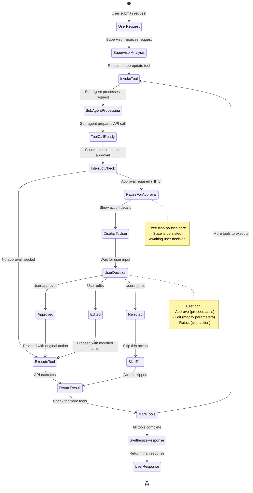

# Supervisor Multi-Agent Architecture Documentation

## Table of Contents
1. [System Overview](#system-overview)
2. [Architecture Layers](#architecture-layers)
3. [Component Interactions](#component-interactions)
4. [Request Flow Examples](#request-flow-examples)
5. [Human-in-the-Loop Flow](#human-in-the-loop-flow)
6. [Sequence Diagrams](#sequence-diagrams)

---

## System Overview

The Supervisor Multi-Agent Pattern implements a hierarchical agent architecture where a central **Supervisor Agent** coordinates multiple specialized **Sub-Agents** to handle complex, multi-domain tasks.

```mermaid
graph TB
    User[👤 User Request] --> Supervisor[🎯 Supervisor Agent]
    
    Supervisor --> |Routes to| CalendarTool[📅 schedule_event Tool]
    Supervisor --> |Routes to| EmailTool[📧 manage_email Tool]
    
    CalendarTool --> |Invokes| CalendarAgent[📅 Calendar Agent]
    EmailTool --> |Invokes| EmailAgent[📧 Email Agent]
    
    CalendarAgent --> |Uses| CalAPI1[create_calendar_event]
    CalendarAgent --> |Uses| CalAPI2[get_available_time_slots]
    
    EmailAgent --> |Uses| EmailAPI[send_email]
    
    CalAPI1 --> |Calls| ExternalAPI1[🌐 Google Calendar API]
    CalAPI2 --> |Calls| ExternalAPI1
    EmailAPI --> |Calls| ExternalAPI2[🌐 SendGrid/Gmail API]
    
    ExternalAPI1 --> Response1[✅ Response]
    ExternalAPI2 --> Response2[✅ Response]
    
    Response1 --> User
    Response2 --> User
    
    style Supervisor fill:#4A90E2,stroke:#2E5C8A,color:#fff
    style CalendarAgent fill:#50C878,stroke:#2E7D4E,color:#fff
    style EmailAgent fill:#FF6B6B,stroke:#C92A2A,color:#fff
    style User fill:#FFD93D,stroke:#C7A600,color:#000
```



---

## Architecture Layers

The system is organized into **three distinct layers**, each with specific responsibilities:

```mermaid
graph TD
    subgraph Layer3[🎯 Layer 3: Orchestration]
        Supervisor[Supervisor Agent<br/>Coordinates workflow<br/>Routes to capabilities]
    end
    
    subgraph Layer2[🤖 Layer 2: Domain Specialists]
        CalAgent[Calendar Agent<br/>Natural language → ISO dates<br/>Availability checking<br/>Event creation]
        EmailAgent[Email Agent<br/>Recipient extraction<br/>Subject generation<br/>Email composition]
    end
    
    subgraph Layer1[🔧 Layer 1: API Tools]
        CreateEvent[create_calendar_event<br/>Requires: ISO datetime]
        GetSlots[get_available_time_slots<br/>Requires: date, attendees]
        SendEmail[send_email<br/>Requires: to, subject, body]
    end
    
    subgraph External[🌐 External Systems]
        GCal[Google Calendar API]
        Outlook[Outlook API]
        SendGrid[SendGrid API]
        Gmail[Gmail API]
    end
    
    Supervisor --> CalAgent
    Supervisor --> EmailAgent
    
    CalAgent --> CreateEvent
    CalAgent --> GetSlots
    EmailAgent --> SendEmail
    
    CreateEvent --> GCal
    CreateEvent --> Outlook
    GetSlots --> GCal
    GetSlots --> Outlook
    SendEmail --> SendGrid
    SendEmail --> Gmail
    
    style Layer3 fill:#E3F2FD,stroke:#1976D2,stroke-width:3px
    style Layer2 fill:#F1F8E9,stroke:#689F38,stroke-width:3px
    style Layer1 fill:#FFF3E0,stroke:#F57C00,stroke-width:3px
    style External fill:#FCE4EC,stroke:#C2185B,stroke-width:3px
```



### Layer Responsibilities

| Layer | Purpose | Input | Output |
|-------|---------|-------|--------|
| **Layer 3: Orchestration** | Routes user requests to appropriate domain specialists | Natural language user request | Synthesized response from multiple domains |
| **Layer 2: Domain Specialists** | Translate natural language to structured API calls | Natural language domain request | Natural language confirmation + API results |
| **Layer 1: API Tools** | Execute precise API operations | Structured parameters (ISO dates, emails) | API response data |

---

## Component Interactions

### How Sub-Agents are Wrapped as Tools

This is the **key architectural pattern** that enables the supervisor to coordinate sub-agents:

```mermaid
sequenceDiagram
    participant Supervisor as 🎯 Supervisor Agent
    participant Tool as 📦 schedule_event Tool
    participant SubAgent as 📅 Calendar Agent
    participant API as 🔧 create_calendar_event API
    
    Note over Supervisor,API: Sub-Agent Wrapping Pattern
    
    Supervisor->>Tool: Call schedule_event("meeting Tuesday 2pm")
    Note over Tool: Tool is a wrapper function
    
    Tool->>SubAgent: Invoke with natural language
    Note over SubAgent: Parses "Tuesday 2pm" → ISO format
    
    SubAgent->>API: create_calendar_event(<br/>title="Meeting",<br/>start_time="2024-10-29T14:00:00",<br/>end_time="2024-10-29T15:00:00")
    
    API-->>SubAgent: "Event created: Meeting from..."
    
    SubAgent-->>Tool: "Meeting scheduled for Tuesday at 2pm"
    
    Tool-->>Supervisor: Return natural language confirmation
    
    Note over Supervisor: Supervisor only sees high-level result
```



### Tool Wrapping Code Pattern

```python
# Step 1: Create specialized sub-agent
calendar_agent = create_agent(
    model,
    tools=[create_calendar_event, get_available_time_slots],
    system_prompt="You are a calendar assistant..."
)

# Step 2: Wrap sub-agent as a tool
@tool
def schedule_event(request: str) -> str:
    """High-level calendar scheduling tool."""
    result = calendar_agent.invoke({
        "messages": [{"role": "user", "content": request}]
    })
    return result["messages"][-1].content

# Step 3: Give wrapped tool to supervisor
supervisor_agent = create_agent(
    model,
    tools=[schedule_event, manage_email],  # High-level tools only
    system_prompt="You are a personal assistant..."
)
```

---

## Request Flow Examples

### Example 1: Simple Single-Domain Request

**User Request:** "Schedule a team standup for tomorrow at 9am"

```mermaid
sequenceDiagram
    participant User as 👤 User
    participant Sup as 🎯 Supervisor
    participant Tool as 📦 schedule_event
    participant Cal as 📅 Calendar Agent
    participant API as 🔧 create_calendar_event
    
    User->>Sup: "Schedule a team standup<br/>for tomorrow at 9am"
    
    Note over Sup: Analyzes request<br/>Identifies: Calendar domain
    
    Sup->>Tool: schedule_event(<br/>"team standup tomorrow at 9am")
    
    Tool->>Cal: Invoke calendar agent
    
    Note over Cal: Parses natural language<br/>"tomorrow at 9am" → ISO format<br/>"2024-10-23T09:00:00"
    
    Cal->>API: create_calendar_event(<br/>title="Team Standup",<br/>start_time="2024-10-23T09:00:00",<br/>end_time="2024-10-23T10:00:00",<br/>attendees=[])
    
    API-->>Cal: ✅ "Event created: Team Standup<br/>from 2024-10-23T09:00:00..."
    
    Cal-->>Tool: "Team standup scheduled<br/>for tomorrow at 9:00 AM"
    
    Tool-->>Sup: Return confirmation
    
    Sup-->>User: "✅ Team standup scheduled<br/>for tomorrow at 9:00 AM"
    
    Note over User,API: Single domain = Single sub-agent invocation
```



---

### Example 2: Complex Multi-Domain Request

**User Request:** "Schedule a meeting with the design team next Tuesday at 2pm for 1 hour, and send them an email reminder about reviewing the new mockups."

```mermaid
sequenceDiagram
    participant User as 👤 User
    participant Sup as 🎯 Supervisor
    participant CalTool as 📦 schedule_event
    participant EmailTool as 📦 manage_email
    participant CalAgent as 📅 Calendar Agent
    participant EmailAgent as 📧 Email Agent
    participant CalAPI as 🔧 Calendar API
    participant EmailAPI as 🔧 Email API
    
    User->>Sup: "Schedule meeting with design team<br/>Tuesday 2pm for 1 hour,<br/>send email reminder about mockups"
    
    Note over Sup: Analyzes request<br/>Identifies: Calendar + Email domains<br/>Plans: Sequential execution
    
    rect rgb(200, 230, 255)
        Note over Sup,CalAPI: Calendar Domain Flow
        Sup->>CalTool: schedule_event(<br/>"meeting with design team<br/>Tuesday 2pm for 1 hour")
        
        CalTool->>CalAgent: Invoke calendar agent
        
        Note over CalAgent: Parse: "Tuesday 2pm" → ISO<br/>Calculate: 1 hour duration
        
        CalAgent->>CalAPI: create_calendar_event(<br/>title="Design Team Meeting",<br/>start_time="2024-10-29T14:00:00",<br/>end_time="2024-10-29T15:00:00",<br/>attendees=["design-team@company.com"])
        
        CalAPI-->>CalAgent: ✅ Event created
        CalAgent-->>CalTool: "Meeting scheduled Tuesday 2-3pm"
        CalTool-->>Sup: Calendar confirmation
    end
    
    rect rgb(255, 230, 230)
        Note over Sup,EmailAPI: Email Domain Flow
        Sup->>EmailTool: manage_email(<br/>"send design team reminder<br/>about reviewing mockups")
        
        EmailTool->>EmailAgent: Invoke email agent
        
        Note over EmailAgent: Extract: recipients<br/>Generate: subject & body<br/>Compose: professional email
        
        EmailAgent->>EmailAPI: send_email(<br/>to=["design-team@company.com"],<br/>subject="Reminder: Review New Mockups",<br/>body="Hi Design Team...")
        
        EmailAPI-->>EmailAgent: ✅ Email sent
        EmailAgent-->>EmailTool: "Email sent to design team"
        EmailTool-->>Sup: Email confirmation
    end
    
    Note over Sup: Synthesize both results
    
    Sup-->>User: "✅ Meeting scheduled Tuesday 2-3pm<br/>✅ Email reminder sent to design team"
    
    Note over User,EmailAPI: Multi-domain = Multiple sub-agent invocations
```



---

## Human-in-the-Loop Flow

The HITL pattern adds approval gates before executing sensitive actions:



### HITL Sequence Diagram

```mermaid
sequenceDiagram
    participant User as 👤 User
    participant Sup as 🎯 Supervisor
    participant Tool as 📦 schedule_event
    participant Agent as 📅 Calendar Agent
    participant HITL as 🛡️ HITL Middleware
    participant API as 🔧 create_calendar_event
    participant Checkpoint as 💾 Checkpointer
    
    User->>Sup: "Schedule meeting Tuesday 2pm"
    
    Sup->>Tool: schedule_event(...)
    Tool->>Agent: Invoke agent
    
    Agent->>HITL: Prepare tool call:<br/>create_calendar_event(...)
    
    Note over HITL: Check interrupt_on config<br/>create_calendar_event: True
    
    HITL->>Checkpoint: Save state
    Checkpoint-->>HITL: State saved
    
    HITL-->>Agent: Interrupt execution
    Agent-->>Tool: Return interrupt event
    Tool-->>Sup: Propagate interrupt
    
    Sup-->>User: ⏸️ PAUSED<br/>📅 Calendar event pending approval<br/><br/>Tool: create_calendar_event<br/>Args: {title: "Meeting", ...}<br/><br/>Approve / Edit / Reject?
    
    User->>Sup: Decision: "Approve"
    
    Sup->>Checkpoint: Resume with decision
    Checkpoint->>HITL: Load state + decision
    
    HITL->>Agent: Resume with approval
    Agent->>API: Execute create_calendar_event(...)
    
    API-->>Agent: ✅ Event created
    Agent-->>Tool: Confirmation
    Tool-->>Sup: Result
    
    Sup-->>User: ✅ Meeting scheduled Tuesday 2pm
    
    rect rgb(255, 240, 240)
        Note over User,Checkpoint: HITL adds approval gate<br/>Execution pauses and resumes<br/>State persisted via checkpointer
    end
```



---

## Sequence Diagrams

### Complete System Flow with All Components

```mermaid
sequenceDiagram
    autonumber
    
    participant User as 👤 User
    participant Sup as 🎯 Supervisor<br/>Agent
    participant LLM1 as 🤖 LLM<br/>(Supervisor)
    participant CalTool as 📦 schedule_event<br/>Tool Wrapper
    participant CalAgent as 📅 Calendar<br/>Agent
    participant LLM2 as 🤖 LLM<br/>(Calendar)
    participant API as 🔧 create_calendar_event<br/>API Tool
    participant External as 🌐 Google<br/>Calendar
    
    User->>Sup: "Schedule team meeting tomorrow 9am"
    
    Sup->>LLM1: System: "You are a personal assistant..."<br/>User: "Schedule team meeting tomorrow 9am"<br/>Tools: [schedule_event, manage_email]
    
    Note over LLM1: Reasoning:<br/>- User wants calendar action<br/>- Use schedule_event tool<br/>- Pass full context
    
    LLM1-->>Sup: Tool Call: schedule_event(<br/>request="team meeting tomorrow 9am")
    
    Sup->>CalTool: Execute tool with request
    
    CalTool->>CalAgent: Invoke agent with:<br/>messages=[{role: "user",<br/>content: "team meeting tomorrow 9am"}]
    
    CalAgent->>LLM2: System: "You are a calendar assistant..."<br/>User: "team meeting tomorrow 9am"<br/>Tools: [create_calendar_event,<br/>get_available_time_slots]
    
    Note over LLM2: Reasoning:<br/>- Parse "tomorrow 9am"<br/>- Calculate ISO datetime<br/>- Default 1 hour duration<br/>- Use create_calendar_event
    
    LLM2-->>CalAgent: Tool Call: create_calendar_event(<br/>title="Team Meeting",<br/>start_time="2024-10-23T09:00:00",<br/>end_time="2024-10-23T10:00:00",<br/>attendees=[])
    
    CalAgent->>API: Execute API tool
    
    API->>External: POST /calendar/events<br/>{title: "Team Meeting", ...}
    
    External-->>API: 200 OK<br/>{event_id: "evt_123", ...}
    
    API-->>CalAgent: "✅ Event created: Team Meeting<br/>from 2024-10-23T09:00:00..."
    
    CalAgent->>LLM2: Tool Result: "Event created..."
    
    Note over LLM2: Generate natural language<br/>confirmation for user
    
    LLM2-->>CalAgent: "Team meeting scheduled<br/>for tomorrow at 9:00 AM"
    
    CalAgent-->>CalTool: Return final message
    
    CalTool-->>Sup: "Team meeting scheduled<br/>for tomorrow at 9:00 AM"
    
    Sup->>LLM1: Tool Result: "Team meeting scheduled..."
    
    Note over LLM1: Synthesize final response
    
    LLM1-->>Sup: "✅ Your team meeting is scheduled<br/>for tomorrow at 9:00 AM"
    
    Sup-->>User: Display response
    
    rect rgb(230, 245, 255)
        Note over User,External: Key Points:<br/>1. Two separate LLM calls (Supervisor + Sub-agent)<br/>2. Tool wrapping enables abstraction<br/>3. Natural language in/out at each layer<br/>4. Structured data only at API layer
    end
```



---

## Information Flow & Context Engineering

### What Each Agent Sees

```mermaid
graph TD
    subgraph UserContext[👤 User Context]
        UR[Full User Request:<br/>"Schedule meeting with design team<br/>Tuesday 2pm, send email reminder"]
    end
    
    subgraph SupervisorContext[🎯 Supervisor Context]
        SC1[User Request: Full text]
        SC2[Available Tools:<br/>- schedule_event<br/>- manage_email]
        SC3[Conversation History]
        SC4[System Prompt:<br/>"You are a personal assistant..."]
    end
    
    subgraph CalendarContext[📅 Calendar Agent Context]
        CC1[Sub-Request:<br/>"meeting with design team Tuesday 2pm"]
        CC2[Available Tools:<br/>- create_calendar_event<br/>- get_available_time_slots]
        CC3[System Prompt:<br/>"You are a calendar assistant..."]
        CC4[❌ NO access to:<br/>- Email tools<br/>- Full conversation<br/>- Other sub-agent results]
    end
    
    subgraph EmailContext[📧 Email Agent Context]
        EC1[Sub-Request:<br/>"send email reminder about mockups"]
        EC2[Available Tools:<br/>- send_email]
        EC3[System Prompt:<br/>"You are an email assistant..."]
        EC4[❌ NO access to:<br/>- Calendar tools<br/>- Full conversation<br/>- Other sub-agent results]
    end
    
    UR --> SC1
    SC1 --> CC1
    SC1 --> EC1
    
    style UserContext fill:#FFD93D,stroke:#C7A600
    style SupervisorContext fill:#4A90E2,stroke:#2E5C8A,color:#fff
    style CalendarContext fill:#50C878,stroke:#2E7D4E,color:#fff
    style EmailContext fill:#FF6B6B,stroke:#C92A2A,color:#fff
```

### Context Isolation Benefits

| Benefit | Description | Example |
|---------|-------------|---------|
| **Reduced Token Usage** | Sub-agents don't see full conversation | Calendar agent doesn't need email context |
| **Focused Reasoning** | Each agent reasons only about its domain | Email agent focuses on composition, not scheduling |
| **Clearer Prompts** | Domain-specific instructions | "Parse dates" vs "Compose emails" |
| **Easier Debugging** | Isolate which agent is failing | Calendar parsing issue ≠ Email issue |
| **Better Performance** | Less context = faster, more accurate responses | Smaller context window = better focus |

---

## Error Handling & Retry Flow

```mermaid
sequenceDiagram
    participant User
    participant Supervisor
    participant Tool
    participant SubAgent
    participant API
    
    User->>Supervisor: Request
    Supervisor->>Tool: Invoke tool
    Tool->>SubAgent: Execute
    SubAgent->>API: API call
    
    alt API Success
        API-->>SubAgent: ✅ Success
        SubAgent-->>Tool: Result
        Tool-->>Supervisor: Result
        Supervisor-->>User: Success response
    else API Error (Retryable)
        API-->>SubAgent: ❌ 429 Rate Limit
        Note over SubAgent: Retry with backoff
        SubAgent->>API: Retry API call
        API-->>SubAgent: ✅ Success
        SubAgent-->>Tool: Result
        Tool-->>Supervisor: Result
        Supervisor-->>User: Success response
    else API Error (Non-retryable)
        API-->>SubAgent: ❌ 400 Bad Request
        SubAgent-->>Tool: Error message
        Tool-->>Supervisor: Error context
        Note over Supervisor: LLM decides:<br/>- Retry with different params?<br/>- Ask user for clarification?<br/>- Fail gracefully?
        Supervisor-->>User: "I couldn't schedule that.<br/>Could you provide more details?"
    else Sub-Agent Error
        SubAgent-->>Tool: ❌ Parse error
        Tool-->>Supervisor: Error context
        Supervisor->>Tool: Retry with clarification
        Tool->>SubAgent: "Please schedule for 2pm"
        SubAgent->>API: API call
        API-->>SubAgent: ✅ Success
        SubAgent-->>Tool: Result
        Tool-->>Supervisor: Result
        Supervisor-->>User: Success response
    end
```



---

## Deployment Architecture

```mermaid
graph TB
    subgraph Client[Client Layer]
        WebUI[🌐 Web UI]
        CLI[💻 CLI]
        API[🔌 API Client]
    end
    
    subgraph Application[Application Layer]
        FastAPI[FastAPI Server]
        SupervisorService[Supervisor Service]
        
        FastAPI --> SupervisorService
    end
    
    subgraph Agents[Agent Layer]
        Supervisor[🎯 Supervisor Agent]
        CalAgent[📅 Calendar Agent]
        EmailAgent[📧 Email Agent]
        
        SupervisorService --> Supervisor
        Supervisor --> CalAgent
        Supervisor --> EmailAgent
    end
    
    subgraph LLM[LLM Provider]
        Anthropic[Anthropic Claude API]
        
        Supervisor -.->|API calls| Anthropic
        CalAgent -.->|API calls| Anthropic
        EmailAgent -.->|API calls| Anthropic
    end
    
    subgraph Storage[Storage Layer]
        Checkpoint[(Checkpointer<br/>PostgreSQL/Redis)]
        LangSmith[(LangSmith<br/>Tracing)]
        
        Supervisor -.->|Save state| Checkpoint
        Supervisor -.->|Log traces| LangSmith
    end
    
    subgraph External[External APIs]
        GCal[Google Calendar]
        SendGrid[SendGrid]
        
        CalAgent -->|API calls| GCal
        EmailAgent -->|API calls| SendGrid
    end
    
    WebUI --> FastAPI
    CLI --> FastAPI
    API --> FastAPI
    
    style Client fill:#FFE5B4,stroke:#D4A574
    style Application fill:#B4D7FF,stroke:#7BA7D4
    style Agents fill:#C8E6C9,stroke:#81C784
    style LLM fill:#E1BEE7,stroke:#BA68C8
    style Storage fill:#FFCCBC,stroke:#FF8A65
    style External fill:#F8BBD0,stroke:#F06292
```



---

## Summary

### Key Architectural Patterns

1. **Hierarchical Delegation**: Supervisor → Sub-agents → APIs
2. **Tool Wrapping**: Sub-agents exposed as high-level tools
3. **Context Isolation**: Each agent sees only relevant information
4. **Natural Language Interfaces**: Human-friendly at every layer
5. **Structured Data at Boundaries**: Precise formats only at API layer

### Benefits Realized

✅ **Modularity**: Add/remove domains independently  
✅ **Maintainability**: Update prompts/tools per domain  
✅ **Scalability**: Parallel sub-agent execution possible  
✅ **Debuggability**: Trace issues to specific layer/agent  
✅ **Flexibility**: Swap LLMs, APIs, or agents easily  

### When to Use This Pattern

| Scenario | Use Supervisor? | Alternative |
|----------|----------------|-------------|
| Multiple distinct domains (calendar, email, CRM) | ✅ Yes | - |
| 10+ tools across different domains | ✅ Yes | - |
| Need centralized workflow control | ✅ Yes | - |
| Only 2-3 simple tools | ❌ No | Single agent |
| Agents need to chat with users | ❌ No | Handoff pattern |
| Peer-to-peer agent collaboration | ❌ No | Mesh pattern |

---

**Next Steps**: Review the code implementation in `main.py` to see how these diagrams map to actual LangChain/LangGraph code!
