# Data Flow & Message Passing

## Message Structure Through the System

### LangChain Message Format

All agents communicate using LangChain's message format:

```python
{
    "messages": [
        {"role": "user", "content": "Schedule meeting tomorrow"},
        {"role": "assistant", "content": "I'll schedule that for you"},
        {"role": "tool", "name": "create_calendar_event", "content": "Event created"}
    ]
}
```

## Complete Data Flow Diagram


## Detailed Message Transformation

### Step-by-Step Message Evolution

```mermaid
sequenceDiagram
    autonumber
    
    participant User
    participant Sup as Supervisor
    participant Tool as Tool Wrapper
    participant Agent as Sub-Agent
    participant API
    
    Note over User,API: Message Transformation at Each Layer
    
    User->>Sup: Input: "Schedule meeting tomorrow 9am"
    
    Note over Sup: State: {<br/>  messages: [<br/>    {role: "user",<br/>     content: "Schedule meeting tomorrow 9am"}<br/>  ]<br/>}
    
    Sup->>Sup: LLM processes messages
    
    Note over Sup: LLM Output: {<br/>  role: "assistant",<br/>  tool_calls: [{<br/>    name: "schedule_event",<br/>    arguments: {<br/>      request: "meeting tomorrow 9am"<br/>    }<br/>  }]<br/>}
    
    Sup->>Tool: Call: schedule_event(<br/>  request="meeting tomorrow 9am"<br/>)
    
    Note over Tool: Extract: request string<br/>Transform to sub-agent format
    
    Tool->>Agent: Invoke: {<br/>  messages: [<br/>    {role: "user",<br/>     content: "meeting tomorrow 9am"}<br/>  ]<br/>}
    
    Note over Agent: State: {<br/>  messages: [<br/>    {role: "user",<br/>     content: "meeting tomorrow 9am"}<br/>  ]<br/>}
    
    Agent->>Agent: LLM processes messages
    
    Note over Agent: LLM Output: {<br/>  role: "assistant",<br/>  tool_calls: [{<br/>    name: "create_calendar_event",<br/>    arguments: {<br/>      title: "Meeting",<br/>      start_time: "2024-10-23T09:00:00",<br/>      end_time: "2024-10-23T10:00:00",<br/>      attendees: []<br/>    }<br/>  }]<br/>}
    
    Agent->>API: Call: create_calendar_event(<br/>  title="Meeting",<br/>  start_time="2024-10-23T09:00:00",<br/>  end_time="2024-10-23T10:00:00",<br/>  attendees=[]<br/>)
    
    Note over API: Execute API call<br/>Return structured response
    
    API-->>Agent: Return: "✅ Event created: Meeting<br/>from 2024-10-23T09:00:00..."
    
    Note over Agent: State: {<br/>  messages: [<br/>    {role: "user", content: "..."},<br/>    {role: "assistant", tool_calls: [...]},<br/>    {role: "tool",<br/>     name: "create_calendar_event",<br/>     content: "✅ Event created..."}<br/>  ]<br/>}
    
    Agent->>Agent: LLM generates final response
    
    Note over Agent: LLM Output: {<br/>  role: "assistant",<br/>  content: "Meeting scheduled<br/>           for tomorrow at 9:00 AM"<br/>}
    
    Agent-->>Tool: Return: {<br/>  messages: [...,<br/>    {role: "assistant",<br/>     content: "Meeting scheduled..."}<br/>  ]<br/>}
    
    Tool-->>Sup: Return: "Meeting scheduled<br/>for tomorrow at 9:00 AM"
    
    Note over Sup: State: {<br/>  messages: [<br/>    {role: "user", content: "Schedule..."},<br/>    {role: "assistant", tool_calls: [...]},<br/>    {role: "tool",<br/>     name: "schedule_event",<br/>     content: "Meeting scheduled..."}<br/>  ]<br/>}
    
    Sup->>Sup: LLM generates final response
    
    Note over Sup: LLM Output: {<br/>  role: "assistant",<br/>  content: "✅ Your meeting is scheduled<br/>           for tomorrow at 9:00 AM"<br/>}
    
    Sup-->>User: Output: "✅ Your meeting is scheduled<br/>for tomorrow at 9:00 AM"
```



## State Management

### Supervisor State

```python
{
    "messages": [
        # User's original request
        {"role": "user", "content": "Schedule meeting tomorrow 9am"},
        
        # Supervisor's tool call decision
        {
            "role": "assistant",
            "tool_calls": [{
                "id": "call_123",
                "name": "schedule_event",
                "arguments": {"request": "meeting tomorrow 9am"}
            }]
        },
        
        # Tool execution result
        {
            "role": "tool",
            "tool_call_id": "call_123",
            "name": "schedule_event",
            "content": "Meeting scheduled for tomorrow at 9:00 AM"
        },
        
        # Supervisor's final response
        {
            "role": "assistant",
            "content": "✅ Your meeting is scheduled for tomorrow at 9:00 AM"
        }
    ]
}
```

### Sub-Agent State (Isolated)

```python
{
    "messages": [
        # Only the sub-request (NOT full conversation)
        {"role": "user", "content": "meeting tomorrow 9am"},
        
        # Sub-agent's tool call
        {
            "role": "assistant",
            "tool_calls": [{
                "id": "call_456",
                "name": "create_calendar_event",
                "arguments": {
                    "title": "Meeting",
                    "start_time": "2024-10-23T09:00:00",
                    "end_time": "2024-10-23T10:00:00",
                    "attendees": []
                }
            }]
        },
        
        # API tool result
        {
            "role": "tool",
            "tool_call_id": "call_456",
            "name": "create_calendar_event",
            "content": "✅ Event created: Meeting from 2024-10-23T09:00:00..."
        },
        
        # Sub-agent's final message
        {
            "role": "assistant",
            "content": "Meeting scheduled for tomorrow at 9:00 AM"
        }
    ]
}
```

## Data Type Transformations

```mermaid
graph LR
    subgraph Layer1[User Input]
        D1[String:<br/>'Schedule meeting<br/>tomorrow 9am']
    end
    
    subgraph Layer2[Supervisor Processing]
        D2[Message List:<br/>role: user<br/>content: string]
        D3[Tool Call:<br/>name: string<br/>arguments: dict]
    end
    
    subgraph Layer3[Tool Wrapper]
        D4[Function Args:<br/>request: str]
        D5[Agent Invoke:<br/>messages: List]
    end
    
    subgraph Layer4[Sub-Agent Processing]
        D6[Message List:<br/>role: user<br/>content: string]
        D7[Tool Call:<br/>name: string<br/>arguments: dict]
    end
    
    subgraph Layer5[API Execution]
        D8[Structured Params:<br/>title: str<br/>start_time: str<br/>end_time: str<br/>attendees: List[str]]
        D9[API Response:<br/>string]
    end
    
    subgraph Layer6[Response Chain]
        D10[Tool Message:<br/>role: tool<br/>content: string]
        D11[Assistant Message:<br/>role: assistant<br/>content: string]
        D12[Final String:<br/>'Meeting scheduled...']
    end
    
    D1 --> D2
    D2 --> D3
    D3 --> D4
    D4 --> D5
    D5 --> D6
    D6 --> D7
    D7 --> D8
    D8 --> D9
    D9 --> D10
    D10 --> D11
    D11 --> D12
    
    style Layer1 fill:#FFE5B4
    style Layer2 fill:#B4D7FF
    style Layer3 fill:#E1BEE7
    style Layer4 fill:#C8E6C9
    style Layer5 fill:#FFCCBC
    style Layer6 fill:#F8BBD0
```

## Context Passing Patterns

### Pattern 1: Minimal Context (Default)

```python
@tool
def schedule_event(request: str) -> str:
    """Only passes the sub-request string."""
    result = calendar_agent.invoke({
        "messages": [{"role": "user", "content": request}]
    })
    return result["messages"][-1].content
```

**Data Flow**:
- Supervisor → Tool: `"meeting tomorrow 9am"`
- Tool → Sub-Agent: `[{role: "user", content: "meeting tomorrow 9am"}]`
- Sub-Agent sees: Only the sub-request

### Pattern 2: Full Context (Advanced)

```python
from langchain.tools import ToolRuntime

@tool
def schedule_event(request: str, runtime: ToolRuntime) -> str:
    """Passes full conversation context."""
    # Access full supervisor state
    full_messages = runtime.state["messages"]
    
    # Build enriched context
    context = f"Original request: {full_messages[0].content}\n"
    context += f"Sub-task: {request}"
    
    result = calendar_agent.invoke({
        "messages": [{"role": "user", "content": context}]
    })
    return result["messages"][-1].content
```

**Data Flow**:
- Supervisor → Tool: `"meeting tomorrow 9am"` + full state
- Tool → Sub-Agent: `[{role: "user", content: "Original request: ...\nSub-task: ..."}]`
- Sub-Agent sees: Full context

## Multi-Domain Data Flow

```mermaid
graph TB
    User[User Request:<br/>'Schedule meeting Tuesday 2pm,<br/>send email reminder']
    
    Sup[Supervisor State]
    
    User --> Sup
    
    Sup --> CalTool[schedule_event Tool]
    Sup --> EmailTool[manage_email Tool]
    
    CalTool --> CalAgent[Calendar Agent State:<br/>messages: ['meeting Tuesday 2pm']]
    EmailTool --> EmailAgent[Email Agent State:<br/>messages: ['send email reminder']]
    
    CalAgent --> CalAPI[create_calendar_event:<br/>title='Meeting'<br/>start_time='2024-10-29T14:00:00']
    
    EmailAgent --> EmailAPI[send_email:<br/>to=['design-team@company.com']<br/>subject='Reminder'<br/>body='...']
    
    CalAPI --> CalResult[Result: 'Event created']
    EmailAPI --> EmailResult[Result: 'Email sent']
    
    CalResult --> CalAgent
    EmailResult --> EmailAgent
    
    CalAgent --> CalTool
    EmailAgent --> EmailTool
    
    CalTool --> Sup
    EmailTool --> Sup
    
    Sup --> FinalResponse[Final Response:<br/>'✅ Meeting scheduled Tuesday 2pm<br/>✅ Email reminder sent']
    
    style User fill:#FFD93D
    style Sup fill:#4A90E2,color:#fff
    style CalAgent fill:#50C878,color:#fff
    style EmailAgent fill:#FF6B6B,color:#fff
    style FinalResponse fill:#FFD93D
```

## HITL State Persistence


### Checkpoint State Structure

```python
{
    "thread_id": "demo-1",
    "checkpoint_id": "abc123",
    "state": {
        "messages": [...],
        "pending_tool_calls": [{
            "tool": "create_calendar_event",
            "arguments": {...},
            "interrupt_id": "xyz789"
        }]
    },
    "metadata": {
        "timestamp": "2024-10-23T00:00:00",
        "user_id": "user_123"
    }
}
```

## Performance Optimization

### Token Usage Breakdown

| Layer | Tokens In | Tokens Out | Total |
|-------|-----------|------------|-------|
| Supervisor LLM Call | ~500 | ~100 | ~600 |
| Sub-Agent LLM Call | ~300 | ~80 | ~380 |
| **Total per request** | | | **~980** |

### Optimization Strategies

1. **Reduce Context Size**
   - Pass only relevant messages to sub-agents
   - Summarize long conversations

2. **Cache Sub-Agent Responses**
   - Cache common queries ("What's my schedule today?")
   - Invalidate on state changes

3. **Parallel Execution**
   - Execute independent sub-agents in parallel
   - Requires async implementation

4. **Streaming**
   - Stream supervisor responses
   - Show progress as sub-agents execute

## Summary

### Key Data Flow Principles

1. **Natural Language at Boundaries**: User input/output always natural language
2. **Structured Data Internally**: APIs use precise formats (ISO dates, emails)
3. **Message Lists for Agents**: All agents work with message lists
4. **Context Isolation**: Sub-agents see minimal necessary context
5. **State Persistence**: Checkpointer enables pause/resume for HITL
6. **Transformation at Each Layer**: Data transforms as it flows through system

### Data Flow Best Practices

✅ Keep sub-agent context minimal  
✅ Use clear message roles (user, assistant, tool)  
✅ Persist state for HITL workflows  
✅ Transform data at layer boundaries  
✅ Return natural language from sub-agents  
✅ Log state transitions for debugging  
