# Visual Summary - One-Page Overview

This document provides a single-page visual summary of the entire Supervisor Multi-Agent Pattern.

## 🎯 The Big Picture

```mermaid
graph TB
    subgraph UserLayer["👤 USER LAYER"]
        User[User submits<br/>natural language request]
    end
    
    subgraph SupervisorLayer["🎯 SUPERVISOR LAYER (Orchestration)"]
        Sup[Supervisor Agent<br/>- Analyzes request<br/>- Routes to domains<br/>- Synthesizes results]
        SupLLM[LLM Call:<br/>Claude/GPT]
        
        Sup <--> SupLLM
    end
    
    subgraph ToolLayer["📦 TOOL WRAPPER LAYER"]
        CalTool[schedule_event<br/>Tool Wrapper]
        EmailTool[manage_email<br/>Tool Wrapper]
    end
    
    subgraph AgentLayer["🤖 SUB-AGENT LAYER (Domain Specialists)"]
        CalAgent[Calendar Agent<br/>- Parse dates<br/>- Check availability<br/>- Create events]
        EmailAgent[Email Agent<br/>- Extract recipients<br/>- Generate subject<br/>- Compose body]
        
        CalLLM[LLM Call:<br/>Claude/GPT]
        EmailLLM[LLM Call:<br/>Claude/GPT]
        
        CalAgent <--> CalLLM
        EmailAgent <--> EmailLLM
    end
    
    subgraph APILayer["🔧 API TOOL LAYER"]
        CreateEvent[create_calendar_event<br/>ISO datetime required]
        GetSlots[get_available_time_slots<br/>Date + attendees]
        SendEmail[send_email<br/>To, subject, body]
    end
    
    subgraph ExternalLayer["🌐 EXTERNAL SYSTEMS"]
        GCal[Google Calendar]
        Outlook[Outlook]
        SendGrid[SendGrid]
        Gmail[Gmail]
    end
    
    User --> Sup
    Sup --> CalTool
    Sup --> EmailTool
    
    CalTool --> CalAgent
    EmailTool --> EmailAgent
    
    CalAgent --> CreateEvent
    CalAgent --> GetSlots
    EmailAgent --> SendEmail
    
    CreateEvent --> GCal
    CreateEvent --> Outlook
    GetSlots --> GCal
    SendEmail --> SendGrid
    SendEmail --> Gmail
    
    GCal --> User
    Outlook --> User
    SendGrid --> User
    Gmail --> User
    
    style UserLayer fill:#FFD93D,stroke:#C7A600,stroke-width:3px
    style SupervisorLayer fill:#4A90E2,stroke:#2E5C8A,stroke-width:3px,color:#fff
    style ToolLayer fill:#9B59B6,stroke:#6C3483,stroke-width:3px,color:#fff
    style AgentLayer fill:#50C878,stroke:#2E7D4E,stroke-width:3px,color:#fff
    style APILayer fill:#FF6B6B,stroke:#C92A2A,stroke-width:3px,color:#fff
    style ExternalLayer fill:#95A5A6,stroke:#7F8C8D,stroke-width:3px
```

---

## 🔄 Request Flow Comparison

### Simple Request (Single Domain)

```mermaid
sequenceDiagram
    participant U as 👤 User
    participant S as 🎯 Supervisor
    participant T as 📦 Tool
    participant A as 🤖 Agent
    participant API as 🔧 API
    
    U->>S: "Schedule meeting tomorrow 9am"
    S->>T: schedule_event(...)
    T->>A: Invoke
    A->>API: create_calendar_event(...)
    API-->>A: ✅ Created
    A-->>T: "Scheduled"
    T-->>S: Result
    S-->>U: ✅ "Meeting scheduled tomorrow 9am"
    
    Note over U,API: 1 domain = 1 sub-agent = Fast
```

### Complex Request (Multi-Domain)

```mermaid
sequenceDiagram
    participant U as 👤 User
    participant S as 🎯 Supervisor
    participant CT as 📦 Cal Tool
    participant ET as 📦 Email Tool
    participant CA as 🤖 Cal Agent
    participant EA as 🤖 Email Agent
    participant API1 as 🔧 Cal API
    participant API2 as 🔧 Email API
    
    U->>S: "Schedule meeting Tuesday 2pm,<br/>send email reminder"
    
    par Calendar Flow
        S->>CT: schedule_event(...)
        CT->>CA: Invoke
        CA->>API1: create_calendar_event(...)
        API1-->>CA: ✅ Created
        CA-->>CT: "Scheduled"
        CT-->>S: Result 1
    and Email Flow
        S->>ET: manage_email(...)
        ET->>EA: Invoke
        EA->>API2: send_email(...)
        API2-->>EA: ✅ Sent
        EA-->>ET: "Sent"
        ET-->>S: Result 2
    end
    
    S-->>U: ✅ "Meeting scheduled + Email sent"
    
    Note over U,API2: 2 domains = 2 sub-agents = Coordinated
```

---

## 🛡️ Human-in-the-Loop Flow

```mermaid
stateDiagram-v2
    [*] --> Analyzing: User Request
    Analyzing --> Routing: Supervisor Routes
    Routing --> Processing: Sub-Agent Processes
    Processing --> InterruptCheck: Tool Call Ready
    
    InterruptCheck --> Executing: No Approval Needed
    InterruptCheck --> Paused: ⏸️ HITL Triggered
    
    Paused --> SaveState: 💾 Save to Checkpoint
    SaveState --> WaitUser: Show to User
    WaitUser --> UserDecides: User Reviews
    
    UserDecides --> Approved: ✅ Approve
    UserDecides --> Edited: ✏️ Edit
    UserDecides --> Rejected: ❌ Reject
    
    Approved --> RestoreState: 💾 Load State
    Edited --> RestoreState: 💾 Load State
    Rejected --> Skipped: Skip Action
    
    RestoreState --> Executing: Resume
    Executing --> Complete: Return Result
    Skipped --> Complete: Return Skipped
    
    Complete --> MoreActions: Check Queue
    MoreActions --> Routing: More to Do
    MoreActions --> [*]: All Done
    
    note right of Paused
        Execution pauses here
        State persisted
        User has control
    end note
```

---

## 📊 Data Transformation Pipeline

```mermaid
graph LR
    subgraph Input
        I1["Natural Language<br/>'Schedule meeting<br/>tomorrow 9am'"]
    end
    
    subgraph Supervisor
        S1["Message List<br/>[{role: 'user',<br/>content: '...'}]"]
        S2["Tool Call<br/>{name: 'schedule_event',<br/>args: {...}}"]
    end
    
    subgraph Wrapper
        W1["Function Call<br/>schedule_event(<br/>request='...')"]
    end
    
    subgraph SubAgent
        A1["Message List<br/>[{role: 'user',<br/>content: '...'}]"]
        A2["Tool Call<br/>{name: 'create_event',<br/>args: {...}}"]
    end
    
    subgraph API
        P1["Structured Params<br/>{title: 'Meeting',<br/>start_time: '2024-10-23T09:00:00',<br/>end_time: '2024-10-23T10:00:00'}"]
        P2["API Response<br/>'✅ Event created'"]
    end
    
    subgraph Output
        O1["Natural Language<br/>'Meeting scheduled<br/>tomorrow at 9am'"]
    end
    
    I1 --> S1 --> S2 --> W1 --> A1 --> A2 --> P1 --> P2 --> O1
    
    style Input fill:#FFD93D
    style Supervisor fill:#4A90E2,color:#fff
    style Wrapper fill:#9B59B6,color:#fff
    style SubAgent fill:#50C878,color:#fff
    style API fill:#FF6B6B,color:#fff
    style Output fill:#FFD93D
```

---

## 🎭 Component Responsibilities

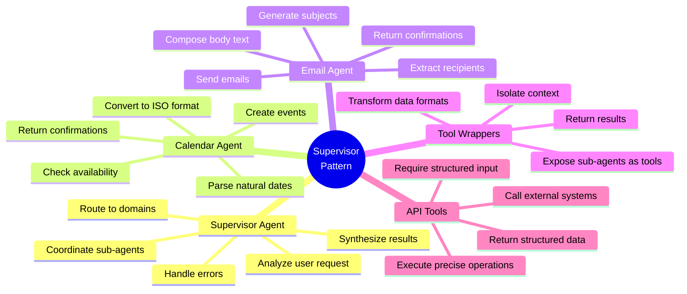

---

## 🔑 Key Design Principles

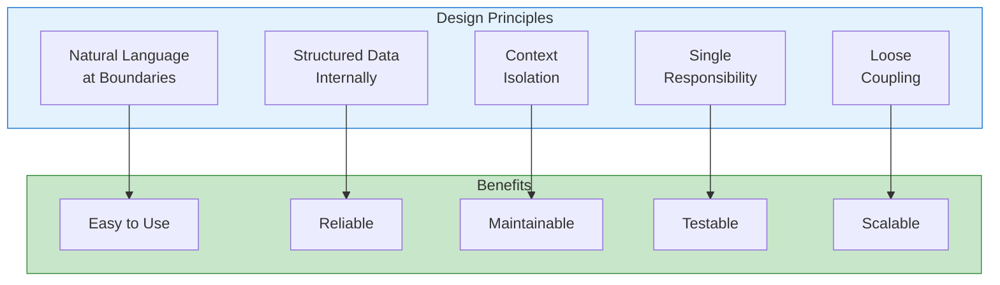

---

## 📈 Scaling Patterns

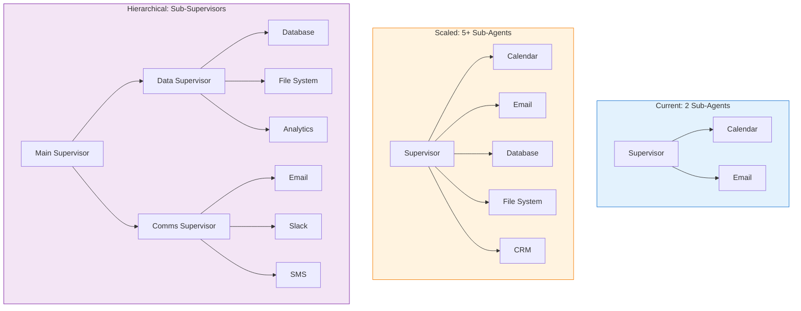

---

## 🎯 Decision Tree: When to Use

```mermaid
graph TD
    Start{Need AI Agent?}
    Start -->|Yes| Q1{Multiple Domains?}
    Start -->|No| End1[Don't use agents]
    
    Q1 -->|No| Q2{Many Tools?}
    Q1 -->|Yes| Q3{Agents Chat with Users?}
    
    Q2 -->|No| End2[Single Agent]
    Q2 -->|Yes| End3[Single Agent<br/>with Tool Groups]
    
    Q3 -->|Yes| End4[Use Handoff Pattern]
    Q3 -->|No| Q4{Need Central Control?}
    
    Q4 -->|Yes| End5[✅ Use Supervisor Pattern]
    Q4 -->|No| End6[Use Mesh Pattern]
    
    style End5 fill:#50C878,stroke:#2E7D4E,color:#fff,stroke-width:3px
    style End1 fill:#95A5A6,stroke:#7F8C8D
    style End2 fill:#3498DB,stroke:#2980B9,color:#fff
    style End3 fill:#3498DB,stroke:#2980B9,color:#fff
    style End4 fill:#E74C3C,stroke:#C0392B,color:#fff
    style End6 fill:#F39C12,stroke:#D68910,color:#fff
```

---

## 🔍 Troubleshooting Quick Reference

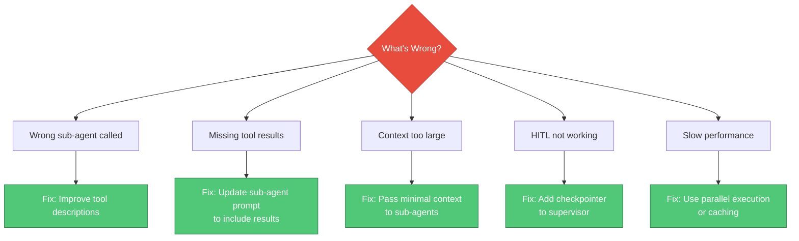

---

## 📊 Performance Metrics

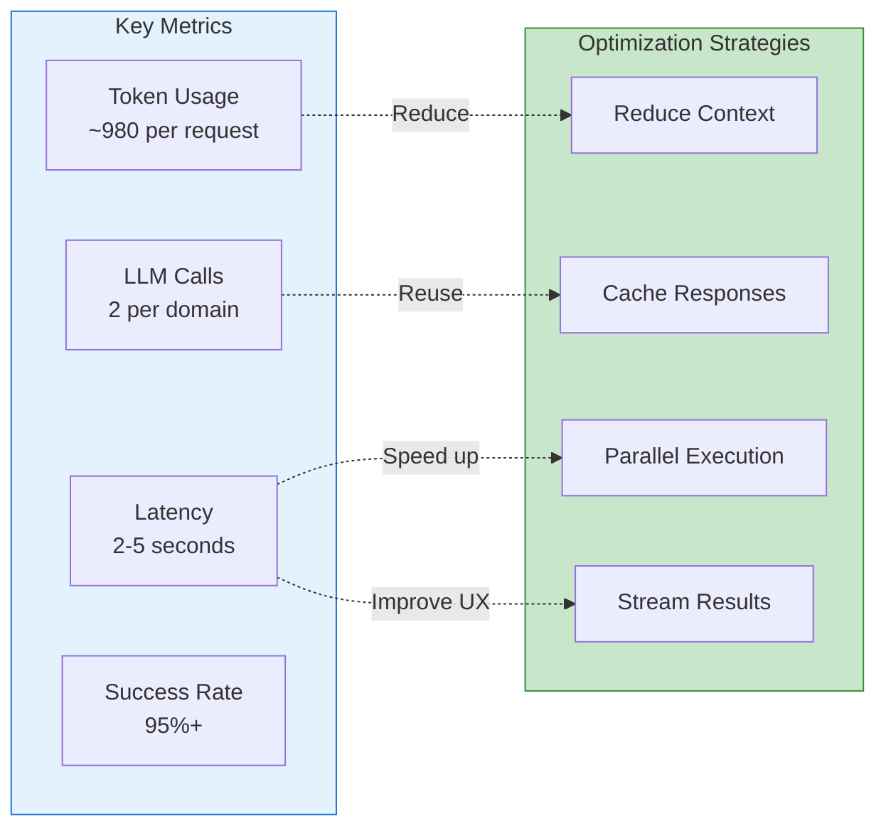

---

## 🎓 Learning Path

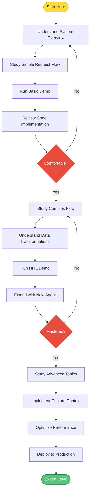

---

## 🚀 Quick Start Checklist

```mermaid
graph TD
    C1[✅ Install dependencies<br/>langchain, langgraph]
    C2[✅ Set ANTHROPIC_API_KEY]
    C3[✅ Review architecture.md]
    C4[✅ Run python main.py]
    C5[✅ Try Example 1]
    C6[✅ Try Example 2]
    C7[✅ Try Interactive Mode]
    C8[✅ Run python main_with_hitl.py]
    C9[✅ Extend with new agent]
    C10[✅ Deploy to production]
    
    C1 --> C2 --> C3 --> C4 --> C5 --> C6 --> C7 --> C8 --> C9 --> C10
    
    style C1 fill:#50C878,stroke:#2E7D4E,color:#fff
    style C2 fill:#50C878,stroke:#2E7D4E,color:#fff
    style C3 fill:#50C878,stroke:#2E7D4E,color:#fff
    style C4 fill:#3498DB,stroke:#2980B9,color:#fff
    style C5 fill:#3498DB,stroke:#2980B9,color:#fff
    style C6 fill:#3498DB,stroke:#2980B9,color:#fff
    style C7 fill:#3498DB,stroke:#2980B9,color:#fff
    style C8 fill:#9B59B6,stroke:#6C3483,color:#fff
    style C9 fill:#F39C12,stroke:#D68910,color:#fff
    style C10 fill:#E74C3C,stroke:#C0392B,color:#fff
```

---

## 📚 Documentation Map

```mermaid
graph TD
    Index[📚 docs/README.md<br/>Documentation Index]
    
    Index --> Arch[📐 architecture.md<br/>System Design & Diagrams]
    Index --> Data[📊 data-flow.md<br/>Message Passing & State]
    Index --> Impl[💻 implementation-guide.md<br/>Code & Best Practices]
    Index --> Visual[👁️ visual-summary.md<br/>One-Page Overview]
    
    Arch --> A1[System Overview]
    Arch --> A2[Layer Architecture]
    Arch --> A3[Request Flows]
    Arch --> A4[HITL Patterns]
    
    Data --> D1[Message Format]
    Data --> D2[State Management]
    Data --> D3[Transformations]
    Data --> D4[Performance]
    
    Impl --> I1[Code Mapping]
    Impl --> I2[Testing Strategy]
    Impl --> I3[Extending System]
    Impl --> I4[Debugging Tips]
    
    Visual --> V1[Big Picture]
    Visual --> V2[Flow Comparison]
    Visual --> V3[Decision Tree]
    Visual --> V4[Quick Reference]
    
    style Index fill:#FFD93D,stroke:#C7A600,stroke-width:3px
    style Arch fill:#4A90E2,stroke:#2E5C8A,color:#fff
    style Data fill:#50C878,stroke:#2E7D4E,color:#fff
    style Impl fill:#FF6B6B,stroke:#C92A2A,color:#fff
    style Visual fill:#9B59B6,stroke:#6C3483,color:#fff
```

---

## 🎯 Summary: The Supervisor Pattern in 30 Seconds

1. **User** sends natural language request
2. **Supervisor** analyzes and routes to domain(s)
3. **Sub-agents** (wrapped as tools) translate to API calls
4. **APIs** execute precise operations
5. **Results** flow back up, supervisor synthesizes
6. **User** receives natural language response

**Key Benefits**: Modular, maintainable, scalable, testable

**Best For**: Multiple domains, many tools, centralized control

**Not For**: Simple cases, user-facing agents, peer collaboration

---

**This is your one-page reference!** Bookmark this for quick visual understanding of the entire system.
