# Supervisor Subgraph Pattern - Architecture Diagrams

This document provides comprehensive visual explanations of the **subgraph pattern** in LangGraph, demonstrating how to build modular, isolated agent teams with their own memory and state schemas.

---

## 1. High-Level Architecture

```mermaid
graph TB
    User[👤 Customer<br/>Support Request]
    
    subgraph "Parent Graph: Coordinator"
        Coordinator[🎯 Coordinator<br/>Routes to Teams]
    end
    
    subgraph "Subgraph: Tech Support Team"
        TechSubgraph[📱 Tech Support<br/>Isolated Memory]
        TechAgent[🔧 Tech Agent<br/>Status, KB, Tickets]
    end
    
    subgraph "Subgraph: Billing Team"
        BillingSubgraph[💳 Billing Team<br/>Isolated Memory]
        BillingAgent[💰 Billing Agent<br/>Invoices, Refunds, Subs]
    end
    
    subgraph "External Systems"
        StatusAPI[📊 System Status API]
        KBAPI[📚 Knowledge Base]
        TicketAPI[🎫 Bug Ticket System]
        InvoiceAPI[💵 Invoice System]
        RefundAPI[💸 Payment Gateway]
    end
    
    User -->|Natural Language| Coordinator
    Coordinator -->|Technical Issues| TechSubgraph
    Coordinator -->|Billing Issues| BillingSubgraph
    
    TechSubgraph --> TechAgent
    BillingSubgraph --> BillingAgent
    
    TechAgent --> StatusAPI
    TechAgent --> KBAPI
    TechAgent --> TicketAPI
    
    BillingAgent --> InvoiceAPI
    BillingAgent --> RefundAPI
    
    TechAgent -->|Response| TechSubgraph
    BillingAgent -->|Response| BillingSubgraph
    
    TechSubgraph -->|Summary| Coordinator
    BillingSubgraph -->|Summary| Coordinator
    Coordinator -->|Final Response| User
    
    style Coordinator fill:#4A90E2,color:#fff
    style TechSubgraph fill:#50C878,color:#fff
    style BillingSubgraph fill:#9B59B6,color:#fff
    style TechAgent fill:#50C878,color:#fff
    style BillingAgent fill:#9B59B6,color:#fff
```



**Key Innovation:** Each subgraph maintains its own private memory and state schema!

---

## 2. Subgraph vs Supervisor Pattern Comparison

```mermaid
graph TB
    subgraph "Hierarchical Supervisor Pattern"
        H1[Top Supervisor<br/>LLM decides]
        H2[Comm Supervisor<br/>LLM decides]
        H3[Schedule Supervisor<br/>LLM decides]
        H4[Email Agent]
        H5[Slack Agent]
        H6[Calendar Agent]
        H7[Meeting Agent]
        
        H1 --> H2
        H1 --> H3
        H2 --> H4
        H2 --> H5
        H3 --> H6
        H3 --> H7
        
        Note1["📝 ALL AGENTS SHARE<br/>SAME MESSAGE HISTORY"]
    end
    
    subgraph "Subgraph Pattern (This Demo)"
        S1[Coordinator<br/>LLM decides]
        S2[Tech Support<br/>Subgraph]
        S3[Billing Team<br/>Subgraph]
        S4[Tech Agent]
        S5[Billing Agent]
        
        S1 --> S2
        S1 --> S3
        S2 --> S4
        S3 --> S5
        
        Note2["🔒 EACH SUBGRAPH HAS<br/>ITS OWN PRIVATE MEMORY"]
    end
    
    style Note1 fill:#FFB84D,color:#000
    style Note2 fill:#50C878,color:#fff
    style S2 fill:#50C878,color:#fff
    style S3 fill:#9B59B6,color:#fff
```



---

## 3. State Schema Isolation


---

## 4. Message Flow: Technical Support Request

```mermaid
sequenceDiagram
    participant C as Customer
    participant Coord as Coordinator
    participant Tech as Tech Subgraph
    participant TechAgent as Tech Agent
    participant Status as Status API
    participant KB as Knowledge Base
    
    C->>Coord: "API returning 500 errors. Service down?"
    Coord->>Coord: Analyze: technical issue
    Coord->>Tech: Route to tech support
    
    Note over Tech: Subgraph has isolated memory
    Tech->>TechAgent: Invoke with customer message
    TechAgent->>Status: check_system_status("api")
    Status->>TechAgent: "API operational (99.9% uptime)"
    
    TechAgent->>KB: search_knowledge_base("500 errors")
    KB->>TechAgent: "Check logs, restart service"
    
    TechAgent->>TechAgent: Create bug ticket for investigation
    TechAgent->>Tech: Return resolution summary
    
    Tech->>Coord: Return tech team response
    Coord->>C: "✅ API is operational. Created ticket BUG-1234. Try restarting service."
    
    Note over C,Coord: Billing team never sees this conversation!
```



---

## 5. Message Flow: Billing Request

```mermaid
sequenceDiagram
    participant C as Customer
    participant Coord as Coordinator
    participant Bill as Billing Subgraph
    participant BillAgent as Billing Agent
    participant Invoice as Invoice API
    participant Refund as Refund API
    
    C->>Coord: "Need refund for INV-003. Charged twice."
    Coord->>Coord: Analyze: billing issue
    Coord->>Bill: Route to billing team
    
    Note over Bill: Subgraph has isolated memory
    Bill->>BillAgent: Invoke with customer message
    BillAgent->>Invoice: lookup_invoice("customer-123")
    Invoice->>BillAgent: "INV-003: $99.00 (Due - Mar 2025)"
    
    BillAgent->>Refund: process_refund("INV-003", 99.00, "double charge")
    Refund->>BillAgent: "Refund approved - 3-5 business days"
    
    BillAgent->>Bill: Return billing summary
    Bill->>Coord: Return billing team response
    Coord->>C: "✅ Refund processed for $99.00. Funds arrive in 3-5 days."
    
    Note over C,Coord: Tech team never sees this conversation!
```



---

## 6. Subgraph Creation Pattern

```mermaid
flowchart TD
    Start[Define Team State] --> Tools[Create Team Tools]
    Tools --> Agent[Build Specialized Agent]
    Agent --> Node[Create Agent Node]
    Node --> Graph[Build StateGraph]
    Graph --> Compile[Compile Subgraph]
    Compile --> Subgraph[Complete Subgraph]
    
    Subgraph --> Parent[Add to Parent as Node]
    Parent --> Route[Create Routing Logic]
    Route --> Compose[Compose Parent Graph]
    
    Start --> TechState[TechSupportState<br/>ticket_created, issue_resolved]
    Tools --> TechTools[check_system_status<br/>create_bug_ticket<br/>search_knowledge_base]
    Agent --> TechAgent[Tech Agent<br/>System prompt for tech issues]
    Node --> TechNode[tech_agent_node]
    Graph --> TechGraph[StateGraph(TechSupportState)]
    Compile --> TechCompile[builder.compile()]
    Subgraph --> TechSubgraph[Tech Support Subgraph]
    
    TechSubgraph --> Parent
    
    style TechState fill:#50C878,color:#fff
    style TechTools fill:#50C878,color:#fff
    style TechAgent fill:#50C878,color:#fff
    style TechSubgraph fill:#50C878,color:#fff
    style Parent fill:#4A90E2,color:#fff
```

---

## 7. State Transformation Between Graphs

```mermaid
graph LR
    subgraph "Coordinator State"
        CoordState[CoordinatorState<br/>messages: [customer query]<br/>assigned_team: "tech"]
    end
    
    subgraph "State Transformation"
        Transform[Extract messages<br/>Pass to subgraph]
    end
    
    subgraph "Tech Support State"
        TechState[TechSupportState<br/>messages: [customer query]<br/>ticket_created: false<br/>issue_resolved: false]
    end
    
    subgraph "Subgraph Execution"
        Execute[Agent processes<br/>Updates private state]
    end
    
    subgraph "Return Transformation"
        Return[Extract messages<br/>Return to coordinator]
    end
    
    subgraph "Updated Coordinator State"
        UpdatedState[CoordinatorState<br/>messages: [customer, tech response]<br/>assigned_team: "tech"]
    end
    
    CoordState --> Transform
    Transform --> TechState
    TechState --> Execute
    Execute --> Return
    Return --> UpdatedState
    
    style Transform fill:#FFD700,color:#000
    style Return fill:#FFD700,color:#000
    style Execute fill:#50C878,color:#fff
```

---

## 8. Memory Isolation Benefits


---

## 9. Routing Logic Flow


---

## 10. Tool Organization by Team


---

## 11. Checkpointing and Persistence


---

## 12. Error Handling in Subgraphs


---

## 13. Testing Strategy for Subgraphs


---

## 14. Extension Pattern: Adding New Teams


---

## 15. Real-World Deployment Architecture


---

## Key Concepts Summary

| Concept | Description | Benefit |
|---------|-------------|---------|
| **Subgraph Pattern** | Complete graphs as nodes in parent graph | Modular, reusable components |
| **State Isolation** | Each subgraph has its own state schema | Privacy, security, flexibility |
| **Memory Separation** | Private conversation history per team | Compliance, reduced noise |
| **State Transformation** | Parent coordinates without team internals | Clean interfaces |
| **Modular Development** | Teams build and test independently | Faster development |

---

## When to Use Subgraphs

### ✅ Perfect For:
- **Multi-tenant systems** where data must be isolated
- **Different state requirements** per team/domain
- **Privacy/security requirements** (HIPAA, financial)
- **Modular, reusable components** across projects
- **Independent team development** and testing

### ❌ Not For:
- **Simple workflows** with shared context
- **Heavy collaboration** between agents
- **Minimal state differences** between teams
- **Rapid prototyping** where flexibility is key

---

## Benefits Visualization


---

## Implementation Checklist

### Phase 1: Foundation
- [ ] Define parent coordinator state
- [ ] Create subgraph state schemas
- [ ] Build team-specific tools
- [ ] Create specialized agents

### Phase 2: Subgraph Creation
- [ ] Build subgraphs independently
- [ ] Test subgraphs in isolation
- [ ] Implement state transformation
- [ ] Add error handling

### Phase 3: Integration
- [ ] Compose parent graph
- [ ] Implement coordinator routing
- [ ] Add checkpointing
- [ ] Test end-to-end flows

### Phase 4: Production
- [ ] Add monitoring and tracing
- [ ] Implement authentication
- [ ] Set up per-team persistence
- [ ] Deploy with proper isolation

---

## Comparison with Other Patterns

| Pattern | Memory | State | Modularity | Privacy | Complexity |
|---------|--------|-------|------------|---------|------------|
| **Flat Supervisor** | Shared | Single | Low | None | Low |
| **Hierarchical** | Shared | Single | Medium | None | Medium |
| **Subgraphs** | Isolated | Multiple | High | Strong | High |

---

## Conclusion

The **Subgraph Pattern** provides powerful benefits for complex multi-agent systems:

1. **True Isolation** - Each team maintains private memory and state
2. **Modular Architecture** - Build, test, and deploy teams independently
3. **State Flexibility** - Different teams track different context
4. **Privacy by Design** - Natural boundaries for sensitive data
5. **Reusability** - Subgraphs can be reused across projects

**Perfect for:** Customer support, healthcare systems, financial services, and any domain requiring isolation between teams.

**Built with LangGraph Subgraphs** 🦜🔗
